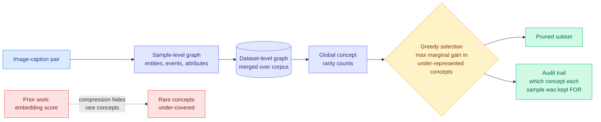

# Mapping the Concept Landscape: Structural Perception of Global Distributions for Transparent Data Pruning

**Source:** Kurate cs.LG leaderboard #5 this week (ai_rating 6.0/10, published 2026-08-24). Dongyue Wu, Tao Ma.
**Links:** [arXiv 2608.22858](https://arxiv.org/abs/2608.22858) · [raw](../../raw/kurate/2026-08-30-cs-lg.md)

---

**TL;DR.** Data pruning (throwing away most of a training set and keeping the subset that trains just as well) is almost always done by scoring samples in embedding space. MCL argues that is the mistake: an embedding is a compressed vector, and compression is exactly what destroys the rare fine-grained concepts you were trying to preserve coverage of. So MCL discards embeddings and represents each image-caption pair as an **explicit graph of entities, events and attributes**, merges all sample graphs into one dataset-level graph, counts how rare each concept actually is across the whole corpus, and then runs greedy **concept-coverage maximization** to select samples. It beats state-of-the-art pruning efficiency and, because selection is now a count over named concepts, it produces an auditable reason for every sample it kept.

---

---

## What problem it solves

Every embedding-based pruning method computes a sample's importance from its position in a high-dimensional feature space, then keeps the samples that are hardest, most representative, or most diverse by some geometric criterion. The paper's objection is mechanical rather than philosophical. **A feature embedding is a lossy summary produced by a model that was trained to discard detail.** Two captions describing a common scene and a rare one may sit close together if the rare element is a small part of the description, so a diversity criterion computed on those vectors cannot see the rarity it is meant to preserve. The observable symptom is that pruned subsets under-cover rare semantic concepts, which is the failure that matters, since the whole point of keeping a subset is retaining the tail.

## The core novelty

Replace the compressed representation with an explicit symbolic one, then make rarity a **global count rather than a local geometric property**.

Each image-caption pair becomes a small graph whose nodes are entities, events and attributes. Those graphs are merged into a single dataset-level graph, which turns "how rare is this concept" from an estimate into a count over the whole corpus. Selection is then a **greedy concept-coverage maximization**: repeatedly take the sample whose marginal gain in coverage of high-value, under-represented concepts is largest.

That greedy step is the standard approximation algorithm for maximum coverage, which is where the practical guarantee comes from. It also makes the method's most useful property fall out for free: because a sample is selected *for* specific named concepts, the selection has a reason attached. The paper calls this a transparent, interpretable audit trail, and it is the genuine differentiator, not the accuracy.

## Results

- **Superior pruning efficiency against state-of-the-art methods** across several benchmarks, meaning better retained performance at the same keep-ratio.
- **Per-sample audit trail** naming the concepts each retained sample contributes. No embedding-based method can produce this, because there is no named quantity to attribute to.
- Rare-concept coverage in the pruned subset improves, which is the failure mode the method was designed against.

## How this relates to prior wiki pages

**It is the second paper in a week to argue that the expensive decision belongs in a build step, and the first to make that decision auditable at the data layer.** The [08-29 digest](../daily-digest/2026-08/2026-08-29.md) drew this thread across CritICL (offline critique repository), the ACE lens (data generation as continual allocation), and a multi-agent fan-out cap chosen offline. MCL is the data-selection member, and it shares CritICL's strongest property: **the artifact is inspectable.** The 08-29 Industrial implication argued that a critique repository beats a test-time weight delta because you can version and diff it. A concept-coverage audit trail is that same argument applied to a training set.

**It answers a question the [ACE lens (08-28)](../agentic-systems/2026-08-28-ace-lens-agentic-data-generation.md) posed and could not operationalize.** ACE decomposes data quality into Accuracy, Complexity and divErsity and was criticized in this wiki for stating **learner-relative complexity as a principle with no measurement procedure**. MCL does not solve that, but it does supply a concrete measurement procedure for the third term: diversity as coverage over a counted concept graph, with redundancy defined as zero marginal gain. That is a usable definition where "spread in embedding space" was not. The gap between them is the interesting part: **MCL's rarity is learner-independent**, a property of the corpus, while ACE argues informativeness is a property of the model-harness pair. Both cannot be fully right, and nobody has run the experiment that separates them.

**It contrasts sharply with [dataset distillation via influence matching (07-24)](2026-07-24-dataset-distillation-influence-matching.md).** That approach compresses a dataset by synthesizing samples that reproduce the training influence of the original, optimizing against the learner's gradients. MCL never touches the learner. The two occupy opposite ends of a trade this wiki has not named: **learner-coupled selection is more accurate per retained sample and is opaque and must be redone per model; corpus-intrinsic selection is transferable across models and auditable and leaves value on the table.** MCL's audit trail is only possible because it chose the second, and the paper is honest that transparency is the headline.

**On [model pruning and sparsity](model-pruning-sparsity.md), created today, MCL and [RoI](2026-08-30-roi-semi-structured-sparsity.md) are the same idea at two layers.** Both keep a small subset from a large pool by maximizing a coverage-like objective over positions the rest of the field scores by magnitude or geometry. Weights and training samples turn out to have the same problem structure, which is worth stating once because it suggests borrowing: RoI's differentiable subset sampling is a direct alternative to MCL's greedy step, and MCL's global rarity counting is a direct alternative to RoI's per-position logits.

## Gaps

**Vision-language only.** The method is built on image-caption pairs, and both the graph extraction and the concept vocabulary depend on captions being present and reasonably complete. What the analogue is for a text-only pre-training corpus, where there is no caption and no obvious entity-event-attribute decomposition, is unaddressed, and that is where nearly all of the pruning money is.

**The graph extractor is an unexamined dependency.** Entities, events and attributes have to come from somewhere, presumably a parser or a model. Every extraction error becomes a miscounted concept, and rare concepts are precisely the ones an extractor is least reliable on. The method's advantage is concentrated in the tail, and so is its dependency's error rate. There is no reported sensitivity analysis on extractor quality, which is the first thing a replication should run.

**No cost accounting.** Building a dataset-level graph over a full corpus and running greedy selection is a real preprocessing job, and greedy maximum coverage is expensive at corpus scale without careful data structures. Against an embedding-scoring baseline that needs one forward pass per sample, MCL's preprocessing may be substantially more expensive. The paper reports pruning *efficiency* in the retained-performance sense and not in the wall-clock sense.

## Research angle

The audit trail is the part with the most leverage, and it is under-claimed. This wiki's measurement-crisis thread reached a formal statement on 08-29 with [the Inspect Evals census](../responsible-ai/2026-08-29-evaluation-license-claim-replay-census.md), which found **110 of 124 eval units cannot license the claims attached to their numbers** because the artifact does not carry the evidence needed to replay them. Training-data selection has exactly the same structure and none of the scrutiny: a model card says a corpus was filtered and never says what the filter kept or dropped. MCL produces, as a side effect, precisely the frozen substrate that census framework requires. **A data-pruning method whose selections can be replayed and contested is a governance artifact, not just an efficiency one**, and the obvious follow-up is to run the claim-replay audit on a pruned corpus rather than on an eval.

## Related pages

- [Model pruning and sparsity](model-pruning-sparsity.md)
- [RoI: semi-structured sparsity](2026-08-30-roi-semi-structured-sparsity.md)
- [Dataset distillation via influence matching](2026-07-24-dataset-distillation-influence-matching.md)
- [Knowledge distillation](knowledge-distillation.md)
