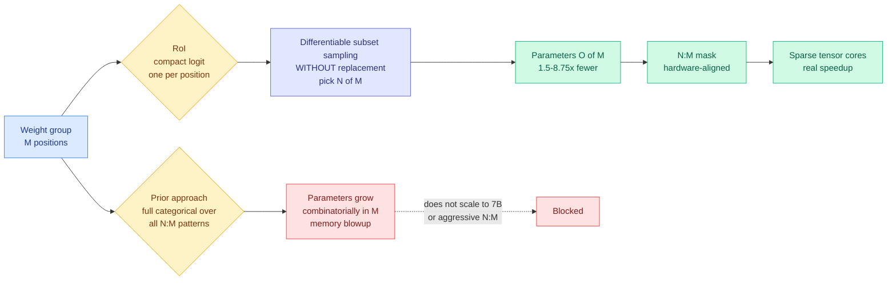

# Reservoir of Importance: Learning Semi-Structured Sparsity with Differentiable Subset Sampling

**Source:** Kurate cs.LG leaderboard #9 this week (ai_rating 5.5/10, published 2026-08-24). Ha Dinh, Xuan Duy Ta, Khoat Than, Khac-Hoai Nam Bui.
**Links:** [arXiv 2608.23048](https://arxiv.org/abs/2608.23048) · [raw](../../raw/kurate/2026-08-30-cs-lg.md)

---

**TL;DR.** N:M sparsity (keep N weights out of every group of M, the pattern Nvidia's sparse tensor cores can actually accelerate) works best when the mask is *learned* rather than picked by magnitude. But learning it means putting a probability distribution over every feasible N:M pattern, and the number of those patterns is combinatorial in M, so the mask parameters themselves become a memory problem at LLM scale. RoI replaces the full categorical distribution with a **compact logit per position plus sampling without replacement**, dropping trainable mask parameters from combinatorial to **O(M)**. That is **1.5x to 8.75x fewer learnable parameters** with matching quality across Qwen2.5 at 0.5B to 7B, and it degrades more gracefully into aggressive sparsity patterns.

---

---

## The problem, stated precisely

Unstructured pruning (zero out any weight anywhere) gives the best quality per parameter removed and almost no speedup, because a scattered sparsity pattern cannot be fed to dense matrix hardware. Structured pruning (remove whole channels or heads) gives real speedup and costs real quality. **N:M semi-structured sparsity is the compromise the hardware chose**: within every contiguous group of M weights, exactly N survive. Nvidia's Ampere-and-later sparse tensor cores implement 2:4 natively. The pattern is regular enough to schedule and fine-grained enough to keep quality.

The open question has been how to pick which N survive. Magnitude is the cheap answer and a weak one. The better answer is to *learn* the mask jointly with a short fine-tune, which means the mask has to be differentiable, which means putting a relaxed probability distribution over mask choices.

**That is where the cost hides.** A full categorical distribution over feasible N:M patterns has one logit per pattern, and the number of patterns is M-choose-N. For 2:4 that is only 6 and nobody notices. Push toward aggressive regimes and larger groups and it grows fast, and every one of those logits is a trainable parameter held in optimizer state during the fine-tune. The technique that was supposed to make the model cheaper makes the *training* of the compression expensive, and it does so precisely in the aggressive-sparsity regime where the payoff would be largest.

## The core novelty

Reparameterize. Instead of a distribution over *patterns*, RoI keeps a **compact logit per position within the group** and draws the surviving set by **differentiable subset sampling without replacement** — pick N of M according to those logits, in a way that gradients flow through. The distribution over patterns is then induced rather than parameterized. Parameters fall from combinatorial in M to **O(M)**.

The framing in the title is the useful mental model: a *reservoir* of per-position importance scores that you draw N samples from, rather than an explicit menu of every legal configuration. It is the same move that makes reservoir sampling and Gumbel top-k tractable, applied to a pruning mask.

## Results

- **1.5x to 8.75x fewer learnable mask parameters** than prior learnable-mask methods, with correspondingly lower memory cost during the pruning fine-tune. The spread is the interesting part: the multiple grows as the sparsity pattern gets more aggressive, which is where prior methods were failing.
- **Competitive quality across Qwen2.5 at 0.5B, 1.5B, 3B and 7B.** A single family across four scales is a modest but honest sweep, and it is more scale evidence than most learnable-mask papers publish.
- **Masks stay fully hardware-aligned.** This is the load-bearing constraint and it is easy to lose: a method that learns a better mask outside the N:M family produces a number nobody can realize on a GPU.
- Reported as more **stable** at aggressive N:M, which is the regime where relaxed-mask methods typically diverge.

## How this relates to prior wiki pages

**This is the wiki's first properly parameterized N:M sparsity result, and it arrives to a topic area that had sources but no concept page.** That gap is now filled at [model pruning and sparsity](model-pruning-sparsity.md), created today.

**It sits opposite [maximal brain damage (04-20)](2026-04-20-maximal-brain-damage-sign-bit-flips.md) on the same axis.** That work probed which individual bits a network can survive losing, treating fragility as the object of study. RoI treats the same fragility as a resource to be allocated: if some positions matter far more than others, learn which and keep those. Both are statements that importance is highly non-uniform within a weight group. Neither has been connected to the other in the literature.

**It shares its structure with a pattern this wiki keeps recording: the expensive decision moves to a build step.** The [08-29 digest](../daily-digest/2026-08/2026-08-29.md) named three items doing this in one day (CritICL moving reasoning supervision into an offline critique repository, the ACE lens making data generation a pre-loop allocation problem, Ken Huang's offline fan-out cap). RoI is the same shape at the weight level: pay once during a pruning fine-tune, serve forever at 2:4. **What is different, and better, is that RoI is the first member of the family to actually publish the build-step cost.** The 08-28 and 08-29 Looking Ahead sections both complained that Self-OPD, TTPO and CritICL delete a serving-time dependency without pricing what replaced it. RoI's headline number *is* the build-step price, in trainable parameters and memory. It is a partial resolution of that open prediction, from an unexpected direction.

**It also intersects [compute economics](../hardware/compute-economics.md) in a way the paper does not claim.** That page records the 2026-08 shift to power as the binding constraint, with tokens-per-joule as the objective. Sparse tensor cores are one of the few levers that improve that ratio without a new chip, because they cut the multiply-accumulates rather than the clock. A learnable-mask method that finally scales to 7B is therefore an efficiency result with a hardware path already deployed, which is not true of most compression research.

## Gaps

**No speedup number.** This is the conspicuous omission. The entire justification for N:M over unstructured is that the hardware accelerates it, and the paper reports parameter counts and quality without a measured wall-clock or throughput figure on sparse tensor cores. The saving demonstrated is in the *pruning procedure*, not in serving, and those are different bills. A reader could come away thinking the model got faster; what got cheaper was learning the mask.

**One model family.** Qwen2.5 at four scales is a scale sweep, not an architecture sweep. Whether the compact-logit parameterization holds up on a mixture-of-experts model, where the effective weight distribution per expert is different and far sparser in usage, is untested and is the deployment case that matters most.

**"Competitive performance" is doing work.** The claim is parameter efficiency at matched quality. What is not shown is whether RoI ever *beats* the full categorical parameterization on quality, or only ties it more cheaply. If the compact logits lose expressiveness, that cost should appear at the most aggressive sparsity, which is exactly where the paper reports its largest parameter savings and where the comparison is hardest to run because the baseline no longer fits.

## Research angle

Two experiments are cheap and nobody has run them. First, **compose RoI with quantization**. Sparsity and low-precision both attack the same memory-bandwidth bottleneck and the field routinely reports them separately; whether a 2:4 RoI mask survives 4-bit weights, or whether the two eat each other's headroom, is a single ablation away and would change deployment recipes immediately. Second, **the mask is a learned importance map, so read it**. Per-position logits over weight groups are an interpretability artifact that comes free with the method, and the 08-28 result on [pruning and SAE robustness](../responsible-ai/2026-08-28-pruning-sae-robustness.md) makes the pruning-interpretability interaction a live question. Whether RoI's learned masks agree with magnitude, with gradient-based importance, or with neither is a diagnostic the paper already computed and did not look at.

## Related pages

- [Model pruning and sparsity](model-pruning-sparsity.md)
- [Knowledge distillation](knowledge-distillation.md)
- [GPU kernels](../hardware/gpu-kernels.md)
- [Compute economics](../hardware/compute-economics.md)
