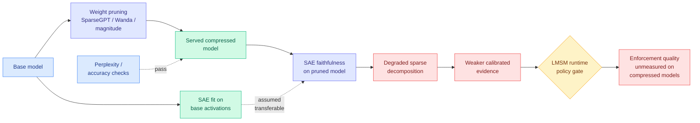

# When Pruning Meets Interpretability: Preserving Sparse Autoencoder Robustness in LLMs

**Source:** [arXiv 2608.25941](https://arxiv.org/abs/2608.25941) · COLM 2026 · Ohio State University (Suchit Gupte, Xueru Zhang, Mohammad Mahdi Khalili) · Kurate cs.LG #8 this week
**Raw:** [raw/kurate/2026-08-31-cs-lg.md](../../raw/kurate/2026-08-31-cs-lg.md)
**Date ingested:** 2026-08-31

## TL;DR

Two large sub-fields have been developed almost entirely independently and are routinely applied to the same model in sequence. **Compression** prunes weights so the model fits and serves cheaply; SparseGPT and Wanda are the standard one-shot methods, magnitude pruning the classical baseline. **Mechanistic interpretability** trains sparse autoencoders (SAEs, overcomplete sparse dictionaries fit to a layer's activations) to pull apart superposition, the phenomenon where a network represents more features than it has neurons so individual neurons end up polysemantic. Every SAE-based workflow, circuit identification, spurious-correlation erasure, causal hypothesis testing, rests on one assumption: that the SAE faithfully decomposes the activations it was fit to. This paper asks what happens to that assumption when the underlying model is pruned first, and the answer is that faithfulness degrades. The practical consequence is uncomfortable and specific: **the model you actually serve is the compressed one, and it is the one your interpretability tooling is least able to describe.**

## Why this is a Tier 1 efficiency result, not only an interpretability result

It is tempting to file this under interpretability and move on. It belongs on the compression page for a concrete reason: it prices a cost of pruning that no pruning paper reports.

Every pruning paper reports perplexity and downstream accuracy. Those metrics ask whether the model still *behaves* the same. This paper asks whether the model is still *legible* the same, and finds that the two degrade on different schedules. A pruning ratio that costs you 0.3 perplexity can cost you materially more in the faithfulness of the sparse decomposition on top. If interpretability artifacts are only research outputs, that is an academic point. If they are becoming serving-path components, it is a production one, and it is becoming one right now.

## The collision with LMSM, stated directly

[LMSM (08-31)](../responsible-ai/2026-08-31-lmsm-llm-security-modules.md), which landed on HuggingFace the same day, makes SAEs and transcoders **pluggable security backends in the serving path**, exposing calibrated evidence to a runtime policy that gates output release, at 98.14% of unmonitored throughput. That is the strongest argument yet for treating an SAE as infrastructure rather than as an analysis notebook.

Put the two together and you get a dependency nobody has traced:

Neither paper cites the other, and the composed question, *how much attack-success-rate reduction does LMSM retain when its SAE backend runs on a 50%-pruned model*, is a single experiment that neither team ran. It is the most valuable unrun experiment on this page today.

## Relation to prior wiki state

**It sharpens this page's one-line thesis rather than contradicting it.** [model-pruning-sparsity](model-pruning-sparsity.md) has held that *sparsity is easy to find and hard to spend*, with schedulability as the thing that decides whether a headline ratio becomes a speedup. This adds a second currency the field has not been counting. A pruning method is now answerable on three axes, not two: quality per removal, hardware schedulability, and **interpretability preservation**. Nothing on the page reports the third.

**It also lands on the pruning-as-selection thread from yesterday.** [MCL (08-30)](2026-08-30-mcl-concept-landscape-data-pruning.md) argued that scoring training samples in embedding space is mechanically wrong because an embedding is a lossy summary produced by a model trained to discard detail, and that detail is exactly the rare material you were pruning to preserve; it built an explicit entity-event-attribute graph instead so every kept sample has a named reason. The structural echo is exact. MCL says do not trust a learned representation to tell you what to keep. This paper says do not trust a learned representation *of a model you just changed* to tell you what the model is doing. Both are arguments for auditability over convenience, one at the data layer and one at the analysis layer.

**And it puts a caveat on the compression-plus-audit story the wiki has been assembling.** [RoI (08-30)](2026-08-30-roi-semi-structured-sparsity.md) made learning an N:M sparsity mask affordable, dropping mask parameters to O(M) at 1.5x to 8.75x fewer than the combinatorial baseline, scaling to 7B. The field's trajectory is clearly toward more pruning, better pruning, cheaper pruning. This paper does not slow that down. It says the audit tooling has to be re-validated on the pruned artifact rather than inherited from the base model, and right now nobody re-validates.

## Gaps

The reported setting is standard one-shot pruning methods on open models, which is the right place to start and is not the deployment reality; production compression is usually quantization plus pruning plus distillation stacked, and the interaction of the stack with SAE faithfulness is untouched. The paper is framed as preservation, so the load-bearing question for a practitioner, *what pruning ratio can I afford if I need the SAE to stay usable*, is a curve that would be more useful than a comparison. And there is no treatment of the reverse direction: whether fitting the SAE on the pruned model from scratch, rather than transferring, recovers faithfulness, which is the cheapest available fix and the first thing an engineer would try.

## Related pages

- [model-pruning-sparsity](model-pruning-sparsity.md)
- [LMSM (08-31)](../responsible-ai/2026-08-31-lmsm-llm-security-modules.md)
- [MCL: concept-landscape data pruning (08-30)](2026-08-30-mcl-concept-landscape-data-pruning.md)
- [RoI: Reservoir of Importance (08-30)](2026-08-30-roi-semi-structured-sparsity.md)
- [responsible-ai](../responsible-ai/responsible-ai.md)
- [Daily digest 2026-08-31](../daily-digest/2026-08/2026-08-31.md)
