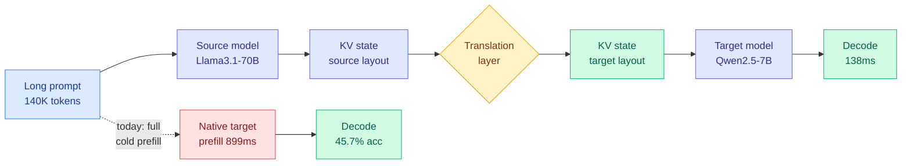

# A Universal Context-Reuse Layer for Cross-Model KV Sharing

**Source:** Kurate cs.LG leaderboard #17 (week of 2026-09-02), ai_rating 3.5/10, published 2026-08-31
**Paper:** [arXiv 2608.30963](https://arxiv.org/abs/2608.30963)
**Authors:** Yi Li, Dongming Jiang, Yi Zhao, Bingzhe Li
**Raw:** [raw/kurate/2026-09-02-cs-lg.md](../../raw/kurate/2026-09-02-cs-lg.md)

## TL;DR

Every KV-cache reuse mechanism in production assumes the model that wrote the cache is the model that reads it. This paper breaks that assumption. It trains a translation layer that converts the KV state (the stored attention keys and values for tokens already processed) produced by one model into a representation a *different* model can consume, across differences in scale, architecture, attention configuration, tokenizer, and model family. In the most heterogeneous setting tested, Llama3.1-70B hands its processed context to Qwen2.5-7B and the target model reaches 44.0% accuracy against 45.7% for native Qwen2.5-7B inference, while measured latency falls from 899ms to 138ms. The authors propose **context mobility** as a systems abstraction: KV states as transferable computational representations rather than model-local caches.

## What it does

Existing prefix caching and KV reuse (vLLM's block-hash prefix cache, provider-side prompt caching) cut redundant prefill *within* one model. The producer and consumer of the cache are the same weights, so the cached tensors are directly valid. Cross-model sharing has to solve a representation-mismatch problem instead: two models disagree on hidden dimension, head count, attention variant (multi-head vs grouped-query vs latent), tokenizer segmentation, and learned feature basis. The paper's contribution is a learned translation of the source KV state into the target's consumable form, evaluated in both within-family and cross-family regimes.

## Key results

- **Within-family, small target gains capability.** Qwen2.5-7B → Qwen2.5-1.5B: LongBench2 accuracy rises from 27.59% to **34.48%**, a 6.89-point gain over the native 1.5B baseline, while reducing handoff cost relative to native target prefill. The small model reads a better-processed context than it could have produced itself.
- **Cross-family, prefill cost collapses.** Qwen2.5-1.5B → Gemma-2-2B: up to **67.05% reduction in target-side prefill cost** at 4K context, with decoding perplexity close to native baselines.
- **Heterogeneous handoff, latency collapses.** Llama3.1-70B → Qwen2.5-7B: **44.0% vs 45.7%** accuracy (a 1.7-point loss), latency **899ms → 138ms** (roughly 6.5x).

## How this relates to prior wiki pages

**This directly addresses the open problem [kv-cache.md](kv-cache.md) named on 08-29 as "the most concrete unpriced item where this page meets routing."** That entry, drawn from the four-cache-layers explainer, recorded that prompt-cache entries are **keyed to a model**, so a mid-session route to a cheaper model pays a full cold prefill on the entire accumulated history. On the 140K-token median agentic prefix measured from replayed Claude Code and Codex traces, that cold prefill plausibly exceeds the per-token saving the route was chosen for. Nothing on [llm-routing.md](../ai-routing/llm-routing.md) priced it and no method removed it. **This paper is the first mechanism in the wiki that removes the penalty rather than pricing it.** Whether it removes *enough* of it at 140K rather than the 4K where the 67% figure was measured is unshown, and that gap is the paper's central weakness.

**It also partially scores the 08-29 Looking Ahead prediction** that the model-keyed cache boundary would become a named routing cost within 90 days. It became a named routing cost *and* got a candidate fix in four days, which is faster than the prediction anticipated, from authors who do not cite the routing literature at all.

**Against the append-never-edit rule.** [kv-cache.md](kv-cache.md) records three independent arrivals (TokenPilot 06-16 as research, DeepSeek Harness v0.1 08-14 as vendor engineering, the 08-29 practitioner explainer) at one rule: keep the prefix byte-identical, because any prefix mutation forces a full prefill recompute. Cross-model handoff is a much more aggressive claim, that the prefix does not even have to be *the same model's* to be reusable. If it holds, the rule's scope narrows from "byte-identical prefix" to "semantically recoverable prefix," which is a materially different serving contract.

**Where it sits against the KV-shape work.** [Maglev (08-16)](2026-08-16-maglev-sliding-recurrent-memory.md) bounds the cache by construction with a fixed-size recurrent memory, removing the eviction decision entirely. This paper goes the other way: it keeps the full growing cache and makes it portable. The two are in tension for the same reason [kv-cache.md](kv-cache.md) already noted about Maglev and prefix economics: a model carrying a bounded recurrent state has less cached prefix worth transferring, so there is less for a mobility layer to move.

## Gaps

The ai_rating of 3.5/10 is the lowest of any Kurate cs.LG top-20 entry this week and the authors themselves call the evidence "initial." The scales tested are small (1.5B to 7B targets, one 70B source) and the prefill-cost win is quoted at 4K context, far below the agentic regime where the problem actually bites. There is no reported cost for the translation layer itself, either to train or to run per handoff, which is the same omission [agent-harness-engineering.md](../agentic-systems/agent-harness-engineering.md) tracks as its open problem 0b. The 1.7-point accuracy loss on the heterogeneous handoff is small but it is a loss, and no paper here establishes how it compounds across multiple sequential handoffs in a long agent session, which is the deployment shape that motivates the work.

## Related

- [kv-cache](kv-cache.md) — the page whose open problem this addresses
- [llm-routing](../ai-routing/llm-routing.md) — the mid-session-route prefill penalty
- [Maglev: sliding recurrent memory (08-16)](2026-08-16-maglev-sliding-recurrent-memory.md) — the competing bounded-cache answer
- [The Physics of LLM Inference (09-02)](../hardware/2026-09-02-physics-of-llm-inference-roofline.md) — why skipping prefill is a different kind of saving from speeding decode
