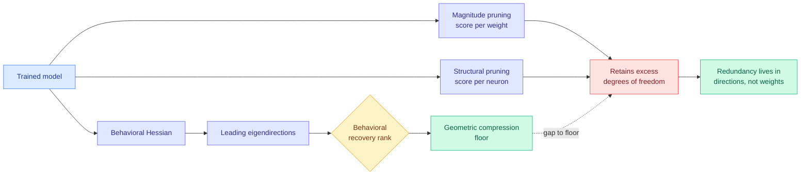

# Functional Degeneracy in Neural Networks: Measurement and Pruning

**Source:** Kurate cs.LG leaderboard #10 (week of 2026-09-02), ai_rating 5.0/10, tier 1, published 2026-08-31
**Paper:** [arXiv 2608.30741](https://arxiv.org/abs/2608.30741)
**Authors:** Maria Matveev, Pascal Esser, Ayush Bharadwaj, Lucius Bushnaq, Gitta Kutyniok
**Raw:** [raw/kurate/2026-09-02-cs-lg.md](../../raw/kurate/2026-09-02-cs-lg.md)

## TL;DR

How much can a trained model be compressed without changing what it does? This paper proposes a geometric answer and then uses it to grade existing pruning methods. It defines the **behavioral recovery rank**: the number of leading eigendirections of the behavioral Hessian needed to recover a trained model's performance. That number is a measure of how much **functional degeneracy** the model carries, meaning how many parameter directions do not matter behaviorally. Used as a benchmark, it finds that **structural and magnitude pruning retain more degrees of freedom than necessary, even after the task is saturated**. The diagnosis is that functional redundancy is spread across parameter *directions* and is therefore invisible to any criterion that scores individual weights or individual neurons.

## Why the framing matters

Almost every pruning method in production scores a *unit*: the magnitude of a weight, the norm of a neuron or channel, the sensitivity of a head. The implicit assumption is that redundancy is localized in units, so ranking units and dropping the bottom ones approaches the compression limit. This paper says the assumption is wrong in a specific way. Redundancy is a property of **directions in parameter space**, which are linear combinations of many weights, and a unit-wise criterion cannot see a direction that spreads across units it individually rates as important. The behavioral recovery rank makes the resulting shortfall measurable, because it gives a geometric target that unit-wise methods can be scored against rather than only being scored against each other.

## How this relates to prior wiki pages

**It is the second result in three days to find that the standard pruning instrument is measuring the wrong quantity, and the two are about different quantities.** [When Pruning Meets Interpretability (08-31)](2026-08-31-pruning-meets-interpretability-sae.md), a COLM 2026 paper that was Kurate cs.LG #4 last week and is #7 this week, found that standard one-shot pruning (SparseGPT, Wanda, magnitude) degrades the faithfulness of sparse autoencoders fit on top, so a pruned model that still *behaves* the same is no longer as *legible*. That is a cost of compression nobody on the pruning leaderboards counts. This paper says something adjacent but distinct: those same methods are also **leaving compression on the table**, because they cannot find directionally-distributed redundancy. **One paper says the methods under-report their cost, the other says they under-deliver their benefit, and both indict the same unit-wise criterion.** Together with [Beyond Geometric Complementarity (07-31)](../ai-routing/2026-07-31-coherent-overlap-moe-routing.md), which found expert-subspace similarity cannot determine redundancy and that any MoE compression ratio derived from subspace similarity should be re-derived, that is **three independent results converging on the claim that similarity- and magnitude-based redundancy criteria do not measure redundancy.** This wiki's threshold for declaring a pattern is three. It is crossed.

**It sharpens what [model-pruning-sparsity.md](model-pruning-sparsity.md) can claim.** The page has carried compression ratios as achievements. The behavioral recovery rank turns them into a ratio against a floor, which is a different and more demanding standard. Nothing on the page has been evaluated that way.

**It has a direct bearing on the interpretability-side result.** If redundancy is directional and sparse autoencoders decompose activations into directions, then the 08-31 finding that pruning degrades autoencoder faithfulness and this finding that pruning misses directional redundancy are plausibly two faces of one phenomenon: unit-wise pruning perturbs the directional structure that both behavior and interpretability depend on, but does so in a way that behavioral metrics tolerate and directional analysis does not. Neither paper makes that connection and it is the obvious next experiment: measure behavioral recovery rank before and after pruning and see whether the rank change predicts the autoencoder faithfulness drop.

## Gaps

The abstract is unusually short and does not name the models, scales, or tasks. Behavioral-Hessian eigendecomposition is expensive, and no cost of computing the behavioral recovery rank is given, which decides whether this is a usable production criterion or a research instrument for grading methods offline. The finding is that unit-wise pruning retains excess degrees of freedom; the paper does not appear to offer a pruning method that closes the gap, so it is a measurement result and a negative one rather than a replacement. And "even after the task is saturated" is a load-bearing qualifier that needs the task to be specified to interpret.

## Related

- [model-pruning-sparsity](model-pruning-sparsity.md) — the concept page this updates
- [When Pruning Meets Interpretability (08-31)](2026-08-31-pruning-meets-interpretability-sae.md) — the companion indictment
- [Beyond Geometric Complementarity (07-31)](../ai-routing/2026-07-31-coherent-overlap-moe-routing.md) — the same criticism at the MoE expert level
