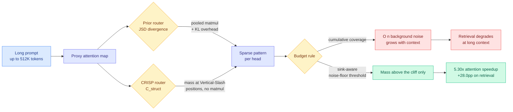

# CRISP: Cliff-awaRe Input-adaptive Sparse Prefilling with Structural-Mass-Motivated Routing

**TL;DR.** Dynamic sparse attention works by routing each attention head to a sparse pattern at runtime, but the router itself has become the tax: it computes a pooled attention map and a Jensen-Shannon divergence against candidate patterns just to decide where to look. CRISP makes two structural corrections. First, it shows the routing decision can be read directly off the shape of the proxy map, replacing the divergence computation with `C_struct`, a structural measure of how much post-softmax mass sits at Vertical-Slash compatible positions, which reproduces the divergence router's decisions while deleting both the pooled matmul and the KL computation. Second, it formalizes the **post-softmax mass cliff** and proves that cumulative-coverage thresholds (take tokens until you have 95% of the mass) accumulate O(n) background noise as context grows, so the budget mechanism gets worse the longer the context. CRISP replaces the cumulative threshold with a sink-aware threshold anchored to the noise floor. Across InfiniteBench, RULER and LongBench on two model families it is the strongest sparse method overall, matches or beats exact dense attention on retrieval-heavy tasks, recovers up to **+28.0 percentage points** on retrieval over sparse baselines, and reaches **5.30x attention speedup at 512K tokens**.

**Source:** [HuggingFace Daily Papers](https://huggingface.co/papers/2609.01925) · [arXiv 2609.01925](https://arxiv.org/abs/2609.01925) · [raw](../../raw/huggingface/2026-09-03-crisp-cliff-aware-input-adaptive-sparse-prefilling-with-stru.md)

---

## What it actually does

Two mechanisms, and they attack different layers of the same pipeline.

**1. The router is free if you read structure instead of computing divergence.** Dynamic sparse-attention methods pick a sparse pattern per head per input. To choose, they build a cheap pooled approximation of the attention map and measure how far it is from each candidate pattern, typically with Jensen-Shannon divergence (a symmetric measure of how different two probability distributions are). That measurement costs a pooled matrix multiply plus the divergence itself, on every head, every input. CRISP's observation is that the decision is a function of the map's *shape*, not its distance to a reference: specifically, how much post-softmax attention mass lands at positions compatible with the Vertical-Slash pattern (the vertical stripes plus diagonal bands that long-context attention maps overwhelmingly exhibit). Measuring that mass directly, as `C_struct`, reproduces the divergence router's routing decisions with neither the matmul nor the KL step. The router stops being a cost center.

**2. The budget rule was quietly broken, and the paper proves it.** Sparse attention needs a stopping rule: how many tokens to keep. The standard answer is cumulative coverage, keep adding tokens until the retained mass hits some threshold. CRISP formalizes the **post-softmax mass cliff**: after the softmax, attention mass is not smoothly distributed but drops off a cliff, with a small set of high-mass positions and then a long floor of near-uniform background. A strictly cumulative threshold cannot tell the difference between real mass and floor, so as context length n grows it accumulates **O(n) background noise** inside the retained budget. This is why sparse methods degrade specifically on retrieval at long context: the budget fills with floor, and the needle gets crowded out. CRISP's fix is a **sink-aware threshold grounded in the noise floor**, cutting at the cliff rather than at a cumulative fraction. Sink-aware because attention sinks (the first few tokens, which absorb large mass for reasons unrelated to content) would otherwise dominate the floor estimate.

The speedup is attributed **primarily to the O(n) noise elimination during selection**, not to the router saving. That ordering matters: the headline 5.30x comes from selecting fewer, better tokens, and the free router is the secondary win.

## Key results

- **5.30x attention speedup at 512K tokens.** The gain scales with context, which follows from the mechanism: the noise term it deletes is the one that grows with n.
- **Up to +28.0 percentage points on retrieval tasks** over sparse baselines. Retrieval is where cumulative-coverage budgeting fails hardest, so this is the mechanism's own prediction confirmed.
- **Matches or exceeds exact dense attention on retrieval-heavy benchmarks.** Beating dense is the interesting half: pruning the noise floor apparently removes a genuine distraction, not just cost.
- Evaluated on InfiniteBench, RULER and LongBench across two model families, described as the strongest sparse method overall.

## How this relates to prior wiki pages

**It is one of two papers on the same day attacking the identical bottleneck from opposite ends, and neither cites the other.** [Declarative Attention (09-03)](2026-09-03-declarative-attention.md) makes the same diagnosis that extrinsic proxy scoring is the thing standing between sparse attention and its promised savings, and resolves it by removing the scorer entirely: the model declares in its chain-of-thought which region it needs, and the engine parses the declaration. CRISP keeps the scorer and makes it structurally free. Read together they bracket the design space. **CRISP is prefill-side (the quadratic dense pass over the prompt) and DA is decode-side (the per-step KV read), so they are complements rather than rivals, and nobody has composed them.** That composition is the obvious next experiment and it is currently unclaimed.

**It supplies the missing budget mechanism for a problem [kv-cache.md](kv-cache.md) has tracked since OasisKV.** [OasisKV (08-11)](2026-08-11-oasiskv-lookahead-sparse-prefetching.md) used lookahead to prefetch the sparse set it would need, treating *which* tokens to fetch as a prediction problem. CRISP says the harder half was never prediction but **thresholding**: even a perfect scorer paired with a cumulative-coverage budget imports O(n) floor. That reframes a run of sparse-attention results as having optimized the wrong stage.

**It confirms, with a proof, the empirical shape [TileMix (08-25)](2026-08-25-tilemix-tile-centric-mixed-precision-attention.md) exploited without explaining.** TileMix assigned precision per attention tile on the observation that most tiles carry almost nothing and can be computed in low precision while a few carry the answer. That is the mass cliff, used as an engineering heuristic. CRISP formalizes the same distribution and derives the noise-accumulation consequence, which means TileMix's tile-importance skew and CRISP's cliff are one phenomenon with two applications, precision allocation and token selection.

**The Vertical-Slash prior connects it to the spectral-routing thread in [ai-routing](../ai-routing/llm-routing.md).** [Chiaroscuro (06-09)](../ai-routing/2026-06-09-chiaroscuro-attention-spectral-routing.md) routed on the spectral structure of the attention map; CRISP routes on its *mass geometry*. Both are the claim that the attention map's own shape is a sufficient routing signal, so you should never train a separate router to tell you what the map already says.

**Efficiency framing.** This is a pure cost-optimization result on the dominant axis. [Ken Huang's inference physics (09-02)](../hardware/2026-09-02-physics-of-llm-inference-roofline.md) established that on a 70B model **99.66% of every decode step is byte movement**, so only optimizations that move fewer bytes or skip the trip count. CRISP is the prefill-side instance of exactly that rule, and its free router is a second-order version of it: even the machinery that decides what to skip must not itself touch memory.

## Gaps

- **No cost accounting for `C_struct` itself.** The paper argues it eliminates the matmul and the KL step, but does not report what computing structural mass costs as a fraction of the attention it saves. "Cheaper than JSD" is a comparison, not a number.
- **The sink-aware threshold has a noise-floor estimator, and its sensitivity is unreported.** If the floor is mis-estimated the method either keeps noise (losing the benefit) or cuts real mass (losing accuracy). This is the same unvalidated-second-estimator pattern [knowledge-distillation.md](knowledge-distillation.md) flagged across the R2-OPD and VoI-MoLE family: a method whose headline depends on an auxiliary estimator that gets no ablation.
- **Prefill only.** The gains are quoted on attention during prefilling. Decode-side behavior, where the memory wall actually bites hardest for agentic serving, is out of scope.
- **Two model families, unnamed in the abstract.** Whether the Vertical-Slash prior holds for models with fundamentally different attention (Multi-head Latent Attention, linear-attention hybrids) is untested, and it is the load-bearing assumption.

## Industrial implication

The immediately actionable claim is not the speedup, it is that **anyone running sparse attention with a cumulative-coverage budget is losing retrieval accuracy at long context for a structural reason, and can fix it by changing a threshold rule rather than a model.** That is a serving-stack config change with a stated +28pp retrieval recovery attached, which is an unusually cheap intervention. Longer term, the free-router result pushes dynamic sparse attention toward being the default rather than a specialized long-context mode, because the argument against dynamic routing was always that the router's own overhead ate the win at short and medium contexts.

## Related

- [Declarative Attention (09-03)](2026-09-03-declarative-attention.md) — the intrinsic-routing counterpart, same bottleneck, opposite solution
- [kv-cache.md](kv-cache.md) — concept page
- [OasisKV (08-11)](2026-08-11-oasiskv-lookahead-sparse-prefetching.md) — sparse prefetching by lookahead prediction
- [TileMix (08-25)](2026-08-25-tilemix-tile-centric-mixed-precision-attention.md) — the mass cliff as a precision-allocation heuristic
- [Ken Huang, Physics of LLM Inference (09-02)](../hardware/2026-09-02-physics-of-llm-inference-roofline.md) — why only byte-reducing wins count
- [attention-mechanisms.md](../llms-foundation-models/attention-mechanisms.md) — concept page
