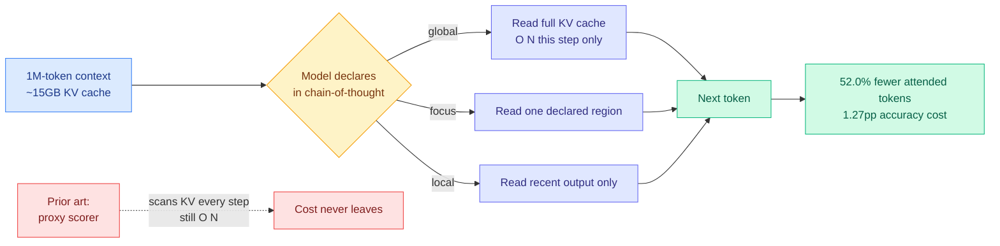

# Language Models Can Control Their Own Attention (Declarative Attention)

**TL;DR.** Every sparse-attention method in production guesses which context tokens matter by scoring them with an auxiliary mechanism, and that scoring pass is itself O(N) in context length, so the cost never actually leaves. This paper asks a question nobody had asked in this form: the model presumably already knows what it needs to look at, so why not just ask it? **Declarative Attention (DA)** is a protocol that elicits the model to declare its attention scope inside its own chain-of-thought, partitioning generation into three modes: `<global>` (read the full context), `<focus>` (read one specific region), and `<local>` (read only recent output). The inference engine parses those declarations the way it parses tool calls and skips most of the KV cache read. Zero-shot on off-the-shelf models with no training, across 15 long-context tasks: **Gemma-4-31B attends 52.0% fewer tokens for a 1.27pp accuracy drop, Qwen-3.6-27B attends 31.1% fewer for 2.75pp.** The accuracy gap shrinks as models get larger.

**Source:** [HuggingFace Daily Papers](https://huggingface.co/papers/2609.02737) · [arXiv 2609.02737](https://arxiv.org/abs/2609.02737) · KAIST AI with Google DeepMind (Namgyu Ho, Huzama Ahmad, Woosung Koh, Se-Young Yun; Tal Schuster and Cicero Nogueira dos Santos advisory) · [raw](../../raw/huggingface/2026-09-03-language-models-can-control-their-own-attention.md)

---

## The problem, stated with the number that makes it urgent

At 1M tokens of context, the KV cache for a single sequence is roughly **15 GB, and a global attention layer reads all of it to produce every single output token.** If the user asks about a detail from earlier in a long conversation, the model re-scans the entire history token by token as it writes the reply. Memory bandwidth, not arithmetic, is what the model is waiting on, and it waits again for each token.

The field's response has been to predict which tokens matter and mask the rest. Static heuristics came first (keep recent tokens, keep historically high-attention tokens), but fixed rules cannot anticipate what a future query will need, so long-context accuracy suffered. The current generation accepts that attention is query-dependent and approximates the mask with a lightweight scan over the KV cache at each decoding step. That reduces the constant factor. **It does not change the complexity: per-step cost stays O(N).** The scorer is a cheaper way of touching everything, and touching everything was the problem.

## The core novelty

DA's move is to get the mask from the model's own generated text rather than from an auxiliary computation over the cache. It is grounded in two established findings: language models encode information about their own future tokens in their hidden states, and chain-of-thought prompting can surface latent computation as readable text. Put together, they imply the model can be asked to *say* what it is about to need.

So the mask becomes a declaration. The model writes something like a mode tag in its reasoning trace; the engine treats it as a parseable instruction, exactly as it treats a tool call; and the attention read for the following span is restricted accordingly. **O(N) reads happen only during the spans the model itself declared global.** The alphaxiv overview frames this well as a "system-2" form of sparse attention: the model reasons explicitly about its attention strategy, rather than having a strategy inferred for it.

Three properties make it unusual:

1. **Zero-shot on off-the-shelf models.** No fine-tuning, no architectural change, no trained router. The capability was already latent in Gemma-4-31B and Qwen-3.6-27B; DA is a protocol for extracting it.
2. **The selection cost is not reduced, it is deleted.** There is no scorer to pay for. The declaration is a handful of tokens the model was generating anyway.
3. **The savings improve with scale.** The accuracy drop shrinks as models get bigger, which is the direction you want: bigger models know their own information needs better.

## Key results

- **Gemma-4-31B: 52.0% reduction in total attended tokens during decoding, 1.27pp accuracy drop.** Halving the KV read for just over a point of accuracy, with no training, is a strong trade at the level of a serving-stack decision.
- **Qwen-3.6-27B: 31.1% reduction, 2.75pp drop.** The spread between the two models is large and unexplained in the abstract, which is itself informative: the capability is model-dependent.
- **Zero-shot across 15 long-context tasks.** Breadth here matters more than any single number, because the failure mode for declaration-based methods would be a protocol that only works on tasks with obvious region structure.
- **Accuracy drops shrink with model scale**, which the authors read as headroom for training-based versions.

## How this relates to prior wiki pages

**Read it against [CRISP (09-03)](2026-09-03-crisp-cliff-aware-sparse-prefilling.md), published the same day, which makes the same diagnosis and takes the opposite exit.** CRISP identifies the routing proxy as the tax and makes it structurally free, replacing a divergence computation with a direct read of post-softmax mass geometry. DA identifies the same tax and removes the scorer altogether by asking the model. **Two independent groups on one day agreeing that the extrinsic scorer is the bottleneck is the strongest signal in today's batch, and it is a genuine convergence rather than a coincidence of topic:** both papers argue explicitly that prior dynamic-sparse work optimized the scorer's constant factor when the scorer's existence was the issue. They are also cleanly complementary in scope, CRISP on prefill and DA on decode, and composing them is unclaimed work.

**It answers, in a way nobody predicted, the routing-object question [llm-routing.md](../ai-routing/llm-routing.md) has been accumulating all summer.** That page tracks what gets routed: [CaRE](../ai-routing/llm-routing.md) routes on a task axis, MISA on a head axis, [Safin-1/MARCH (09-02)](../ai-routing/2026-09-02-safin-1-march-memory-anchor-routing.md) routes over durable capability states. DA introduces a routing decision made **by the model, about itself, expressed in natural language, and consumed by the serving engine.** The router is not a component in the stack; it is a span of generated text. That is a different kind of object from anything on that page, and it means the routing policy is inspectable and loggable by construction, which no learned router is.

**It is the decode-side sibling of yesterday's prefill-side result, and together they describe a two-day arc.** [Cross-Model KV Sharing (09-02)](2026-09-02-cross-model-kv-sharing.md) showed a second model can inherit the first model's processed context, deleting a prefill rather than accelerating one (Llama3.1-70B → Qwen2.5-7B, latency **899ms → 138ms** for 1.7 accuracy points). DA deletes roughly half the per-step decode read. **The shared premise is that work already done, or work provably unnecessary, should not be paid for twice**, and the two papers hit the two halves of inference.

**It gives the memory-wall physics a second lever.** [Ken Huang's inference physics chapter (09-02)](../hardware/2026-09-02-physics-of-llm-inference-roofline.md) derived that a 70B FP8 model spends **99.66% of each decode step moving bytes**, running at under 0.3% of peak Tensor Core throughput, because single-stream decode sits at ~1.5 FLOP/byte against an H100 ridge point near 591. DA's 52% reduction in attended tokens is a direct cut to the numerator of that ratio, and it is the rare optimization that improves arithmetic intensity without batching.

**One tension worth holding open against the harness thread.** [agent-harness-engineering.md](../agentic-systems/agent-harness-engineering.md) records a contradiction it resolved on 09-02 via [Harness-of-Harness](../agentic-systems/2026-09-02-harness-of-harness.md): the harness should own decisions with **checkable correctness**, the model should own genuine **judgement calls**. DA hands the model a decision that is emphatically not checkable at declaration time, since whether `<focus>` on region R was correct is only knowable after the answer is wrong. That places DA on the model-discretion side of a line the wiki just drew, and its 1.27pp accuracy cost is the price of that discretion. The proposed reconciliation would predict DA needs an evidential backstop, some cheap verification that a declared focus did not miss the needle. It has none.

## Gaps

- **No latency or throughput numbers in the abstract.** Attended tokens is a proxy for cost, not cost. Whether a 52% cut in attended tokens becomes a 52% cut in decode latency depends on whether the engine can actually skip those reads contiguously, and irregular declared regions can defeat memory coalescing. This is the same gap between theoretical and realized sparsity that has dogged the whole sparse-attention literature.
- **The two-model spread (52.0% vs 31.1%) is unexplained.** Without a diagnosis of what makes Gemma-4-31B better at self-declaration than Qwen-3.6-27B, there is no way to predict what a third model will do, which is what a serving operator needs.
- **Accuracy is lost, not preserved.** 1.27pp and 2.75pp are modest but real, and they are averages over 15 tasks. The worst-case task is not reported, and for retrieval workloads worst-case is the number that matters. CRISP, notably, claims it *matches or exceeds* dense on retrieval-heavy benchmarks, so on that axis the intrinsic approach is currently behind the extrinsic one.
- **A declared `<focus>` that is wrong is unrecoverable within that span.** There is no fallback-to-global mechanism described for the case where the model's own declaration was mistaken.
- **Zero-shot is the headline and also the ceiling.** The authors explicitly leave training-based versions to future work, so the numbers here are a lower bound on the idea and not a characterization of it.

## Industrial implication

This is deployable in a way that most sparse-attention research is not: it needs no retraining, no new kernels for the model itself, and no change to weights. What it needs is an **inference engine that parses declarations mid-generation and re-scopes the attention read**, which is the same machinery vLLM and friends already have for tool calls and structured output. That is a plausible quarter-scale change, not a research program. Expect it to appear first in long-context chat serving, where the 1M-token 15GB-per-sequence figure is a live margin problem and a one-point accuracy cost is acceptable. The more consequential second-order effect: if models declare their attention scope in readable text, **the attention policy becomes auditable**, and every learned router in production today is a black box by comparison. That is an interpretability win arriving as a side effect of a cost optimization, which is the opposite of the trade the industry made this week with Astra's recurrent depth.

## Related

- [CRISP (09-03)](2026-09-03-crisp-cliff-aware-sparse-prefilling.md) — same bottleneck, extrinsic solution, prefill side
- [Cross-Model KV Sharing (09-02)](2026-09-02-cross-model-kv-sharing.md) — deleting the prefill instead of the decode read
- [kv-cache.md](kv-cache.md) · [attention-mechanisms.md](../llms-foundation-models/attention-mechanisms.md) — concept pages
- [llm-routing.md](../ai-routing/llm-routing.md) — the routing-object taxonomy this extends
- [Ken Huang, Physics of LLM Inference (09-02)](../hardware/2026-09-02-physics-of-llm-inference-roofline.md) — the memory-wall arithmetic
