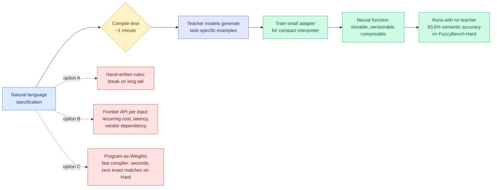

# Compile by Training: Turning Natural-Language Specifications into Local Neural Functions

**Source:** HuggingFace Daily Papers · [arxiv 2609.04199](https://arxiv.org/abs/2609.04199)
**Raw:** [raw/huggingface/2026-09-04-compile-by-training-turning-natural-language-specifications.md](../../raw/huggingface/2026-09-04-compile-by-training-turning-natural-language-specifications.md)

## TL;DR

A large class of production text operations are trivial to describe and miserable to implement: normalize this messy field, classify this into one of six buckets, rewrite this in that register. Rules break on the long tail, so teams call a frontier model per input and pay for it forever in cost, latency and vendor dependency. **Compile by training** treats the natural-language specification as source code and compiles it into a **reusable neural function**. At compile time, teacher models generate task-specific examples, and those examples train a small adapter for a compact interpreter model. The compiled function then runs **without the teachers**, and because it is a small artifact, it can be stored, versioned and composed like ordinary software. On **FuzzyBench-Hard**, a subset where the prior Program-as-Weights fast compiler produced **no exact matches at all**, compile by training reaches **83.6% semantic accuracy**. The price is compile time: roughly **a minute rather than seconds**. The authors ship it as a public interactive service and demonstrate compiled functions in a multi-site website helper, a language-controlled 3D avatar, and a bidirectional English-Claudish translator.

## The tradeoff is the contribution

Strip the framing and this is task-specific distillation with a deliberate, explicit, and well-chosen cost curve. What makes it more than that is the **compiler metaphor taken seriously**: a spec is source, compilation is a one-time cost, the output is an artifact with a filename that you can diff, pin to a version, and call from other artifacts. Every one of those properties is a software-engineering property rather than a machine-learning one, and none of them holds for a prompt against a hosted API.

The compile-time-versus-quality curve is stated honestly and it is the paper's real result. The prior fast compiler (**Program-as-Weights**, which predicts weights directly from a specification in seconds) is the speed baseline, and on the hard subset it scores **zero exact matches**. Spend a minute generating examples and training an adapter instead, and you get 83.6% semantic accuracy. **A 60x compile-time increase converts a complete failure into a usable function, and for an artifact that will be invoked millions of times, compile time is the cheapest axis to spend on.** That asymmetry is the whole argument, and it is correct: amortization over the artifact's lifetime makes one minute indistinguishable from one second.

The choice of **semantic accuracy** over exact match is doing quiet work. The gap between "no exact matches" and "83.6% semantic accuracy" partly reflects the metric change, and the paper does not report both metrics for both compilers, which would separate the compiler's improvement from the metric's leniency.

## Relation to prior wiki state

**This is the fourth mechanism on [parametric-context-internalization.md](parametric-context-internalization.md) and it moves the internalized object from data to *behavior*.** That page's three prior positions all internalize an artifact: [Code2LoRA (06-06)](2026-06-06-code2lora-hypernetwork-repo-adapters.md) predicts a repository adapter from a code snapshot, [Video2LoRA (06-06)](2026-06-06-video2lora-parametric-video-internalization.md) predicts a LoRA from a video in one perceiver pass at up to 1,500x fewer answer-time visual tokens, and [Experience Distillation (07-25)](../agentic-systems/2026-07-25-experience-distillation-sample-efficient-agent-learning.md) trains a student on tool-call histories. All three answer "how do I stop paying context tokens for this document." Compile by training answers a different question: **how do I stop paying API calls for this function.** The input is not a document, it is a specification of behavior, and there is no context to internalize because there was never any context, only a recurring inference bill.

**It is the strongest confirmation yet of that page's own lesson about what to optimize.** The page's Experience Distillation entry found a large gap between distilling *behavior* (64.8% of the in-context gain retained) and fine-tuning on raw transcripts (3.8%), and concluded that *what* you internalize matters more than *how*. [LatentPress (09-04)](2026-09-04-latentpress-latent-context-compression.md), today, found the same thing from the compression side: a compressor trained to preserve answerability beats a text-reconstruction baseline 0.504 to 0.184. Compile by training is the third instance and the most extreme, because it never has an artifact to reconstruct at all, only teacher behavior to imitate. **Three mechanisms, one rule: optimize for the downstream read, never for fidelity to the source representation.** That rule is now the page's most reliable finding.

**Against [knowledge-distillation.md](knowledge-distillation.md), it inverts the page's central resource question.** That page's five-axis selective-supervision literature all asks which supervision to *discard*, on the premise that teacher tokens are cheap and abundant. Today's [One-Example OPD (09-04)](2026-09-04-one-example-on-policy-distillation.md) pushed that to its limit and found OPD is **data-overfed but algorithm-starved**: one query reaches 71.5% state coverage, sixteen semantically distinct queries reach 98.9% and match full-data training, while alignment slows at the same rate no matter how much data you supply. Compile by training operates in exactly the regime that result predicts is fine: **generate a small quantity of teacher examples and train.** It does not measure state coverage and does not cite the OPD thread, but it is a practical existence proof on the same side of the argument. **The compose is obvious and unrun: if sixteen queries suffice, a compiler's example-generation stage should be optimized for state coverage rather than for volume, and that is a cheaper compiler.**

**And it prices a lever the [compute-economics](../hardware/compute-economics.md) thread has only discussed at the model level.** [The AlphaSense study (08-14)](../ai-industry/2026-08-14-alphasense-token-price-vs-task-cost.md) found per-token pricing ranks models backwards because stronger models finish in fewer tokens, and [Optima (08-16)](../ai-industry/2026-08-16-optima-cost-per-task-benchmarking.md) built the cost-per-task infrastructure. Compile by training says that for a bounded recurring text operation, the right cost-per-task is **not a model choice at all**: compile once, then the marginal cost is a small local forward pass. On [llm-routing.md](../ai-routing/llm-routing.md)'s taxonomy, that is a route to a target the page does not have, a compiled single-purpose function, and it dominates every model in the pool for the narrow slice of traffic it covers. **The unbuilt system is a router whose cheapest tier is a library of compiled functions, escalating to a general model only on a compile-time-declared out-of-scope signal.**

## Gaps

**FuzzyBench-Hard only, and no baseline that is a frontier API call.** The comparison is against another compiler. The decision a practitioner actually faces is compiled function versus calling the teacher, and the paper reports no accuracy or cost gap for that comparison, which is the one that determines adoption.

**No serving cost numbers.** "Compact interpreter" plus "small adapter" is the entire specification of the runtime artifact. Without parameter counts, latency, and memory, the recurring-cost saving that motivates the whole approach is unquantified.

**Composition is claimed, not measured.** "Composed like ordinary software" is the most interesting property asserted, and there is no reported result on chaining compiled functions, no error-propagation analysis across a chain, and no discussion of what happens when a downstream function receives an input outside the distribution its own compilation covered.

**Out-of-scope behavior is unaddressed and it is the safety-relevant gap.** A rule-based implementation fails visibly on inputs it does not cover. A distilled neural function produces a confident, fluent, wrong answer instead. There is no reported abstention mechanism, no calibration measurement, and no per-function scope declaration, which makes the versionable-artifact story weaker than it sounds: you can pin the version, but you cannot tell whether the input belongs to it.

## Related

- [parametric-context-internalization.md](parametric-context-internalization.md) — concept page
- [knowledge-distillation.md](knowledge-distillation.md) · [One-Example OPD (09-04)](2026-09-04-one-example-on-policy-distillation.md)
- [LatentPress (09-04)](2026-09-04-latentpress-latent-context-compression.md)
- [Code2LoRA (06-06)](2026-06-06-code2lora-hypernetwork-repo-adapters.md) · [Video2LoRA (06-06)](2026-06-06-video2lora-parametric-video-internalization.md)
- [llm-routing.md](../ai-routing/llm-routing.md) · [Optima (08-16)](../ai-industry/2026-08-16-optima-cost-per-task-benchmarking.md)
