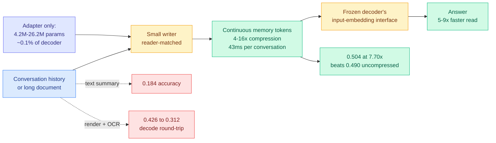

# LatentPress: Context Compression Beyond Text and Vision

**Source:** HuggingFace Daily Papers · [arxiv 2609.01507](https://arxiv.org/abs/2609.01507) · [code](https://github.com/xuyd16ai/context_softtoken_compress)
**Raw:** [raw/huggingface/2026-09-04-latentpress-context-compression-beyond-text-and-vision.md](../../raw/huggingface/2026-09-04-latentpress-context-compression-beyond-text-and-vision.md)

## TL;DR

Compressed context is almost always carried in a format built for humans: a text summary, or a rendered image the model has to decode. Both are lossy round-trips through a human-facing representation even though the consumer is a language model. LatentPress writes conversational history and long documents into a third representation, **continuous memory tokens that a frozen decoder reads directly through its input-embedding interface**, with no text reconstruction at inference. A small writer, reader-matched, compresses 4-16x while training only an adapter of **4.2M to 26.2M parameters, about 0.1% of the decoder**. On LongMemEval it reaches **0.504 accuracy at 7.70x compression against 0.490 for the uncompressed evidence**, beating text summaries (0.184) and OCR-based compression (0.426 falling to 0.312). Writing takes **43ms per conversation**, roughly an order of magnitude faster than summarizing or OCR, and reading is **5-9x faster** than raw context.

## The claim worth isolating

The headline is not the compression ratio. It is that **compressed evidence outscored uncompressed evidence** (0.504 against 0.490) on LongMemEval memory QA. That result only makes sense if the raw context was carrying something actively harmful, most plausibly distractor content that a 7.7x compression pass discards. The paper does not overclaim this and the margin is small, but it is the same shape as a result the wiki has seen before from a different direction, and it is the reason to take the interface argument seriously rather than treat this as one more compressor.

The second claim is the interface itself. Text summaries and rendered-image compression both force the information through a representation designed for a human reader, and then charge the model to parse it back. Soft tokens skip the round trip. The 43ms write time versus roughly an order of magnitude more for summarization is that skip, priced.

Transfer is validated in two settings: zero-shot from UltraChat to LongMemEval memory QA, and from LongMemEval-derived QA to unseen LongBench document domains. That is what earns the word "interface" rather than "task-specific compressor."

## Relation to prior wiki state

**This belongs on [parametric-context-internalization.md](parametric-context-internalization.md) as a fourth position, and it splits that page's cost model.** That page tracks the move of putting context into *weights* rather than into the prompt: [Code2LoRA (06-06)](2026-06-06-code2lora-hypernetwork-repo-adapters.md) predicts a repository adapter from a code snapshot, [Video2LoRA (06-06)](2026-06-06-video2lora-parametric-video-internalization.md) predicts a LoRA from a video in one perceiver pass at up to 1,500x fewer answer-time visual tokens, and [Experience Distillation (07-25)](../agentic-systems/2026-07-25-experience-distillation-sample-efficient-agent-learning.md) does the same for tool-call histories by training a student rather than predicting an adapter. All three pay `O(1)` per item then `O(0)` context tokens per query.

LatentPress pays `O(1)` per item and then a **small but nonzero** per-query cost, because the memory tokens still occupy input positions. It is the intermediate point the page did not have: cheaper to produce than an adapter (a 43ms forward pass, no hypernetwork over layer activations), cheaper to swap and compose than weights, and not free at query time. **The page's framing that internalization "wins whenever an item is queried many times" needs a middle row: soft tokens win at low reuse counts where adapter prediction has not amortized.**

**It also answers, partially, the question that page's Experience Distillation entry raised.** That entry found a large gap between distilling *behavior* (64.8% of the in-context gain retained) and fine-tuning on the raw transcripts (3.8%), and concluded that *what* you internalize matters more than *how*, then asked whether the hypernetwork branch has the same failure mode of encoding the document rather than the competence. LatentPress is evidence on the near side of that question: a compressor trained to preserve *answerability* rather than reconstruct text beats the reconstruct-text baseline (0.184) by a very large margin. **Optimizing for the reconstruction is the failure; optimizing for the downstream read is the fix.** Same lesson, third mechanism.

**Against [kv-cache.md](kv-cache.md)'s current state, this is the opposite lever on the same problem.** That page's last three days have been about not reading cache entries: [CRISP (09-03)](2026-09-03-crisp-cliff-aware-sparse-prefilling.md) with a free threshold, [Declarative Attention (09-03)](2026-09-03-declarative-attention.md) with model-declared scope, [Random Attention (09-04)](2026-09-04-random-attention-kv-eviction.md) with no scorer at all. Those shrink the *read*. LatentPress shrinks the *write*, upstream, so there are fewer positions to cache in the first place. **These compose trivially and nobody has stacked them**, which matters because a 7.7x shorter input and a 50% cheaper read multiply rather than overlap.

**The OCR comparison retires a live option.** Rendering context as an image and letting a vision-language model read it has been circulating as a compression trick on the argument that a page of text costs fewer visual tokens than text tokens. LatentPress measures it at 0.426 degrading to 0.312 against 0.504, plus a decode cost. As a machine-facing context interface it is dominated on both axes.

## Gaps

**16x trails raw context on LongBench-QA.** In-domain writers match or exceed raw reading at 4-8x; the useful operating range is therefore narrower than the headline "4-16x" suggests, and the paper is straightforward about this.

The frozen decoder is the point of the design, but it also means every result is contingent on the writer being **reader-matched**. What happens when you route to a different model mid-session is unaddressed, and it is the same model-keyed boundary [cross-model KV sharing (09-02)](2026-09-02-cross-model-kv-sharing.md) attacked for KV state. Soft tokens are arguably a worse case: a KV state at least has a defined translation target, while a continuous embedding tuned to one decoder's input space has no reason to mean anything in another's. **Whether memory tokens are portable across models is the obvious next experiment and the answer decides whether this is a serving primitive or a single-model optimization.**

No adversarial or safety evaluation. A continuous, non-human-readable representation sitting in the context window is not inspectable by any of the prompt-auditing tooling that assumes text, which is a governance property the paper does not discuss and which cuts against the monitorability arguments on [responsible-ai.md](../responsible-ai/responsible-ai.md).

## Related

- [parametric-context-internalization.md](parametric-context-internalization.md) — concept page
- [kv-cache.md](kv-cache.md) · [Random Attention (09-04)](2026-09-04-random-attention-kv-eviction.md)
- [Code2LoRA (06-06)](2026-06-06-code2lora-hypernetwork-repo-adapters.md) · [Video2LoRA (06-06)](2026-06-06-video2lora-parametric-video-internalization.md)
- [Cross-model KV sharing (09-02)](2026-09-02-cross-model-kv-sharing.md)
