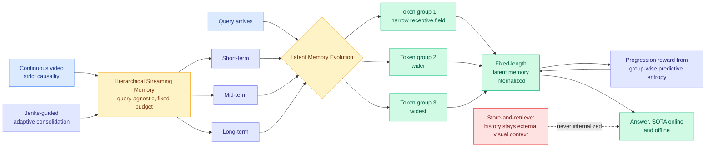

# Beyond Retrieval: Progressive Latent Memory Evolution for Streaming Video Understanding (LatentStream)

**Source:** HuggingFace Daily Papers · [arxiv 2609.04131](https://arxiv.org/abs/2609.04131)
**Raw:** [raw/huggingface/2026-09-04-beyond-retrieval-progressive-latent-memory-evolution-for.md](../../raw/huggingface/2026-09-04-beyond-retrieval-progressive-latent-memory-evolution-for.md)

## TL;DR

A model watching a live video stream has to answer questions under two hard constraints: it cannot look ahead (causality) and it cannot keep everything (bounded memory). The standard answer is **store-and-retrieve**: compress history into an external memory bank, and when a question arrives, fetch the relevant fragments and paste them back into the context as extra visual tokens. LatentStream's objection is that this leaves the history sitting *outside* the model as visual context forever, so it never becomes a compact internal state that can guide the reasoning that follows. The proposed shift is **retrieve-and-internalize**, in three parts. **Query-agnostic Hierarchical Streaming Memory** organizes history into short, mid and long-term levels under a fixed budget, using Jenks-guided adaptive consolidation to decide where the level boundaries fall. When a query arrives, **Hierarchical Latent Memory Evolution** gives groups of latent memory tokens progressively expanding receptive fields over that hierarchy, so each group iteratively pulls evidence from its own scope and folds it into a compact, **fixed-length** latent memory. **Progressive Confidence-guided Latent Memory Optimization** then builds a hierarchical progression reward from group-wise predictive entropy and jointly refines both the latent tokens and the retrieved evidence, pushing toward increasingly confident answers. New state of the art on online and offline video benchmarks.

## What is actually new here

Two things, and the second is the more portable.

**The fixed-length latent memory is a hard budget rather than a soft one.** Retrieval-augmented streaming systems have a budget on the *store* and no budget on the *read*: retrieve five fragments and the context grows by five fragments' worth of visual tokens. LatentStream's read output is a fixed-length latent memory regardless of how much evidence the groups pulled. That converts a variable, query-dependent context cost into a constant, which is the difference between a system whose per-query cost you can put in a capacity plan and one whose cost depends on what the user asked.

**The progressively expanding receptive field is a coarse-to-fine schedule expressed as a routing structure.** Different groups of latent tokens are responsible for different temporal scopes, narrow to wide, and each internalizes from its own scope. That is a much more disciplined design than letting one pool of memory tokens attend everywhere, and it means the hierarchy in the store and the hierarchy in the read are the same hierarchy. The **entropy-based progression reward** then does something unusual: it supervises the *sequence* of intermediate states, requiring each level of internalization to be more confident than the last, rather than only scoring the final answer.

The entropy reward is also the design's weakest point on principle. Predictive entropy is a confidence measure, not a correctness measure, and optimizing a model to become progressively more confident as it internalizes evidence is a training signal that a well-calibrated wrong answer satisfies perfectly. The paper reports benchmark accuracy, so this did not bite here; it is a mechanism that could.

## Relation to prior wiki state

**The strongest signal is that this and [LatentPress (09-04)](2026-09-04-latentpress-latent-context-compression.md) arrived on the same board making the same architectural argument in two different modalities, and neither cites the other.** LatentPress writes conversational history and long documents into continuous memory tokens read directly through a frozen decoder's input-embedding interface, with **no text reconstruction at inference**, and beats both text summaries (0.184) and OCR-based compression (0.426 falling to 0.312) at 0.504 while also beating **uncompressed** evidence at 0.490. LatentStream refuses to hold video history as external visual context and internalizes it into fixed-length latent state instead. **Both are rejecting a human-facing intermediate representation, text in one case and retrieved visual fragments in the other, on the grounds that the consumer is a model and the round trip is pure loss.** Two papers, one day, two modalities, one claim.

That is the second half of a pattern this page can now name at three. The third instance is [EM²Mem (09-02)](../agentic-systems/2026-09-02-em2mem-event-centric-multimodal-memory.md), which bound heterogeneous evidence to event anchors **at memory-construction time** rather than reconstructing cross-modal alignments at inference, and reported **63.66% fewer inference tokens with 4.67x lower latency** alongside accuracy gains. **Three papers in three days, all moving work out of the read path and into a representation the model consumes directly: write-time anchoring, latent soft tokens, and progressive internalization. The store-and-retrieve architecture that has dominated agent and video memory for two years is being attacked from three sides at once.** Per this wiki's three-paper threshold, that is a pattern, and the shared claim is precise: **retrieval's real cost is not the search, it is that what you retrieve arrives in a format the model has to re-parse.**

**It does not touch the retrieval failure mode [InMind (07-29)](../agentic-systems/2026-07-29-inmind-implicit-association-blind-spot.md) measured, and this is worth stating explicitly because the paper's title invites the misreading.** InMind found that retrieval only surfaces a fact when the fact resembles the query, so a stored tree-nut allergy never fires on a macaron request, and six vector, graph and agentic systems reached **at most 14.4%** on indirect queries against **84.0%** when the memory was simply placed in context. LatentStream is called "Beyond Retrieval" but its Latent Memory Evolution stage still *retrieves* from the hierarchy before internalizing. **The gate is still similarity. Improving the packaging of retrieved evidence, which is what this does well, leaves the roughly 70-point indirect-association headroom untouched**, exactly as [agent-memory.md](../agentic-systems/agent-memory.md) recorded for EM²Mem two days ago. That is now the same caveat applied to three consecutive results, and it is the strongest argument that the memory literature is optimizing the wrong stage.

**On [kv-cache.md](kv-cache.md)'s current frame, this is an upstream lever.** That page's arc for the last three days is about not reading cache entries: [CRISP (09-03)](2026-09-03-crisp-cliff-aware-sparse-prefilling.md) with a structurally free threshold, [Declarative Attention (09-03)](2026-09-03-declarative-attention.md) with model-declared scope, [Random Attention (09-04)](2026-09-04-random-attention-kv-eviction.md) with no scorer at all. A fixed-length latent memory means there are fewer positions to cache in the first place, which is the same upstream position LatentPress occupies. **All four compose and none have been stacked.**

## Gaps

**No cost numbers, which is conspicuous given the framing.** The whole argument is that store-and-retrieve wastes context. The abstract reports state of the art on accuracy and gives no token count, no latency, and no memory footprint. EM²Mem published both halves of its ledger two days earlier and that is now the bar; LatentPress published 43ms writes and 5-9x faster reads. **This paper's claim is an efficiency claim argued entirely with accuracy numbers.**

**Three coupled components, no ablation reported in the abstract.** Jenks-guided consolidation, expanding receptive fields, and the entropy progression reward are three independent ideas, and which of them carries the result is unknown. The Jenks consolidation in particular is a classical one-dimensional clustering method doing a job that a learned boundary predictor would normally do, and whether that choice matters is the first thing to check.

**Confidence as the training target, as above.** No calibration analysis and no measurement of whether the progression reward increases confident errors.

**Streaming video only.** The internalization mechanism has no obvious dependence on video, and the natural next target is exactly where the architecture would be most valuable and least tested: long-running agent sessions, where history is text and tool output rather than frames, and where the fixed-length-read property would be worth the most.

## Related

- [LatentPress (09-04)](2026-09-04-latentpress-latent-context-compression.md) — same claim, text and document modality
- [parametric-context-internalization.md](parametric-context-internalization.md) — concept page
- [EM²Mem (09-02)](../agentic-systems/2026-09-02-em2mem-event-centric-multimodal-memory.md) · [agent-memory.md](../agentic-systems/agent-memory.md)
- [InMind (07-29)](../agentic-systems/2026-07-29-inmind-implicit-association-blind-spot.md) — the retrieval gate this does not move
- [kv-cache.md](kv-cache.md) · [Random Attention (09-04)](2026-09-04-random-attention-kv-eviction.md)
