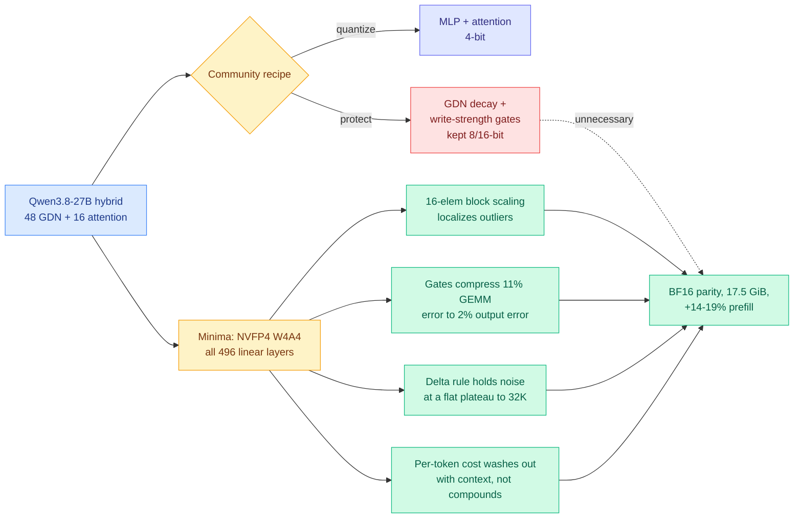

# Why Gated DeltaNet Survives 4-Bit Quantization: NVFP4 W4A4 for the Recurrent Half of a Hybrid 27B LLM

**Source:** HuggingFace Daily Papers · [arxiv 2609.04098](https://arxiv.org/abs/2609.04098) · [checkpoint](https://huggingface.co/minima-ai/mnma_qwen3.8_27b_nvfp4) · Sergii Kozyrev and Davyd Maiboroda (mnma.ai)
**Raw:** [raw/huggingface/2026-09-04-why-gated-deltanet-survives-4-bit-quantization-nvfp4-w4a4.md](../../raw/huggingface/2026-09-04-why-gated-deltanet-survives-4-bit-quantization-nvfp4-w4a4.md)

## TL;DR

Hybrid LLMs pair a few softmax attention layers with many linear-attention layers such as Gated DeltaNet (GDN), whose recurrent state summarizes context in fixed size. Every community 4-bit quantization of Qwen3.8-27B left the GDN block, and especially its decay and write-strength gates, in 8- or 16-bit, on the intuition that errors inside a recurrence accumulate over long contexts. **The intuition is backwards.** Minima quantizes all 496 linear layers to NVFP4 W4A4 (4-bit weights and 4-bit activations), GDN gates included, and matches BF16 within seed noise (5-task average **-0.52**) while being the smallest recipe compared (**17.5 GiB**) and the fastest at prefill (**+14-19%**). The gates that everyone protected turn out to be the *least* sensitive layers in the block.

## The four-part mechanism study

This is the part worth reading. Most quantization papers report that a recipe works. This one explains why the failure everyone feared does not occur, and the four parts are independently useful.

1. **NVFP4's 16-element block scaling localizes the residual stream's extreme outliers.** Because each scale covers only 16 elements, an outlier contaminates its own block and nothing else, which equalizes activation error across layer roles instead of letting the worst layer set the budget for all of them.

2. **The supposedly fragile gate projections are the least sensitive layers in the block.** Softplus/exponential and sigmoid parameterizations are *contractive* on error: roughly **11% GEMM error compresses to about 2% output error**. The nonlinearity that makes gates conceptually delicate is arithmetically a shock absorber.

3. **The delta-rule recurrence holds injected noise at a flat plateau over 32K tokens** and forgets a state impulse within hundreds of steps. The reason is structural: each write overwrites the state along the current key direction, so the recurrence is not an accumulator, it is a continuously overwritten register. Error does not compound because old error is being erased.

4. **The per-token quantization cost washes out with context instead of compounding.** Consistent with (3), and it produces the paper's most counterintuitive measurement: the **32K perplexity gap shrinks with position**. Longer context makes the quantized model relatively better, not worse.

Two practical repairs ship alongside. A **global-scale mismatch** arises when per-module-calibrated NVFP4 checkpoints are served by kernels that fuse those modules into a single GEMM, which the paper fixes. And **calibrated FP8 KV-cache scales are performance-free**, so the recipe is "quantize everything, ship KV scales."

## Relation to prior wiki state

**This is the clean counterexample to a claim the wiki has been treating as settled about where hybrid models are fragile.** [Massive Activations in Hybrid Linear Attention (08-14)](2026-08-14-massive-activations-hybrid-linear-attention.md) found that in hybrids (Qwen3-Next, Qwen3.5, Kimi Linear, Kimi K3, Nemotron-H) massive activations spike immediately before every full-attention layer and persist through the intervening linear layers as plateaus, and concluded that spike location is readable off the architecture config so quantization becomes a scheduling problem. Minima adds the missing half: knowing where the outliers are matters much less once the number format's block size is small enough to contain them. **Part (1) of the mechanism study is a format-level answer to a problem 08-14 framed as a calibration-schedule problem.** The two compose rather than conflict, but the priority order flips, and that has a concrete consequence for anyone building a recipe: pick the block size first, schedule second.

**It also rebuts, with a mechanism, the reason linear attention was expected to be quantization-hostile.** The intuition being tested is old and general: a recurrent state that carries information across tens of thousands of tokens should integrate error. The delta rule's overwrite-along-the-key-direction structure means it does not. That is a property of *this* linear-attention family and the paper is honest that it tested GDN, not linear attention in general. Gated architectures that accumulate rather than overwrite (pure additive state updates, some SSM variants) have no such protection and the paper does not claim they do.

**It is the second result in three days pointing the same way about compression intuitions.** [Random Attention (09-04)](2026-09-04-random-attention-kv-eviction.md), today, found the KV cache's fragile part is the prompt rather than the reasoning trace, the reverse of what the eviction literature optimized for. Minima finds the fragile part of a hybrid block is not the recurrence, the reverse of what every community quantization recipe protected. **Two papers on one day, in adjacent subfields, both reporting that the component the field spent its protection budget on was the wrong one.** In both cases the protected component turned out to be self-correcting through redundancy or overwriting, and in both cases removing the protection bought a double-digit throughput or memory win. That is a pattern worth stating as a prior: **before protecting a component in a compression pipeline, run the ablation that removes the protection entirely.**

**On [quantization-aware healing (QAH, 08-26)](2026-08-26-quantization-aware-healing.md)**, which argued quantization after structural compression should be a second full distillation pass against the original pre-compression teacher: Minima is a post-training quantization result with no healing stage at all and it reaches BF16 parity, which suggests QAH's machinery is needed specifically for the *structural* compression case (where no full-precision version of the smaller architecture exists) and not for bit-width reduction on an intact architecture. That boundary was not previously drawn.

## Gaps

One model family, one size. The claim is about GDN inside Qwen3.8-27B; whether it holds for Kimi Linear, Nemotron-H, or Qwen3-Next is untested, and the 48-to-16 GDN-to-attention ratio is itself a variable the mechanism study does not sweep.

The noise plateau is demonstrated to 32K and RULER retrieval to 64K. The hybrid architectures being sold on their long-context economics target 256K and beyond, which is exactly where an accumulator story, if it were true, would finally show up. **The measurement stops one order of magnitude short of the regime the argument is most load-bearing for.**

No end-to-end serving throughput at realistic batch. Prefill is +14-19% and the checkpoint is 17.5 GiB, but decode throughput under concurrency is what the [inference roofline (09-02)](../hardware/2026-09-02-physics-of-llm-inference-roofline.md) says decides deployment economics, and it is not reported.

## Related

- [kv-cache.md](kv-cache.md) · [knowledge-distillation.md](knowledge-distillation.md)
- [Massive Activations in Hybrid Linear Attention (08-14)](2026-08-14-massive-activations-hybrid-linear-attention.md)
- [Random Attention (09-04)](2026-09-04-random-attention-kv-eviction.md)
- [QAH (08-26)](2026-08-26-quantization-aware-healing.md)
- [The Physics of LLM Inference (09-02)](../hardware/2026-09-02-physics-of-llm-inference-roofline.md)
