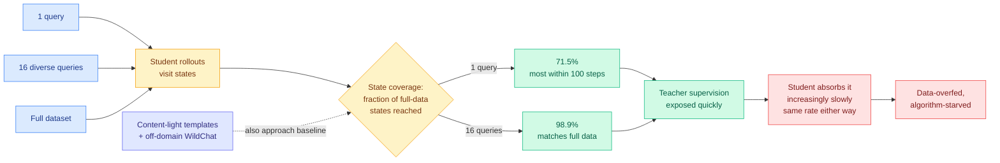

# Rethinking On-Policy Distillation of Large Language Models II: One Training Example

**Source:** HuggingFace Daily Papers · [arxiv 2609.04172](https://arxiv.org/abs/2609.04172) · Tsinghua University with UIUC, Johns Hopkins, Northeastern, UCAS
**Raw:** [raw/huggingface/2026-09-04-rethinking-on-policy-distillation-of-large-language-models.md](../../raw/huggingface/2026-09-04-rethinking-on-policy-distillation-of-large-language-models.md)

## TL;DR

On-policy distillation (OPD) trains a student on its own rollouts under dense token-level supervision from a teacher. It is now standard in frontier post-training (Qwen3, MiMo, GLM-5, DeepSeek-V4, Kimi K3). This paper trains OPD on **a single query** and finds it keeps improving for hundreds of steps and recovers most of full-data OPD's gain across task domains and model families. The explanation is a quantity the authors name **state coverage**, the fraction of the states full-data OPD visits that a query set's rollouts also reach. **One query already reaches 71.5%**, most of it inside the first 100 steps. **Sixteen semantically distinct queries reach 98.9% and match full-data training.** Meanwhile alignment with the teacher slows at the same rate whether you train on one query or the whole dataset. The conclusion is a sentence the field should absorb: **OPD is data-overfed but algorithm-starved.**

## The finding that changes what the data is for

The stress test is the sharpest part. **Content-light templates and off-domain WildChat queries also approach the real-query baseline.** Task content and induced state coverage come apart. The training query's job is not to supply the task, and not to supply a verifiable outcome; its job is to **make the student walk through a diverse enough set of reasoning states that the teacher has somewhere to put supervision.** A query that induces the right state distribution works even when its content is irrelevant to the target domain.

The state-coverage result extends to multi-teacher OPD as well: 16 semantically diverse queries per domain match full-data multi-teacher training.

And the negative half is the actionable half. If coverage saturates at 16 queries and roughly 100 steps, then everything after that is the student slowly absorbing supervision it was already shown. **Every research hour spent curating OPD datasets is being spent on the non-binding constraint.** The binding constraint is step efficiency, which almost nobody on this thread has worked on.

## Relation to prior wiki state

**This reframes the entire selective-supervision thread on [knowledge-distillation.md](knowledge-distillation.md), which is one of the longest-running threads in the wiki.** That thread has five axes, and every one of them is a filter that discards supervision:

- **which tokens** — [TIP (04-16)](2026-04-16-tip-token-importance-distillation.md) found most teacher-generated tokens carry no learning signal and roughly 10% suffice, extended through TA-OPD, TrOPD, FiRe-OPD, SG-OPD to [R2-OPD (08-25)](2026-08-25-r2-opd-reasoning-progress-filtering.md)
- **which layer** — OPRD (06-05), match teacher hidden states instead of output tokens
- **which trajectories** — [OPDVR (08-26)](2026-08-26-opdvr-distillation-verifiable-reward.md), gate on verified correctness
- **which teacher** — [QAH (08-26)](2026-08-26-quantization-aware-healing.md), distill from the original pre-compression model
- **which updates** — [IDA-OPD (09-03)](2026-09-03-ida-opd-influence-directed-distillation.md), label each update entropy-expanding or entropy-contracting before applying it

Yesterday's page entry already recorded that four granularities of the same finding (tokens, turns, reasoning spans, whole rollouts) all say most supervision is discardable. **Today's paper says the same thing about the input side and pushes it much further: not just most of the supervision, most of the training set.** A single query recovers most of the gain. Sixteen match it. That is the fifth and cheapest instance of the discardable-supervision pattern, and it is the first one measured on the *query* rather than on anything the teacher produced.

**It also lands squarely on the standing complaint that thread has carried for months, that the field keeps adding filters and never compares them.** If alignment slows at the same rate regardless of data supply, then a filter that improves *which* supervision the student sees is optimizing a quantity that was not limiting. **Some fraction of the five-axis literature may be reporting gains that a 16-query subset would also produce.** That is a cheap and rather uncomfortable ablation and it applies to almost every paper on the page.

**Against [IDA-OPD (09-03)](2026-09-03-ida-opd-influence-directed-distillation.md), the two are complements and the fit is unusually clean.** IDA-OPD's diagnosis was diversity distillation failure: pass@1 improves while pass@k plateaus because concentrating supervision concentrates the student's output distribution. Its fix works on the update, replacing entropy-contracting updates with divergence-adaptive advantage shrinkage. Today's paper works on the state distribution the updates are computed over. **IDA-OPD makes each step less collapsing; one-shot OPD says you need far fewer distinct queries but many more steps.** Both are arguing that the step, not the sample, is the unit that matters. Neither reports the other's metric: this paper does not report pass@k, which is exactly the omission IDA-OPD flagged as a question mark over a year of results on this page. **One-shot OPD trained on a single query is the most extreme distribution-concentrating setup imaginable, and it is the single best test case for IDA-OPD's failure mode. It was not run.**

**On [the Extrapolation Cliff (05-14)](2026-05-14-extrapolation-cliff-on-policy-distillation.md)**, which found a closed-form threshold above which on-policy distillation collapses: state coverage is a plausible mechanistic reading of that threshold. If the student cannot reach the states where the teacher's advantage lives, coverage is low regardless of dataset size, and no amount of data fixes it. The paper does not make this connection and it is a good one to test.

## Gaps

No pass@k, as above. Given IDA-OPD published the diversity-collapse result one day earlier, this is the most conspicuous missing measurement.

State coverage is defined relative to full-data OPD's visited states, which makes it a *relative* metric: it tells you a small query set reaches where the big one goes, not that either reaches where the teacher's competence actually lives. A coverage of 98.9% against a ceiling that is itself low is consistent with everything reported.

Model scale is not swept in the abstract's claims. Whether 16 queries suffices at frontier scale, where the labs actually run OPD, is the question the result implies and does not answer.

## Related

- [knowledge-distillation.md](knowledge-distillation.md) — concept page
- [IDA-OPD (09-03)](2026-09-03-ida-opd-influence-directed-distillation.md) · [OPDVR (08-26)](2026-08-26-opdvr-distillation-verifiable-reward.md)
- [The Extrapolation Cliff (05-14)](2026-05-14-extrapolation-cliff-on-policy-distillation.md)
- [Cliff (09-03)](../llms-foundation-models/2026-09-03-cliff-process-rewards-first-mistake.md)
