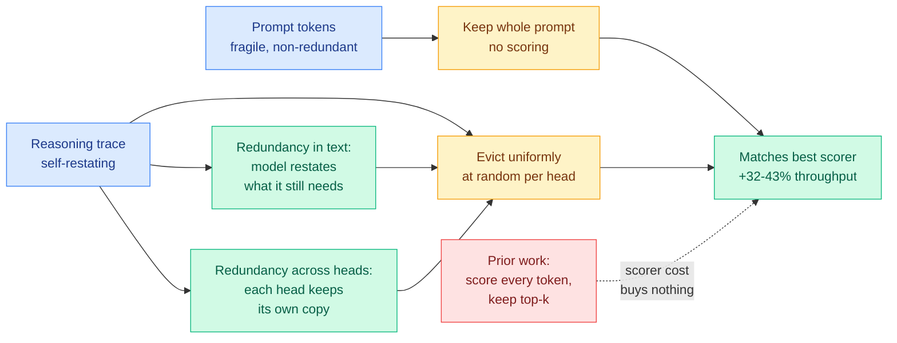

# Random Attention: Rethinking KV Cache Eviction for Efficient Reasoning

**Source:** HuggingFace Daily Papers · [arxiv 2609.03430](https://arxiv.org/abs/2609.03430) · [code](https://github.com/SalesforceAIResearch/Random-Attention) · Salesforce AI Research
**Raw:** [raw/huggingface/2026-09-04-random-attention-rethinking-kv-cache-eviction-for-efficient.md](../../raw/huggingface/2026-09-04-random-attention-rethinking-kv-cache-eviction-for-efficient.md)

## TL;DR

Every KV cache eviction method published in the last two years scores each cached token by some estimate of how much it will matter later, then keeps the top scorers. Random Attention keeps the prompt, evicts uniformly at random inside each attention head, and computes no score at all. Across four models and six reasoning tasks it matches the strongest prior evictor while serving **32-43% higher throughput** in vLLM. The paper's real contribution is not the method but the two controlled experiments explaining why the method works, which together say that **the selection signal the entire literature has been refining contributes almost nothing.**

## What the paper actually establishes

The method is a control condition promoted to a method. The findings are the two ablations that explain it.

**Finding 1: the prompt is the fragile part of the cache, and that is nearly the whole story.** When the authors compare scoring-based evictors against each other, most of the measured gap between them turns out to be *whether that scorer's signal happened to retain the prompt*. Score-based selection was never being rewarded for finding the important reasoning tokens. It was being rewarded, incidentally and unreliably, for protecting the prompt. Protect the prompt explicitly and the differences between scorers collapse.

**Finding 2: the reasoning trace protects itself, at two levels.** In the text, the model restates what it still needs as it works, so a dropped statement of a fact is usually recoverable from a later restatement of the same fact. Across attention heads, each head maintains its own copy of the trace, so a random draw that loses an entry in one head very likely retains it in another. Once the prompt is safe, a uniform random draw retains enough copies of what the model still needs. **Redundancy, not importance, is what makes the reasoning cache compressible.**

The throughput number follows directly. A scorer is work done on the critical path of every decode step; deleting it is a pure win if it was buying nothing.

## Relation to prior wiki state

**This closes a two-day arc on [kv-cache.md](kv-cache.md) in the most aggressive way available.** Yesterday that page recorded two papers from unconnected groups making the same diagnosis, that the mechanism deciding which KV entries to read has become the cost it was introduced to remove:

- [CRISP (09-03)](2026-09-03-crisp-cliff-aware-sparse-prefilling.md) kept the scorer and made it structurally free, replacing a Jensen-Shannon divergence over a pooled proxy attention map with a shape statistic that reproduces the same routing decisions. 5.30x attention speedup at 512K tokens.
- [Declarative Attention (09-03)](2026-09-03-declarative-attention.md) removed the scorer by asking the model to declare its own attention scope inside its chain-of-thought. Gemma-4-31B attended 52.0% fewer tokens for a 1.27pp accuracy drop, zero-shot.

The page stated the pair's rule as: prefill-side, the win is a better threshold; decode-side, the win is not scoring at all. **Random Attention is the third instance in two days and it is the strongest form of the decode-side half.** Declarative Attention still needs the model to say something. Random Attention needs nothing at all. Three papers, three groups, one week: the scorer is not the frontier, and one of them says it was never load-bearing.

**It supplies a mechanism for a result [VaSE (06-03)](2026-06-03-vase-value-aware-stochastic-kv-eviction.md) reported without one.** VaSE evicted stochastically with a large-magnitude value guard and worked. This page filed that as an empirical curiosity next to the deterministic top-k literature. Random Attention says why stochastic eviction was always viable: head-level redundancy means a random draw is sampling with many copies in the urn. VaSE's value guard and Random Attention's prompt guard are the same architectural move, protect the non-redundant part, and the rest of the design is free.

**It sharpens [the 07-28 impossibility result](2026-07-28-kv-eviction-error-certificates.md)** (deterministic top-k eviction cannot estimate the error it created) into something more useful than a warning. If the selection signal contributes almost nothing, then the inability to certify its error was never the binding problem. The binding problem was that the community was certifying a decision that did not need to be made.

**And it lands against [Eviction as Estimation (08-03)](2026-08-03-eviction-as-estimation-rmm.md)**, which found KV-eviction ablations do not measure the quantity they are trusted for and that gains appear specifically where reuse is endogenous and time-separated. Random Attention is that critique executed as an experiment: run the null hypothesis, discover it is not rejected.

**Tension with [CRISP](2026-09-03-crisp-cliff-aware-sparse-prefilling.md), unresolved.** CRISP's post-softmax mass cliff proof says attention mass falls onto a near-uniform floor and that a cumulative-coverage budget imports O(n) of that floor. That argument implies a *sharp* distinction between signal and floor at long context, which is a strong reason to select carefully. Random Attention says selection does not matter. Both are measured, and the likely reconciliation is regime: CRISP operates on the quadratic prefill pass over a 512K prompt, Random Attention on the decode-side reasoning trace whose redundancy structure the prompt does not share. **That reconciliation is a hypothesis, not a result, and nobody has run the two on the same workload.**

## Gaps

Reasoning tasks only. The self-protecting-trace mechanism is a property of long chains of thought that restate their own intermediate state, and there is no reason to expect it in summarization, retrieval, or the 140K-token agentic prefixes that dominate the [AgentX trace distribution](../hardware/2026-07-25-semianalysis-amd-cuda-moat.md). On a workload where the cache is mostly non-redundant prompt-like content, "keep the prompt and randomize the rest" degenerates to "keep everything."

The throughput number is measured (vLLM, real deployment), which is a genuine improvement over the proxy metrics this page complained about yesterday, when CRISP quoted attention speedup and Declarative Attention quoted attended-token reduction and neither reported realized latency. Random Attention reports serving throughput. **It is the first paper in this three-day cluster to close that gap.**

Not reported: whether the head-level redundancy that makes random draws safe survives at high tensor-parallel degree, where heads are split across devices, or in GQA and MQA models where heads already share KV by construction and the redundancy budget is smaller by design.

## Related

- [kv-cache.md](kv-cache.md) — concept page
- [CRISP (09-03)](2026-09-03-crisp-cliff-aware-sparse-prefilling.md) · [Declarative Attention (09-03)](2026-09-03-declarative-attention.md)
- [VaSE (06-03)](2026-06-03-vase-value-aware-stochastic-kv-eviction.md) · [Eviction as Estimation (08-03)](2026-08-03-eviction-as-estimation-rmm.md)
- [The Physics of LLM Inference (09-02)](../hardware/2026-09-02-physics-of-llm-inference-roofline.md) — why byte-reducing wins are the only wins that count at decode
