# Select, Compress, Reinvest: A Controlled Study of Visual-Token Allocation in Long-Video MLLMs

**arxiv:** [2609.03820](https://arxiv.org/abs/2609.03820) · **Source:** [HuggingFace Daily Papers 2026-09-05](../../raw/huggingface/2026-09-05-select-compress-reinvest-a-controlled-study-of-visual-token.md) · **Author:** Prakhar Khatri (single author) · **Categories:** cs.CV, cs.CL

## TL;DR

A long-video language model cannot look at every frame. An hour sampled once per second is 3,600 images and the model keeps a small fixed slice, typically eight or sixteen frames. Which frames survive that slice is normally written up as a preprocessing detail inside a paper whose real contribution is somewhere else. This paper promotes it to the object of study and runs the controlled experiment the area has never had: hold the frame scorer, the prompt boundary, the resolution policy and the answering model fixed, then vary exactly one decision at a time, across **six training-free selection rules, three long-video benchmarks and two answering models**.

Three findings, in the order the title gives them. **Selection is the largest single lever**: on LongVideoBench's hour-long bin, eight query-selected frames beat sixteen uniformly spaced ones by **6.9 points**, so halving the token budget and choosing well beats doubling it and choosing badly. **Compression is close to free**: halving each frame's spatial budget at fixed timestamps costs **at most 0.44 points**. And **reinvestment is where compression turns back into accuracy**: spending the freed tokens on twice as many compressed frames, at a measured cost no higher than the original eight, returns a **further two to three points**. Compression on its own banks a saving nobody spends, and only pays once the saving is spent.

The result that should unsettle the subfield is the identity of the winning selector. **Orthogonal Matching Pursuit, an unmodified sparse-approximation algorithm from the early 1990s, matches or comes within a point of every purpose-built selector compared against it, on all three benchmarks.** OMP was not designed for video, does not know what a query is in any semantic sense, and has no learned component. It treats frame selection as what it structurally is: pick a small subset of basis vectors that approximates the whole pool.

The paper also reports two measurement failures it found in itself, which is the part that makes the rest credible. It found an **implementation bug in its own AKS baseline**, and it measured a **0.07 to 3.74 point gap between two harnesses running the same published rules at the same budget**. That second number is the argument for the whole paper: a 3.74-point harness artifact is larger than most of the gains the frame-selection literature reports against each other.

## Mechanism

```mermaid
flowchart LR
  V[Hour of video<br/>3,600 frames at 1 fps] --> SEL{Selection<br/>which frames survive}
  SEL -->|uniform spacing| U[16 frames<br/>evenly spaced]
  SEL -->|query-conditioned<br/>OMP / AKS / others| Q[8 frames<br/>query-selected]
  Q -->|+6.9 pts over U| BASE[Baseline budget<br/>8 full-resolution frames]
  BASE --> CMP[Spatial compression<br/>halve per-frame budget<br/>timestamps unchanged]
  CMP -->|costs at most 0.44 pts| SAVE[Freed token budget]
  SAVE --> BANK[Bank the saving<br/>report a cheaper system]
  SAVE --> REI[Reinvest: 16 compressed frames<br/>at no higher measured cost]
  REI -->|+2 to 3 pts| OUT[Final accuracy]
  BANK -.->|no accuracy gain<br/>compression alone pays nothing| OUT
  HARN[Harness variance<br/>0.07 to 3.74 pts on<br/>identical published rules] -.->|larger than most<br/>reported deltas| SEL
  classDef input fill:#dbeafe,stroke:#3b82f6,color:#1e3a8a
  classDef decision fill:#fef3c7,stroke:#f59e0b,color:#78350f
  classDef output fill:#d1fae5,stroke:#10b981,color:#065f46
  classDef warn fill:#fee2e2,stroke:#ef4444,color:#7f1d1d
  class V,BASE input
  class SEL,CMP,SAVE decision
  class Q,REI,OUT output
  class U,BANK,HARN warn
```

## Key findings

- **Selection dominates budget.** Eight query-selected frames beat sixteen uniformly spaced ones by 6.9 points on LongVideoBench's hour-long bin. The token budget is not the binding constraint; the choice rule is.
- **OMP, unmodified, matches every purpose-built selector** across three benchmarks. A decades-old sparse-approximation algorithm with no video-specific machinery and no learned parameters is not beaten by the selectors designed for this exact task.
- **Spatial compression is nearly free but pays nothing on its own.** At most 0.44 points lost when each frame's spatial budget is halved at fixed timestamps. The accuracy only appears when the saved tokens buy more frames.
- **Reinvestment is a separate decision from compression** and is where the two-to-three-point gain lives. Papers that report a compression ratio without reporting what the savings bought are reporting half a result.
- **Cross-paper comparison in this area is unsound as currently practised.** Two harnesses running the same published rules at the same budget differ by up to 3.74 points, which exceeds most published margins between competing selectors.

## Relation to prior wiki state

**This is the fourth result in two days saying the learned selection layer does not justify its cost, and the pattern threshold is crossed.** [Random Attention (09-04)](2026-09-04-random-attention-kv-eviction.md) deleted the KV cache scorer entirely, evicted uniformly at random inside each attention head and matched the strongest prior evictor at **32 to 43 percent higher vLLM throughput**, showing that what the scorers were really being rewarded for was incidentally protecting the prompt. [One-shot on-policy distillation (09-04)](2026-09-04-one-example-on-policy-distillation.md) found a single training query recovers most of full-data gain and sixteen queries match it outright, meaning the elaborate data-selection literature was optimising a constraint that was not binding. Today SCR adds the visual-token axis with OMP, and [AutoTraceGT (09-05)](../agentic-systems/2026-09-05-autotracegt-grounded-theory-agent-traces.md) adds the trajectory-analysis axis, where a 1967 social-science coding method recovers 73 to 91 percent of hand-built failure taxonomies. **Four different subfields, four purpose-built learned selection layers, four classical or trivial baselines that match them.** The general statement the wiki can now make: in every case measured so far, the selection signal these systems compute is a small fraction of the value, and the structural constraint (keep the prompt, cover the state space, span the frame pool) is nearly all of it.

**It supplies the missing decision on [test-time compute allocation](test-time-compute-allocation.md).** That page's table has five decisions: whether to spend at all, when to stop, where to spend across traces, how to spend more cheaply, and who should spend it. SCR names a sixth that none of them cover: **what to do with a saving once you have it.** [Gambit (08-16)](2026-08-16-gambit-thought-level-beam-search.md), which kills weak reasoning traces and immediately re-branches from strong prefixes rather than letting the freed KV memory sit idle, is the only prior entry on that page that implicitly answers it, and its stated advantage over subtractive pruning methods is precisely reinvestment: pruning "frees that memory and then wastes it, starving the hardware." SCR is the same argument in a different modality with the ablation attached.

**It also partially answers that page's first open problem.** The page flagged an unresolved methodological objection, that reported allocation gains may be the variance of drawing more samples rather than a real allocation effect, and noted nobody had run the audit. SCR does not run the sampling-luck audit, but it runs the adjacent one: it shows that a **harness artifact of up to 3.74 points** contaminates cross-paper comparison in its area, and it fixes that by running every rule inside one harness. That is the same class of correction applied to a different confound.

**Against the visual-token compression line specifically, it reframes what those papers were measuring.** [OmniScope (07-31)](2026-07-31-omniscope-modality-decoupled-token-compression.md) showed that audio relevance and video relevance peak at different moments for the same query, so estimating salience from one modality throws away the answer in the other, and delivered up to 3.53x prefill speedup at 25 percent token retention for a 0.35-point drop. [DPVR (06-10)](../ai-routing/2026-06-10-dpvr-vision-token-routing.md) showed vision tokens saturate by the middle layers and routed them into a one-layer side branch. Both are compression results reported as compression ratios. SCR's reinvestment finding says the interesting question for both is what happens when you spend the saving rather than bank it, and neither reports that experiment.

## Gaps

Single author, single harness, three benchmarks, two answering models, and all selection rules are training-free, so the comparison is silent on whether a *trained* selector beats OMP once you pay for the training. The reinvestment result is reported at one budget doubling (8 to 16 compressed frames); nobody shows where the curve turns over, and it must, since 3,600 quarter-resolution frames is not better than 16 good ones. The harness gap is measured between two harnesses, which establishes that the artifact exists but not its distribution. And the whole study is long-video question answering, where the query is available before selection; a streaming or agentic setting where frames arrive before the question does is a different problem and OMP's query-agnostic structure might do relatively better or worse there.

## Industrial implication

If you ship a long-video system with a learned frame selector, the cheap experiment is to drop OMP in as a control before your next optimisation cycle, exactly as [Random Attention](2026-09-04-random-attention-kv-eviction.md) argued for KV eviction. If it ties, the selector is a deletable line item. The second cheap experiment is the reinvestment ablation: most production video stacks compress frames and pocket the saving as a lower serving bill, and this paper says the same budget spent on more compressed frames is worth two to three accuracy points that are currently being left on the table.

## Related pages

- [Test-Time Compute Allocation](test-time-compute-allocation.md)
- [Random Attention (09-04)](2026-09-04-random-attention-kv-eviction.md)
- [OmniScope (07-31)](2026-07-31-omniscope-modality-decoupled-token-compression.md)
- [DPVR vision token routing (06-10)](../ai-routing/2026-06-10-dpvr-vision-token-routing.md)
- [Daily digest 2026-09-05](../daily-digest/2026-09/2026-09-05.md)
