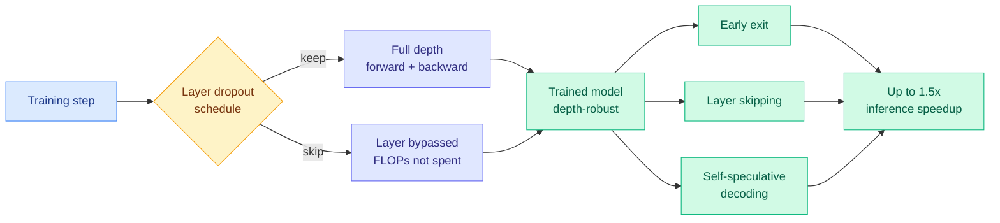

# Don't Drop Dropout: Optimizing Layer Sparsity for Efficient LLM Training and Inference

**Source:** HuggingFace Daily Papers, 2026-09-07 · [arXiv 2609.05275](https://arxiv.org/abs/2609.05275) · [raw](../../raw/huggingface/2026-09-07-don-t-drop-dropout-optimizing-layer-sparsity-for-efficient-l.md)

**TL;DR.** Layer dropout (randomly skipping whole transformer layers during a training step, also called stochastic depth) quietly disappeared from large-language-model pre-training recipes because a few groups reported it hurt accuracy. This paper runs the study nobody ran: **more than 2,400 training runs, models from 271M to 8.2B parameters, datasets up to 160B tokens**. With the right layer distribution, time schedule and optimizer hyperparameters, layer dropout reaches **lower loss at equal training FLOPs**, or the same validation loss while **saving up to 25% of training FLOPs**. It also leaves the trained model with a property the baseline does not have: robustness to having layers removed at inference, which unlocks early exit, intermediate-layer skipping and self-speculative decoding for **up to 1.5x inference speedup at negligible accuracy cost**. All pre-training ran on Cerebras CS-3 systems.

## What it actually claims

Three claims, in ascending order of how much they should change practice.

1. **The accuracy-degradation reports were about hyperparameters, not about layer dropout.** Prior work reported dropout hurting LLM quality; nobody quantified the effect or tried to mitigate it. Sweeping the layer distribution (which layers get dropped, and at what rate), the time schedule (when in the run the dropout is active), and the optimizer settings turns the reported regression into a gain at matched FLOPs.
2. **The training saving is real and it scales.** Up to 25% of training FLOPs at equal-or-better validation loss, verified across a 30x parameter range and up to 160B tokens. The saving comes from not computing the skipped layers, which is the cleanest possible form of compute reduction: no gather, no mask, no irregular memory access.
3. **The inference saving is a free byproduct, and it is the more interesting half.** A model trained with layer dropout has been trained to produce a usable representation at many depths, so removing layers post-hoc is a distribution the model has already seen. Three separate post-training optimizations become available on the same checkpoint: early exit (stop at layer k when confident), intermediate-layer skipping, and self-speculative decoding (the shallow sub-network drafts, the full network verifies).

## Relation to prior wiki state

**This is the direct answer to the one-line state of knowledge on [model pruning and sparsity](model-pruning-sparsity.md): "sparsity is easy to find and hard to spend."** That page's whole argument is that nearly every study finds importance wildly non-uniform, and that what decides whether the finding becomes a speedup is entirely whether the surviving pattern is one the hardware can schedule. Layer dropout inverts the order of operations. Instead of training densely, measuring redundancy afterwards and discovering the redundant pattern is unschedulable, it **decides the granularity up front at the one granularity that is always schedulable, the whole layer**, and then trains the model to be robust at that granularity. Sparsity you created is sparsity you can spend.

**It also routes around the criterion problem the page crossed its pattern threshold on.** [Functional Degeneracy in Neural Networks (09-02)](2026-09-02-functional-degeneracy-pruning.md) showed that functional redundancy is distributed across *parameter directions*, which are linear combinations of many weights, and is therefore invisible to any criterion scoring an individual weight or neuron. That is an indictment of post-hoc importance scoring. Layer dropout never scores anything. It does not need to know which layers are redundant, because it makes every layer individually droppable by construction. **The page has been arguing about how to measure redundancy; this paper says you can decline to measure it.**

**On the [speculative decoding](speculative-decoding.md) page it is the second draft-free route to arrive in one day.** That page's persistent structural cost is the drafter: [DraftExpert (08-03)](2026-08-03-draftexpert-moe-self-speculative-decoding.md) found that on end-device MoE inference a better drafter is a slower one, because growing the draft expert set triggers extra expert loading. Self-speculative decoding removes the separate drafter entirely by using the model's own shallow prefix as the draft. [Uno (09-07)](2026-09-07-uno-discrete-diffusion-lossless-speedup.md), the day's other acceleration result, removes it a different way, by adding lightweight diffusion weights that sample in parallel from the autoregressive model's own distribution. **Two independent groups, same day, both deleting the draft model. Neither cites the other, and the two are composable in principle: an Uno-augmented model whose autoregressive weights were pre-trained with layer dropout has two orthogonal parallelism sources.**

## Gaps

Every pre-training run is on Cerebras CS-3 hardware, whose wafer-scale memory model makes layer skipping cheaper to exploit than it is on a GPU cluster where layers are pipeline-sharded across devices. **A skipped layer on a pipeline stage does not return its FLOPs as wall-clock unless the schedule can absorb the bubble**, and no GPU-cluster wall-clock number is reported. The 1.5x inference figure is not broken down by which of the three post-training mechanisms produced it, so it is not clear whether early exit, skipping and self-speculation compose or substitute. And 8.2B is well below the scale where the reported degradation originally appeared.

## Related

- [Model pruning and sparsity](model-pruning-sparsity.md) · [Speculative decoding](speculative-decoding.md) · [Uno (09-07)](2026-09-07-uno-discrete-diffusion-lossless-speedup.md)
- [Daily digest 2026-09-07](../daily-digest/2026-09/2026-09-07.md)
