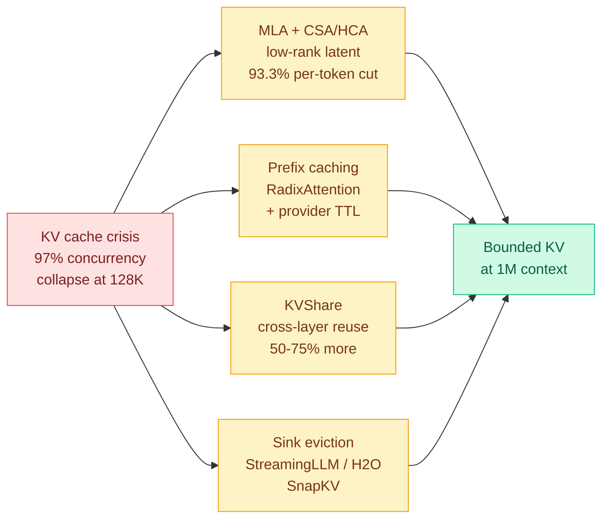

# The KV Cache Frontier: MLA, global prefix caching, KVShare and sink eviction

**Source:** RSS, Ken Huang / DistributedApps.ai, Chapter 2 of *The Physics and Engineering of Frontier LLM Inference* · [post](https://kenhuangus.substack.com/p/chapter-2-the-kv-cache-frontier-hybrid) · [raw](../../raw/rss/2026-09-06-agentic-ai-chapter-2-the-kv-cache-frontier-hybrid-compressed-spars.md)

**TL;DR.** Chapter 1 of this series established that inference is memory-bound. Chapter 2 does the arithmetic that turns that into an operations problem, and the number to carry is **97%**. On an 8x H100 node with roughly 450 GB left for KV memory after weights and workspace, a Llama-3-70B-class grouped-query model in FP16 costs **327.68 KB of VRAM per token**, so a single 128K-token session consumes **41.94 GB of pure KV cache**. In a 4K-token chat regime that node comfortably serves **340-plus concurrent streams**. The moment users start submitting 128K-token coding repositories, maximum concurrency **collapses to about 10**. That is a 97% loss of serving density from a change in user behaviour, not a change in model or hardware. The chapter then lays out the four architectural responses the frontier labs actually deployed against it.

## The four levers, and what each is actually buying

**1. Multi-head latent attention, and DeepSeek-V4's hybrid compressed sparse attention.** MLA projects the key and value states into a shared **512-dimensional low-rank latent vector** and carries a separate **64-dimensional decoupled rotary positional key**, for a **93.3% reduction in per-token KV footprint** while keeping 128 attention heads' worth of expressiveness. The decoupling is the non-obvious part and the chapter is explicit about why: rotary position embeddings do not commute with the low-rank projection, so a naive low-rank compression breaks positional information. Separating the content vector from the positional key is what makes the absorption legal. At inference the up-projection matrices are pre-multiplied into the query projections, so the high-dimensional KV tensors are never reconstructed at all.

**2. Global prefix caching as a radix tree.** SGLang's RadixAttention represents the cache as a dynamic radix tree over token sequences, so shared system prompts, codebase trees and few-shot blocks are matched, reused and evicted by least-recently-used order. The chapter prices the provider version directly: Anthropic's prompt caching writes at roughly **1.25x** the base input rate and reads at roughly **0.1x**, on a **5-minute sliding TTL**, which sets a concrete break-even on how often a prefix must be reused before caching it pays.

**3. KVShare, cross-layer deduplication.** In 60-plus-layer topologies the KV projections of adjacent layers have high cosine similarity, so anchor layers can serve follower layers at 1:2 or 1:4 ratios for **an additional 50% to 75%** memory reduction. This is a redundancy nobody on this wiki had recorded: every other method here compresses along the token axis or the head axis, and this one compresses along **depth**.

**4. Dynamic sparsification and sink eviction.** StreamingLLM's attention sinks, H2O's heavy-hitter cumulative attention tracking, and SnapKV's prompt observation clustering, used to hold a bounded cache during unbounded generation.

## Relation to prior wiki state

**It supplies the fourth axis the [KV cache](kv-cache.md) page did not have.** That page's methods compress along tokens (eviction, sparse selection), along heads (MISA, grouped-query), and along the sequence upstream (LatentPress, LatentStream). **KVShare compresses along layer depth, and the page has no entry for it.** Depth-wise sharing is also multiplicative with everything else on the page rather than competing with it, which makes it the highest-leverage unexplored axis currently recorded.

**Same-day resonance with a training-side result.** [Don't Drop Dropout (09-07)](2026-09-07-dont-drop-dropout-layer-sparsity.md) finds that layers are individually removable if you train for it. KVShare finds that adjacent layers' KV projections are near-duplicates at inference. **Two independent observations that the depth axis carries much less independent information than the parameter count implies**, one on the training side and one on the serving side, and neither knows about the other.

**It prices the pressure behind the whole 09-03 to 09-04 arc.** [CRISP (09-03)](2026-09-03-crisp-cliff-aware-sparse-prefilling.md) made the prefill scorer structurally free and proved the post-softmax mass cliff; [Declarative Attention (09-03)](2026-09-03-declarative-attention.md) deleted the decode-side scorer by having the model declare its own attention scope; [Random Attention (09-04)](2026-09-04-random-attention-kv-eviction.md) showed that on reasoning traces you can evict uniformly at random inside each head and match the strongest scorer at 32-43% higher vLLM throughput. **This chapter is the operations context those three papers were solving for.** The 340-to-10 concurrency collapse is what makes a 30-to-50% read reduction commercially decisive rather than a benchmark curiosity.

**One honest caveat about the source.** Everything past the roadmap is behind a paid subscription, so the derivations, the runnable MLA and RadixAttention implementations, and the production failure-mode section (radix-tree fragmentation under high chat churn, FP8/FP4 dequantization overflow in the low-rank path) are announced rather than read. **The FP8/FP4 low-rank dequantization hazard is the item most worth chasing**, because it is the exact interaction between two of this wiki's Tier 1 areas that nobody has measured.

## Related

- [KV cache](kv-cache.md) · [Memory hierarchy](../hardware/memory-hierarchy.md) · [Chapter 1: the physics of LLM inference (09-02)](../hardware/2026-09-02-physics-of-llm-inference-roofline.md)
- [Daily digest 2026-09-07](../daily-digest/2026-09/2026-09-07.md)
