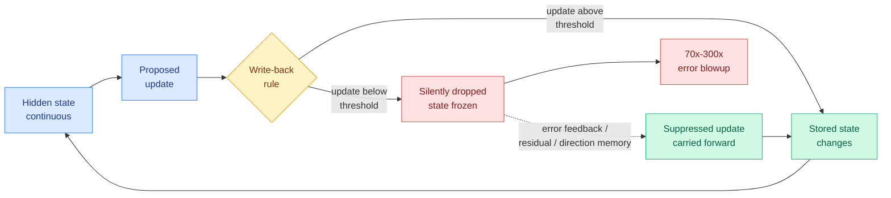

# When Quantization Breaks Memory: recurrent-state write-back in low-precision inference

**Source:** HuggingFace Daily Papers, 2026-09-07 · [arXiv 2609.04490](https://arxiv.org/abs/2609.04490) · [raw](../../raw/huggingface/2026-09-07-when-quantization-breaks-memory-recurrent-state-write-back-i.md)

**TL;DR.** Quantization is normally analysed as a lossy encoding of weights and activations: you lose some precision, you lose some accuracy, the relationship is roughly monotone. **In a recurrent network that reasoning fails, because the quantized state is written down and then read back as the input to the next timestep, so the rule used to store it changes the computation rather than merely approximating it.** The paper names this rule **recurrent-state write-back** and isolates it in a compact GRU encoder-decoder. Holding the trained model completely fixed and replacing continuous state propagation with deterministic 4-bit state storage increases estimation error by roughly **70x on one target parameter and 300x on the other**. The failure mode is specific and nasty: repeated small updates fall below the write threshold, so the stored state stays nearly frozen while the network keeps proposing changes that are silently discarded. Error feedback, residual memory and direction memory carry the suppressed updates forward and **recover accuracy without any retraining**.

## The three results, and why the second one is the one to remember

1. **The blowup.** Deterministic 4-bit state storage, applied post-hoc to a fixed trained model, raises error on the short-lived lifetime parameter by about 70x and on the long-lived one by about 300x. The application is fluorescence lifetime imaging, a quantitative biological-imaging modality, but the mechanism has nothing to do with biology.
2. **Increasing state precision can make a fixed recurrent solution worse.** This is the counterintuitive one and it breaks the standard mental model outright. Precision sweeps do not produce a monotone accuracy curve, because the trained solution was tuned against a particular state interface and changing that interface in either direction is a perturbation. **Quantization of a recurrent state is not a lossy approximation of the original computation. It is a different dynamical system.**
3. **Compatibility with the state interface is learnable, and the failure generalizes.** Matched training, where the model is trained against the quantized write-back rule it will be served under, recovers the accuracy. And an independently trained LSTM reproduces the whole pattern, with the **cell state more sensitive than the hidden state**, which is the expected ordering if the mechanism is about accumulated small updates being discarded.

## Why this belongs in the Tier 1 efficiency thread rather than in imaging

Nothing in the mechanism depends on GRUs or on microscopy. It depends on one structural property: **a state that is quantized, stored, and read back as an input at the next step.** That property is now spreading through language-model serving.

**The direct collision is with bounded-cache designs.** [Maglev (08-16)](2026-08-16-maglev-sliding-recurrent-memory.md) removes the KV eviction decision entirely by replacing the growing cache with a **fixed-size recurrent memory**, and the [KV cache](kv-cache.md) page treats that as one of the two live answers to the capacity problem. A fixed-size recurrent memory is precisely a state that is written and read back every step. **If you quantize it, which is the obvious next efficiency move and the one everyone will make, this paper says the failure is not a graceful accuracy taper.** Nobody has run that experiment, and the same argument applies to linear-attention and state-space hybrids, whose recurrent state is the whole point of the architecture.

**It also complicates a claim on the [knowledge distillation](knowledge-distillation.md) page.** [QAH (08-26)](2026-08-26-quantization-aware-healing.md) reframed quantization as a second full distillation pass against the original teacher, and reported that a GPT-OSS 120B compressed to 60B and quantized to MXFP4 beats the 60B architecture's own bfloat16 checkpoint on 7 of 9 benchmarks. That reframing treats quantization as recoverable information loss, and for a feedforward stack it is. **This paper's matched-training result is QAH's argument applied to a recurrent state, and its post-hoc result is what happens when you skip that step: not information loss, but a changed update rule that no amount of healing on a fixed interface will find.**

## Gaps

The model is a compact GRU encoder-decoder on a single scientific task, so the 70x and 300x figures are properties of that system and should not be quoted as a general magnitude. **No transformer, no state-space model, and no language task is tested**, which leaves the generalization I have argued for above as an argument rather than a result. The three mitigations (error feedback, residual memory, direction memory) are reported as recovering accuracy without a cost comparison, and error feedback in particular requires carrying an extra full-precision residual per state element, which partly gives back the memory the quantization was for. And the paper does not report where the write threshold sits relative to the update magnitude distribution, which is the quantity that would let a reader predict whether their own system is in the failure regime.

## Related

- [KV cache](kv-cache.md) · [Knowledge distillation](knowledge-distillation.md) · [Model pruning and sparsity](model-pruning-sparsity.md) · [Memory hierarchy](../hardware/memory-hierarchy.md)
- [Daily digest 2026-09-07](../daily-digest/2026-09/2026-09-07.md)
