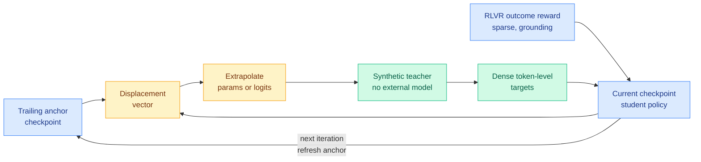

# RISE: Recursive Improvement via Self-Extrapolating Policy Distillation

**Source:** HuggingFace Daily Papers, 2026-09-07 · [arXiv 2609.05295](https://arxiv.org/abs/2609.05295) · [raw](../../raw/huggingface/2026-09-07-rise-recursive-improvement-via-self-extrapolating-policy-dis.md)

**TL;DR.** On-policy distillation gives dense per-token supervision, but it is capped by the teacher. An external teacher brings distribution mismatch, and self-distillation with privileged conditioning is limited by how much the model can absorb in context. **RISE builds the teacher out of the model's own optimization history.** It takes the displacement between the current checkpoint and a trailing anchor checkpoint, extrapolates along it (in parameter space or in output-logit space), and treats the extrapolated model as a synthetic teacher. That converts a **sparse, outcome-induced parameter update from reinforcement learning with verifiable rewards into a dense token-level target**, with no external model and no privileged conditioning. Because the anchor is refreshed each iteration as the student improves, distillation stops being a one-shot compression step and becomes a recursive improvement loop. It beats both RLVR-only training and on-policy self-distillation on math reasoning, multi-domain STEM, code generation and multi-turn agentic tasks.

## Why the mechanism is the interesting part

The trick is a conversion between two supervision densities that the field has treated as incommensurable. RLVR gives you one bit at the end of a rollout, and every credit-assignment method on this wiki is an attempt to spread that bit backwards over tokens. On-policy distillation gives you a full distribution at every token, but only if you have a teacher whose distribution is worth copying.

RISE observes that **the RLVR update itself already contains directional information about where a better policy lies.** The difference between the checkpoint now and the checkpoint N steps ago is a vector pointing in the direction improvement has been happening. Step further along that vector and you get a model that is, by construction, slightly ahead of the student on the same trajectory. Its per-token distribution is then a dense target, and it is on-distribution by construction because it was produced by moving the student, not by importing a different model.

The two roles are complementary rather than redundant. **The outcome reward grounds the extrapolation** (it prevents the direction from drifting into a region that only looks like improvement) and **the extrapolated teacher refines token-level decisions** (it converts the grounded direction into supervision at a resolution the outcome reward could never reach).

## Relation to prior wiki state

**The [knowledge distillation](knowledge-distillation.md) page tracks six selective-supervision axes, and RISE does not add a seventh. It attacks the premise all six share.** Every existing axis is a filter over supervision the teacher already produced: which tokens (TIP, 04-16, most teacher tokens carry no learning signal and roughly 10% suffice), which layer (OPRD, 06-05, match hidden states rather than output tokens), which trajectories ([OPDVR, 08-26](2026-08-26-opdvr-distillation-verifiable-reward.md), gate on verified correctness), which teacher ([QAH, 08-26](2026-08-26-quantization-aware-healing.md), distill from the original pre-compression model), which updates ([IDA-OPD, 09-03](2026-09-03-ida-opd-influence-directed-distillation.md), label each update entropy-expanding or contracting), which queries ([One-Example OPD, 09-04](2026-09-04-one-example-on-policy-distillation.md), sixteen queries reach 98.9% state coverage). **RISE does not select supervision. It manufactures a teacher.** The axis is not which supervision to keep, it is where supervision comes from at all.

**That lands directly on the page's strongest three-instance pattern.** OPRD, OPDVR and QAH independently concluded that **in distillation the binding constraint is usually the supervisor, not the student**, and their three fixes were change the layer, add a verifier, change the teacher. RISE is the fourth instance and the most literal reading of the diagnosis: if the supervisor is the constraint, build a better supervisor out of the only thing guaranteed to be on-distribution, which is the student's own path.

**It is also the constructive answer to One-Example OPD's verdict that "OPD is data-overfed but algorithm-starved."** That paper found training on a *single* query keeps improving for hundreds of steps and recovers most of full-data OPD's gain, and concluded the field has been optimizing data supply when the algorithm was the shortfall. RISE is an algorithm change with no data change at all. **The composition is obvious and unrun: RISE's synthetic teacher on One-Example OPD's sixteen-query budget would test whether the two independent findings multiply.**

**The name should worry you, and the page has a reason.** [The Extrapolation Cliff (05-14)](2026-05-14-extrapolation-cliff-on-policy-distillation.md) found a closed-form threshold above which on-policy distillation collapses, and RISE's entire mechanism is extrapolation along a displacement vector. **How far you may step, and what happens as the anchor gets stale, is exactly the quantity that paper says has a cliff.** The abstract reports no extrapolation-coefficient sensitivity and no anchor-distance ablation, which is the single most important missing experiment.

**One more gap the page should hold it to.** [IDA-OPD (09-03)](2026-09-03-ida-opd-influence-directed-distillation.md) showed that concentrating supervision concentrates the student's output distribution, producing rising pass@1 with flat pass@k, and this page has since treated a missing pass@k as a red flag on any selective-supervision result. **A teacher extrapolated from the student's own direction of travel is the most self-reinforcing supervision signal on the page**, and RISE reports no pass@k.

## Related

- [Knowledge distillation](knowledge-distillation.md) · [RL for LLMs](../llms-foundation-models/rl-for-llms.md) · [GAPO (09-07)](../llms-foundation-models/2026-09-07-gapo-group-adaptive-clipping.md)
- [Daily digest 2026-09-07](../daily-digest/2026-09/2026-09-07.md)
