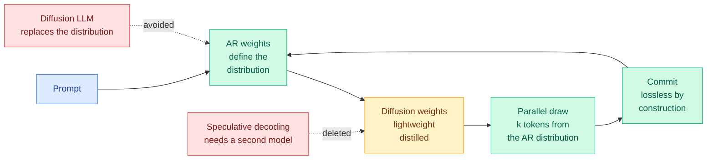

# Uno: Unlocking Lossless Speedups in LLMs via Discrete Diffusion

**Source:** X home feed (@dair_ai) · [arXiv 2609.04010](https://arxiv.org/abs/2609.04010) · alphaxiv overview consulted

**TL;DR.** Speculative decoding buys parallel token generation by paying for a second model, the draft model. Diffusion language models buy it by giving up the quality of the autoregressive model they replace. **Uno buys it with neither.** It splits the parameters in two: the autoregressive weights define the model's distribution and train under ordinary next-token prediction, and a small set of **diffusion weights, added by a short distillation phase, draws several tokens in parallel from that same autoregressive distribution.** Because the sampler draws from the autoregressive distribution itself rather than approximating it, the speedup is **lossless**. An existing open-weight autoregressive model can be upgraded rather than retrained. Uno beats leading speculative-decoding methods at **every evaluated batch size including the largest the device supports**, reaching up to **3x** over the base model, and the 8B Uno outperforms the 26B DiffusionGemma and the proprietary Mercury 2 on agentic tool use, coding and long-context reasoning. From the Institute of Foundation Models with UIUC, Cornell Tech, Harvard and Cerebras Systems.

## The mechanism, and why the batch-size result is the headline

The three existing families each fail somewhere specific. **Speculative decoding** proposes with a small draft model and verifies with the large one; the speedup depends on the alignment of two separate models and on there being spare compute to run the verification, which is exactly what disappears at large batch. **Discrete diffusion language models** generate in parallel natively but define a different distribution than the autoregressive model, so they trade quality for speed, and their speedups shrink as batch size grows. **Multi-token prediction** bolts extra heads on and has generally measured slower than speculative decoding.

Uno's structural move is to **decouple the weights that determine quality from the weights that determine speed**. The autoregressive parameters are the model, untouched and unmodified. The diffusion parameters are a sampler for that model, obtained by a short distillation pass that the authors describe as negligible overhead on an existing training pipeline. Because the object being sampled from is the autoregressive distribution, there is no acceptance test to fail and no quality to lose. That is a stronger guarantee than speculative decoding's, which is lossless only because the rejection-sampling verification is exact, and which pays for that exactness in verification compute.

**The batch-size claim is the one to carry.** Every acceleration method on the [speculative decoding](speculative-decoding.md) page has its numbers quoted at low batch, where the accelerator is idle and free parallelism exists. Real agentic serving runs at whatever batch the memory allows. A method that still wins **at the largest batch the device supports** is claiming its speedup survives the regime where speculative decoding's advantage is usually eaten by contention.

## Relation to prior wiki state

**Two draft-free acceleration results landed on the same day, from unconnected groups, with one shared author affiliation.** [Don't Drop Dropout (09-07)](2026-09-07-dont-drop-dropout-layer-sparsity.md) gets self-speculative decoding for free by training a model to be robust at reduced depth, so the shallow prefix is the drafter. Uno gets parallel decoding by adding a diffusion sampler over the model's own distribution. **Cerebras authors appear on both.** Different mechanisms, same target: the separate draft model is the thing to delete. The [speculative decoding](speculative-decoding.md) page has spent the year on how to make drafters cheaper. Both of today's results say the drafter is optional.

**It sharpens DraftExpert's structural claim rather than contradicting it.** [DraftExpert (08-03)](2026-08-03-draftexpert-moe-self-speculative-decoding.md) found that once weights are paged, speculation and memory prefetch are the same computation, because a drafter trained to agree with the target's router is a prefetch oracle. That argument depends on there being a drafter with a router opinion. **Uno has no drafter, so on a paged on-device MoE it supplies parallelism without supplying a prefetch signal.** Whether that is a net loss on memory-constrained hardware is untested and is the obvious composition question.

**It also lands on the constraint [the physics of LLM inference (09-02)](../hardware/2026-09-02-physics-of-llm-inference-roofline.md) made non-negotiable**, that a 70B FP8 model spends 99.66% of every decode step moving bytes at under 0.3% of peak Tensor Core throughput. Drawing k tokens per weight-load pass is a direct multiplication of arithmetic intensity, and unlike batching it does not require k concurrent users.

## Gaps

No ablation is reported on how the distillation phase's cost scales with model size, and "negligible overhead" is asserted rather than priced. The claim of losslessness rests on the diffusion sampler drawing exactly from the autoregressive distribution, which is a property of the training objective, not something the runtime verifies per token the way rejection sampling does. **A speculative decoder is lossless because it checks; Uno is lossless because it was trained to be**, and those are different reliability guarantees under distribution shift. No KV-cache interaction is reported, which matters because parallel commitment of k tokens changes the cache write pattern.

## Related

- [Speculative decoding](speculative-decoding.md) · [Don't Drop Dropout (09-07)](2026-09-07-dont-drop-dropout-layer-sparsity.md) · [KV cache](kv-cache.md)
- [Daily digest 2026-09-07](../daily-digest/2026-09/2026-09-07.md)
