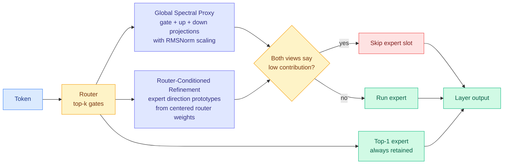

# ACE: Adaptive Calibration-Free Expert Skipping for MoE-based LLMs

**Source:** arXiv [2609.05228](https://arxiv.org/abs/2609.05228) · Zukang Xu, Zhixiong Zhao, Xing Hu, Jiangyong Yu, Houji Wen, Jun Li, Zhe Jiang, Dawei Yang
**Signal:** Kurate cs.AI weekly leaderboard #20, ai_rating 6.0/10, inferred tier 1. Not on HuggingFace.
**Raw:** `raw/kurate/2026-09-08-cs-ai.md`
**Date ingested:** 2026-09-08

---

## TL;DR

A mixture-of-experts model (MoE, where each token is routed through a small subset of specialized sub-networks rather than the whole model) uses fixed top-k routing: every token activates exactly k expert slots, whether it needs them or not. That is a lot of redundant compute on easy tokens. Prior expert-skipping methods decide what to drop using router confidence, a calibration dataset, or extra training, and ACE's argument is that none of those actually measure **how much a routed expert contributes**. ACE is **training-free, calibration-free, and checkpoint-preserving**: it estimates each expert's contribution two independent ways, skips a slot only when **both** views call it low-contribution, and always keeps the top-1 expert. All statistics are precomputed offline, so the online cost is table lookups and scalar arithmetic. At a **50% skipping ratio on Qwen3.6-35B-A3B, it cuts WikiText-2 perplexity 7.96% and lifts average downstream accuracy 4.15 points** over the strongest competing method.

---

## Mechanism

**Global Spectral Proxy (GSP)** estimates an expert's global transformation capacity from the *coupled* gate, up and down projections together with the RMSNorm scaling, rather than scoring any single matrix. That coupling matters: in a gated feed-forward expert the three projections compose, so a large-magnitude down-projection paired with a near-zero gate contributes nothing, and any criterion looking at one matrix at a time will misread it.

**Router-Conditioned Refinement (RCR)** builds an expert-specific direction prototype from **centered** router weights and evaluates each expert's response *along the directions routing actually prefers*. GSP asks "how much can this expert transform anything." RCR asks "how much does it transform the things routed to it." They fail differently, which is why requiring both to agree is the right conjunction and not just conservatism.

**The AND-gate is the design decision.** Skipping only when two independent estimators agree buys robustness at the cost of skipping less aggressively than either alone would. The paper reports that ACE's margin over baselines *widens* as the skipping ratio grows, which is the signature you would expect: at gentle ratios everything works, and the conjunction only pays when the decision gets hard.

---

## How this relates to prior wiki pages

**It lands squarely on the [pruning and sparsity page](model-pruning-sparsity.md)'s one-line state of knowledge: *sparsity is easy to find and hard to spend.*** The reason ACE is on the spendable side is that **an unrun expert is a whole matmul block that never executes.** No mask, no gather, no irregular memory access. That is the same structural argument [Don't Drop Dropout (09-07)](2026-09-07-dont-drop-dropout-layer-sparsity.md) made for the layer granularity, where 2,400 runs from 271M to 8.2B parameters showed tuned layer dropout gives lower loss at equal training FLOPs, up to 25% FLOPs saved, precisely because the whole layer is the one granularity that is always schedulable. **Expert slot and whole layer are the two structures a serving stack can skip for free.** ACE is the second entry on this page choosing granularity for schedulability rather than for measured redundancy, and the first at the expert axis.

**It is a direct answer to the criterion indictment this page crossed a pattern threshold on.** The 09-02 entry recorded three independent results saying the standard redundancy criterion does not measure redundancy, with [Functional Degeneracy (09-02)](2026-09-02-functional-degeneracy-pruning.md) giving the mechanism: functional redundancy is distributed across **parameter directions**, linear combinations of many weights, so it is invisible to any criterion scoring an individual weight or neuron. **GSP is a direction-aware criterion by construction** (spectral, over coupled projections), and RCR is explicitly a *directional* response measure. ACE is the first method on this page whose criterion is built at the granularity Functional Degeneracy said the redundancy actually lives at. Whether it captures enough of that structure is untested against the behavioral recovery rank benchmark that paper proposed, and that comparison is the obvious next experiment.

**It is the third result in a week deleting a learned selection layer.** [Random Attention (09-04)](2026-09-04-random-attention-kv-eviction.md) removed the KV cache importance scorer entirely and evicted uniformly at random inside each head, matching the strongest prior evictor at 32-43% higher throughput. [Select, Compress, Reinvest (09-05)](2026-09-05-select-compress-reinvest-visual-tokens.md) found Orthogonal Matching Pursuit, an unmodified sparse-approximation algorithm from the early 1990s, matching every purpose-built long-video frame selector. **ACE deletes the calibration set and the training step, which is the same move at the setup layer rather than the runtime layer.** The [test-time compute allocation page](test-time-compute-allocation.md) has been tracking this as the deletable-learned-selection-layer pattern; ACE is a further instance, and it strengthens the pattern because it deletes the *data dependency* rather than the scorer. A calibration-free method has no distribution-shift failure mode, which is the quiet reason practitioners will adopt it.

---

## Gaps

- **Everything is perplexity and downstream accuracy. There is no wall-clock or throughput number anywhere in the abstract.** This is exactly the trap the pruning page's one-line thesis warns about. A 50% expert-skip ratio should be a large real speedup because the granularity is schedulable, but in a deployed MoE the expert weights may already be resident and the bottleneck may be routing and all-to-all communication rather than expert FLOPs. SemiAnalysis's [TPU externalization piece (09-08)](../hardware/2026-09-08-tpu-ironwood-inference-externalization.md) makes this concrete: on real MoE serving, the ragged grouping, the all-gather of routing metadata and the reduce-scatter of expert outputs are large enough that Google spent multiple engineering pushes on them alone. **Skipping an expert does not obviously shrink those collectives.** Until someone reports tokens/s, ACE is a found-sparsity result, not a spent-sparsity one.
- **Three MoE models and eight benchmarks is a reasonable spread but the headline is one model.** The 7.96% perplexity and 4.15-point figures are Qwen3.6-35B-A3B at 50%.
- **No interaction with quantization.** Nearly every deployed MoE is also quantized, and whether a spectral contribution proxy computed on FP16 weights survives INT4/FP8 is unaddressed.
- **Kurate ranked it #20 with all scores at the 1200 TrueSkill default and 0% win rate**, meaning this week's 3-LLM tournament had not actually run when the leaderboard was farmed. The rank carries no quality information this week; the tier-1 topic match is why it is here.

---

## Industrial implication

Training-free and calibration-free is an unglamorous pair of adjectives that decides adoption. A method requiring calibration data needs someone to own the calibration set, re-run it per checkpoint, and debug it when the serving distribution drifts. A method that is pure offline statistics plus online table lookups is a config flag. If the throughput number comes in anywhere near the FLOP saving, **ACE is the kind of thing that ships in vLLM within a quarter**, because checkpoint-preserving means it changes nothing anyone has to store or re-download.

---

## Related pages

- [Model Pruning and Sparsity](model-pruning-sparsity.md)
- [Test-Time Compute Allocation](test-time-compute-allocation.md)
- [XMerge: depth compression (09-08)](2026-09-08-xmerge-depth-compression.md)
- [Post-training ternarization of Qwen3-4B (09-08)](2026-09-08-ternarization-qwen3-4b.md)
- [Daily digest 2026-09-08](../daily-digest/2026-09/2026-09-08.md)
