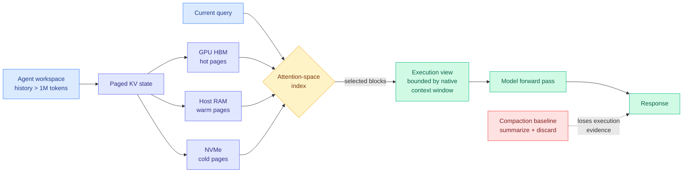

# KVMem: Virtualizing Million-Token Agent Workspaces on a Consumer GPU

**Source:** arXiv [2609.04852](https://arxiv.org/abs/2609.04852) · Di Chai, Leye Wang, Zeshen Su, Zhiguo Xia, Zhihang Yu
**Surfaced via:** X home feed (top-ranked item of 2026-09-08), [@di_zhang_fdu](https://x.com/di_zhang_fdu)
**Raw:** `raw/twitter/feed/2026-09-08-morning-ranked.json`
**Date ingested:** 2026-09-08

---

## TL;DR

An agent's workspace history grows past both the GPU's KV cache capacity and the model's context window. Every deployed system today handles that overflow one of two ways: compact the old context into a summary, or throw it away and retrieve it later as text. Both throw something out. Compaction loses the fine-grained execution evidence (which command failed, what the exact stack trace said), and retrieval re-prefills text the model already processed once, paying the prefill bill twice. KVMem refuses the choice. It keeps the overflowed history as **paged KV state** spread across GPU memory, host RAM and NVMe, indexes those pages in the model's own attention space, and at each query materializes a **query-dependent execution view** that fits inside the native context window. On DeepSWE long-context with Qwen3.8-27B it lifts task success from **43.8% (compaction) to 48.4%**. On a laptop with a **24GB RTX 5090** it virtualizes a **1M-token** workspace against a 256K native window, four times over, at roughly **50 tokens/s**.

---

## Architecture

---

## What it actually does

Three pieces do the work.

**1. KV state is the storage format, not text.** When history overflows the window, KVMem does not serialize it back to tokens. It keeps the key and value tensors that the model already computed and pages them out of HBM into host memory and then onto NVMe, the same way an operating system pages virtual memory to disk. The consequence is the whole point: **a page that comes back from NVMe does not need to be prefilled again.** It was prefilled once, when it was live. Retrieval-based memory systems pay the prefill cost every time a retrieved chunk re-enters the prompt; KVMem pays it once, ever.

**2. The index lives in attention space and is model-native.** Selecting which historical blocks matter for the current query is a retrieval problem, and the obvious move would be to bolt on an embedding model and a vector store. KVMem does not. It builds **lightweight indexes in the model's own attention space**, so the relevance signal is derived from the same geometry the model will use to attend, not from a separate encoder trained on a different objective. This is the design decision that keeps the system from needing a second model in the loop, and it is the one this wiki should watch hardest, because it is also where an unvalidated approximation would hide.

**3. The execution view is query-dependent and bounded.** The model never sees a million tokens. It sees a freshly assembled view, capped at the native context window, containing the blocks the index selected for this specific query. The addressable workspace and the context window are decoupled. That decoupling is the paper's actual thesis, stated in its own last line: a path toward long-running agents whose workspaces grow past the window without the window growing.

---

## Numbers

- **DeepSWE long-context, Qwen3.8-27B: 43.8% → 48.4% task success** against compaction-only context management. A 4.6-point absolute gain, and compaction is the de facto standard, not a strawman.
- Evaluated on **LongMemEval, MemoryAgentBench and AgentLongBench** with histories up to **1M tokens**, reported as generally higher task utility *and* higher inference efficiency than compaction. Winning on both axes at once is rare in this literature; usually a memory system buys accuracy with latency.
- **Local deployment: Qwen3.6/3.8-27B in NVFP4 with multi-token prediction on a 24GB RTX 5090 Laptop GPU**, virtualizing **1M tokens against a 256K native window (4x)**, at **~50 tokens/s** single-session. That is interactive speed on a laptop, not a cluster result.

---

## How this relates to prior wiki pages

**It is the sixth entry in the "transcript is the wrong carrier" cluster, and it is the one that disagrees.** The [agent harness engineering page](../agentic-systems/agent-harness-engineering.md) recorded on 09-07 that five results in two days all argue the raw transcript should not be what the loop carries between steps: [ContextPipe (09-06)](2026-09-06-contextpipe-database-context-assembly.md) plans the prompt like a relational query instead of appending to it and cuts total tokens 31%; **SKILL.state** replaces the conversation history with a mutable structured state and takes prompt size from O(T) in the number of steps to O(1); **Harness-of-Harness** passes an evidence bundle rather than a transcript between iterations; [Iris (09-07)](../agentic-systems/2026-09-07-iris-search-agents.md) shows the inference-time context-management policy is worth more than most reported model differences; and [the Handoff Tax (09-07)](../ai-routing/2026-09-07-handoff-tax-model-switching.md) finds that passing a raw transcript across a model-escalation boundary recovers less than half the quality gap and costs more than twice starting fresh, while dropping the trajectory and passing only the code edits lifts recovery to 64-84%.

Every one of those five throws information away on purpose, and argues the throwing-away *is* the gain. **KVMem throws nothing away and beats the baseline that throws things away.** Its diagnosis is orthogonal: the problem was never that the transcript is too long, it was that the transcript was stored in the wrong representation. Text is a lossy, expensive-to-reload encoding of state the model already computed. Keep the KV and the length stops mattering.

These are not obviously compatible claims, and nobody has run the crossover. The honest reading is that they are addressing different failure modes: SKILL.state and ContextPipe attack *attention dilution* (the model does worse when the prompt is cluttered, regardless of cost), KVMem attacks *capacity and recompute* (the model would do better with the history if it could afford to hold it). **The experiment that separates them is a direct comparison of KVMem against SKILL.state on the same long-horizon benchmark, and it is cheap.** If structured state still wins with KV paging available, dilution was the binding constraint. If KVMem wins, the field spent a year building summarizers to solve a memory-management problem.

**It extends the KV cache page's own open thread by inverting it.** The [KV cache page](kv-cache.md) has spent two weeks on methods that make the cache *smaller*: eviction ([Random Attention, 09-04](2026-09-04-random-attention-kv-eviction.md), which deletes the scorer entirely and evicts uniformly at random inside each head, matching the strongest prior evictor at 32-43% higher throughput), sparse selection ([CRISP, 09-03](2026-09-03-crisp-adaptive-sparse-prefill.md), input-adaptive sparse prefilling for up to 5.30x attention speedup at 512k), head-axis compression, and as of 09-07 a fourth axis, depth (**KVShare**, cross-layer sharing between adjacent layers whose KV projections have high cosine similarity, for an additional 50-75% reduction). **KVMem is on none of those axes. It makes the cache bigger and moves it down the memory hierarchy.** Eviction and paging are substitutes for the same problem, and the composition is unrun and obvious: page cold blocks to NVMe *and* evict inside the hot set. Random Attention's finding that a random evictor matches a learned one is directly useful here, because it means the hot-set policy can be cheap.

**It closes, partially, the mid-session-switch problem this page has carried since 08-29.** That entry noted prompt-cache entries are keyed to a specific model, so routing mid-session to a cheaper model pays a full cold prefill on the accumulated history. [Cross-model KV sharing (09-02)](2026-09-02-cross-model-kv-sharing.md) supplied a translation layer that hands one model's KV state to another across scale, architecture and tokenizer (Llama3.1-70B → Qwen2.5-7B at 44.0% against 45.7% native, latency 899ms → 138ms). **KVMem supplies the other half: the storage tier that makes a translated cache worth keeping around.** A translation layer with nowhere to put the translated state only helps within a session. Neither paper cites the other.

**It is a consumer-hardware result, which changes who it is for.** Nearly every efficiency paper on this wiki reports datacenter numbers. A 24GB laptop GPU running a 27B model over a 1M-token workspace at interactive speed is the practitioner-facing version of the same claim, and it is the kind of result r/LocalLLaMA would normally surface first. It did not, because Reddit was empty today.

---

## Gaps

- **The attention-space index is the load-bearing component and gets the least validation in the abstract.** No ablation is quoted against a naive alternative (recency, BM25, an off-the-shelf embedding retriever). If a dumb index matches it, the contribution is the paging system, not the selection, and the paper should be read as a systems result rather than a retrieval one. This page has been burned before: the [pruning page](model-pruning-sparsity.md) generalized a warning on 08-26 that methods in this family routinely depend on a second estimator nobody has validated.
- **NVMe latency is not in the headline numbers.** ~50 tokens/s is quoted for a *single session*. Paging from NVMe under concurrency, where the page cache thrashes across users, is the regime that decides whether this ever serves traffic, and it is not reported.
- **The 4.6-point DeepSWE gain is against compaction, not against a strong retrieval baseline or against SKILL.state-style structured state.** Compaction is the deployed default, so beating it matters, but it is the weakest of the three families.
- **No pass@k, and no cost accounting in dollars.** Holding 1M tokens of KV on NVMe is cheap; holding it on host RAM at scale is not.

---

## Industrial implication

If this replicates, the "context window" stops being the number that matters for agent products, and the number that matters becomes **addressable workspace per dollar of storage tier**. That is a much better number for everyone except the labs selling long-context premiums. The immediate commercial pressure lands on frontier-model pricing for long sessions: a local 27B model with a 1M-token virtualized workspace on a laptop is a credible substitute for a hosted long-context call in exactly the multi-turn coding-agent workload that is currently the most expensive thing anyone runs.

It also lands directly on the serving stacks. SemiAnalysis reported the same day that Google is externalizing **TPU-Sync**, its disaggregated KV-cache transfer library, with **native TPU KV-cache DRAM offloading** and support for **Mooncake Store**, which pools DRAM and NVMe across servers into one logical KV tier (see [TPU inference externalization (09-08)](../hardware/2026-09-08-tpu-ironwood-inference-externalization.md)). KVMem is the algorithm; Mooncake and TPU-Sync are the infrastructure it would run on. **Research and industry converged on tiered KV storage on the same day from opposite ends, and neither mentions the other.**

---

## Related pages

- [KV Cache](kv-cache.md)
- [Agent Harness Engineering](../agentic-systems/agent-harness-engineering.md)
- [Agent Memory](../agentic-systems/agent-memory.md)
- [Memory Hierarchy](../hardware/memory-hierarchy.md)
- [TPU inference externalization (09-08)](../hardware/2026-09-08-tpu-ironwood-inference-externalization.md)
- [Daily digest 2026-09-08](../daily-digest/2026-09/2026-09-08.md)
