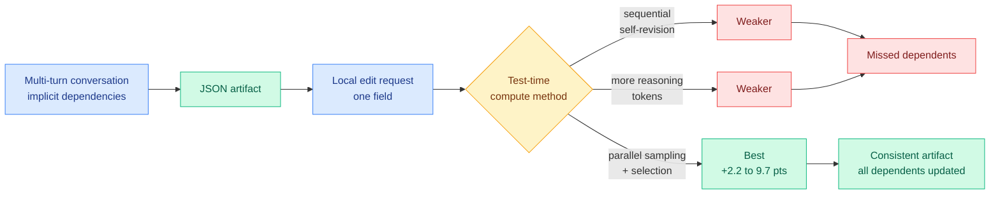

# What Else Needs Fixing? Cost-Effective Test-Time Compute for Revision Propagation

**Source:** arXiv [2609.03254](https://arxiv.org/abs/2609.03254) · Daisuke Kikuta (NTT, Inc.)
**Signal:** HuggingFace Daily Papers, 2026-09-08 (one of only two papers listed).
**Raw:** `raw/huggingface/2026-09-08-what-else-needs-fixing-exploring-cost-effective.md`
**Enrichment:** alphaxiv overview available and used.
**Date ingested:** 2026-09-08

---

## TL;DR

You build something with a model over several turns of conversation: a trip plan, a config file, a JSON schema. Then you ask for one local change. "Move the trip start to the 14th." A correct system does not just edit that one field, it finds every downstream thing that depended on it, and the dependency is often recorded nowhere except the conversation itself, because it was established in turn four when you said "and book the museum for day three." This paper builds a benchmark for that problem, **revision propagation in conversationally generated artifacts**, and then asks which form of extra inference-time compute buys the most accuracy per dollar. The answer is unglamorous and useful: **parallel sampling with selection wins**, for a **2.2 to 9.7 percentage-point** gain over baselines.

---

## Why the setting is genuinely different

The alphaxiv overview positions this well, and the positioning is the paper's main non-benchmark contribution. Three adjacent literatures have studied edit propagation, and all three have something this one does not:

- **Repository-level coding** (Jimenez et al. 2024, Bairi et al. 2024) propagates edits across a codebase using **call graphs, imports and variable references**. The dependencies are statically analyzable.
- **Knowledge editing** (Cohen et al. 2024, Dong et al. 2025) studies the "ripple effect" of factual edits, leaning on **pre-existing knowledge graphs** to know what else must change.
- **Document editing** (Wang et al. 2026, Kruthof 2026) uses **document structure and explicit references**.

In a conversationally generated artifact, the dependency graph is not in the artifact. A JSON file with `"start_date": "2026-09-14"` and `"museum_date": "2026-09-17"` contains no record that the second was defined as *start plus three days*. That relation exists only in the conversation history. **So the model cannot look up the dependencies; it has to reconstruct them from dialogue, then decide which are load-bearing.** That is a harder problem than any of the three above, and it is the one that actually occurs whenever a model is used as an iterative tool rather than a one-shot generator.

---

## The result, and why it is the interesting part

Parallel sampling with selection means: generate several independent candidate revisions, then pick one. It beats sequential self-revision and beats simply spending more reasoning tokens on a single attempt. **The mechanistic reading is that dependency discovery is a recall problem, not a reasoning-depth problem.** Any single pass has some chance of overlooking the museum booking. Thinking harder in one pass does not reliably fix an omission, because the model does not know what it missed. Sampling several times and selecting gives independent draws at the recall step, and union-like coverage across draws is what closes the gap. That predicts the gain should scale with the *number of dependents* rather than with reasoning difficulty, which is a testable claim the paper does not appear to make.

---

## How this relates to prior wiki pages

**It is a clean instance of the [test-time compute allocation page](test-time-compute-allocation.md)'s central question, and it answers it in the direction the recent evidence has been pointing.** The wiki's 09-05 batch recorded [Locked at the Entrance](2026-09-05-locked-at-the-entrance-rlvr-coverage.md), which found that reinforcement learning with verifiable rewards destroys up to **67% of a policy's solution coverage at the very first token**, and recovers 37% of it for free by interpolating with checkpoints already on disk. Coverage, not depth, was the binding quantity there too. **Parallel sampling is the cheapest possible coverage purchase, and this paper finds it dominates depth purchases on a task where coverage is obviously what is needed.** Two results from different subfields agreeing that the field over-buys depth and under-buys breadth.

**It sharpens a pattern the digest has been tracking since 09-05: buying compute is worthless unless you know which quantity is scarce.** [Select, Compress, Reinvest (09-05)](2026-09-05-select-compress-reinvest-visual-tokens.md) showed that compressing visual tokens pays nothing on its own and only earns accuracy when the freed budget is **reinvested** into more frames, with eight query-selected frames beating sixteen uniformly spaced ones by 6.9 points. [CLEAR](test-time-compute-allocation.md) rations inference compute across a batch of queries with a single shadow price. **This paper is the same discipline applied to a new task: enumerate the available forms of test-time compute, hold the budget fixed, and measure which one converts into accuracy.** That is a boring methodology and it keeps producing the field's most reusable findings.

**It intersects the agentic thread directly, and the intersection is a cost argument.** The [agent harness engineering page](../agentic-systems/agent-harness-engineering.md) recorded on 09-07 that append-the-transcript is the default every serious 2026 harness result is designed to escape, and that structured-state approaches such as **SKILL.state** cut prompt growth from O(T) in the number of steps to O(1) by discarding intermediate reasoning once it yields a validated state update. **This paper is a warning about the cost of that discipline.** The dependencies it studies are exactly the information that a summarizer or a structured-state projection throws away: "museum_date = start + 3" is conversational reasoning, not artifact state, and once compacted it is gone. **A harness that compacts aggressively will fail revision propagation, and this benchmark is the instrument that would show it.** That is a concrete, cheap experiment: run the benchmark with and without transcript compaction.

**And it is the second result today arguing that the fine-grained conversational record has value the summary destroys.** [KVMem (09-08)](2026-09-08-kvmem-kv-context-virtualization.md) pages overflowed agent history as KV state across GPU, RAM and NVMe rather than compacting it into summaries, and lifts DeepSWE task success from 43.8% to 48.4% precisely because compaction "loses fine-grained execution evidence." **Same claim, two subfields, same day, no cross-citation.** One measures the loss on agent task success, the other builds the benchmark that isolates what kind of information is being lost.

---

## Gaps

- **JSON artifacts only.** JSON is a reasonable proxy because it is what tool calls and agent actions actually emit, but it is structurally simple. Whether the finding holds for prose documents, spreadsheets or code is untested.
- **A 2.2 to 9.7-point range is wide**, and the abstract does not say what determines where in it a task lands. That variation is probably the most informative thing in the paper and it is unexplained here. If it tracks dependent count, the recall hypothesis above is confirmed.
- **"Selection" is doing unspecified work.** Picking among parallel candidates requires a selector, and the [test-time compute allocation page](test-time-compute-allocation.md) has an accumulating pattern of results showing purpose-built learned selectors are frequently replaceable by something trivial. Whether selection here is majority voting, an LLM judge, or a trained scorer decides both the cost accounting and whether the result is robust.
- **Single author, single institution, benchmark-and-evaluation paper.** The contribution is the setting and the measurement, not a method, and it should be read as such.
- **No dollar figures**, only "cost-effective" as a relative claim across methods at matched budget.

---

## Industrial implication

This is a real production failure mode that is currently invisible because nobody measures it. Every configurator, itinerary builder, form filler and agent that emits structured output over multiple turns has this bug, and it surfaces as a user editing one field and silently getting an internally inconsistent artifact. **The immediate practical takeaway is a cheap one: for revision requests specifically, spend the extra inference budget on parallel candidates rather than on a longer reasoning trace.** That is a routing decision, and it is the kind that belongs in the harness rather than in the model: detect that a turn is a revision request, switch the test-time compute policy for that turn. Nobody ships that today.

---

## Related pages

- [Test-Time Compute Allocation](test-time-compute-allocation.md)
- [Agent Harness Engineering](../agentic-systems/agent-harness-engineering.md)
- [KVMem (09-08)](2026-09-08-kvmem-kv-context-virtualization.md)
- [Daily digest 2026-09-08](../daily-digest/2026-09/2026-09-08.md)
