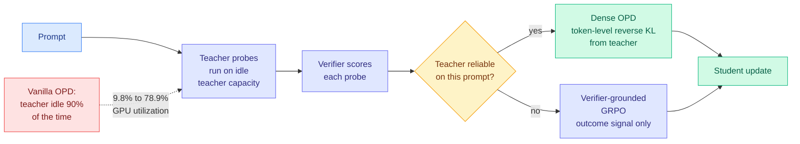

# Verify Before You Distill: Prompt-Level Teacher Gating for On-Policy Distillation (TGOPD)

**Source:** arXiv [2609.02998](https://arxiv.org/abs/2609.02998) · AllSpark Team (Zhiwei Zhang, Zechen Sun, Fei Zhao, Kang Peng, Bin Liang, Huayu Deng, Yao Hu, Kam-Fai Wong, Mu Chuan)
**Signal:** HuggingFace Daily Papers, 2026-09-08 (one of only two papers listed).
**Raw:** `raw/huggingface/2026-09-08-verify-before-you-distill-prompt-level-teacher-g.md`
**Enrichment:** alphaxiv overview available and used.
**Date ingested:** 2026-09-08

---

## TL;DR

On-policy distillation (OPD) trains a small student on its own generated rollouts, with a big frozen teacher supplying dense per-token supervision. It reaches teacher-level accuracy much faster than reinforcement learning with verifiable rewards (RLVR, where the only signal is whether the final answer checks out) because it converts one sparse outcome signal into thousands of token-level targets. TGOPD attacks two problems at once and the second one is the real contribution. **Problem one:** vanilla OPD applies teacher supervision to every prompt without checking whether the teacher is any good at that prompt, and because the objective is a mode-seeking reverse KL, a confidently-wrong teacher produces strong, misleading updates. **Problem two:** in asynchronous OPD the teacher node sits idle most of the time waiting for student rollouts. TGOPD spends the idle teacher capacity on **repeated verifier-scored teacher probes per prompt**, and uses the result to decide, per prompt, whether to admit dense OPD supervision or fall back to verifier-grounded GRPO. Reported **teacher-node GPU utilization goes from 9.8% to 78.9%.**

---

## Mechanism

**The economic trick is what makes the gate free.** Every reliability-aware distillation method costs something: an extra forward pass, a trained estimator, a verifier call. TGOPD's probes cost teacher FLOPs that were being wasted anyway. In asynchronous OPD the teacher waits on the student, so the probe budget comes out of idle time rather than out of the training budget. **That reframes the gating decision from "is this filter worth its overhead" to "what should the teacher do while it waits," and the answer is: verify itself.**

**Why prompt-level, and why a verifier.** The alphaxiv overview lays out the two prior families clearly. One uses *distributional* evidence: EOPD adds forward KL at high-entropy teacher tokens, TrOPD defines trust regions from teacher-student decoding agreement, REOPOLD clips token rewards using likelihood ratios and student entropy. These measure uncertainty or compatibility, **not correctness**. A teacher can be confident, agree with the student, and be wrong. The other family uses *outcome* evidence: RG-OPD keeps trajectory-level distillation when verifier feedback aligns with the teacher-student likelihood gap, RLSD uses environmental correctness to set update direction, SPOT scores teacher-proposed branches via verifier-scored student continuations. Those operate at the trajectory or token-branch level. **TGOPD is the first to put direct outcome evidence at the prompt level, which is the granularity at which "the teacher does not know this topic" is actually true.**

---

## How this relates to prior wiki pages

**It is the seventh axis on the [knowledge distillation page](knowledge-distillation.md)'s longest-running structure, and the axis is "which prompts."** That page has tracked selective supervision as a series of filters, each discarding some of what the teacher produced: **which tokens** (TIP, 04-16, most teacher tokens carry no learning signal and roughly 10% suffice), **which layer** (OPRD, 06-05, match hidden states rather than output tokens), **which trajectories** ([OPDVR, 08-26](2026-08-26-opdvr-distillation-verifiable-reward.md), gate on verified correctness), **which teacher** ([QAH, 08-26](2026-08-26-quantization-aware-healing.md), distill from the original pre-compression model), **which updates** ([IDA-OPD, 09-03](2026-09-03-ida-opd-influence-directed-distillation.md), label each update entropy-expanding or contracting and shrink the contracting ones), **which queries** ([One-Example OPD, 09-04](2026-09-04-one-example-on-policy-distillation.md), sixteen semantically distinct queries reach 98.9% state coverage and match full-data training). TGOPD adds which prompts, verified rather than estimated.

**And here is the problem, which this page is obliged to raise.** One-Example OPD's diagnosis, which this page absorbed whole, is that **OPD is data-overfed but algorithm-starved**: alignment with the teacher slows at the same rate whether you train on one query or the entire dataset, and sixteen queries match full-data training. That paper's uncomfortable consequence was stated as a standing caution: *if alignment slows at the same rate regardless of data supply, a filter that improves which supervision the student sees is optimizing a quantity that was not limiting.* **TGOPD is a filter over prompts. On One-Example OPD's own finding, prompt selection should be close to worthless, because sixteen prompts are enough and the job of a prompt is only to induce state coverage.** Both papers are from the same three-week window and neither cites the other.

There are two readings and they are testable apart. **The generous reading is that reliability and coverage are different quantities.** One-Example OPD says you need few prompts to cover the state space; TGOPD says on some prompts the teacher's supervision is actively harmful, and a small prompt set makes each bad prompt proportionally more damaging. Under that reading the two compose, and gating a 16-prompt set matters *more* than gating a large one. **The deflationary reading is that TGOPD's accuracy gains would survive if you replaced its gate with random prompt dropping at the same rate, and that its real contribution is the 9.8% → 78.9% utilization number, which is a scheduling result and not a distillation one.** The ablation that separates these is cheap: run TGOPD's probe machinery, then gate randomly at the measured admission rate. **Nobody in this seven-axis literature has run the random-gate control, which is exactly the complaint this page has carried since 09-04.**

**It is the second result in a week whose real win is hardware utilization dressed as an algorithm.** [RISE (09-07)](2026-09-07-rise-self-extrapolating-distillation.md) builds a synthetic teacher out of the student's own optimization trajectory, deleting the external teacher entirely and therefore its serving cost. TGOPD keeps the teacher and fills its idle cycles. **These are opposite solutions to the same accounting problem, which is that a frozen teacher is an expensive, badly-utilized asset.** RISE says stop paying for it; TGOPD says use what you already bought. Read as cost optimization, RISE is strictly better if its extrapolation is safe, and this page has flagged that its safety is unmeasured because [the Extrapolation Cliff (05-14)](2026-05-14-extrapolation-cliff-on-policy-distillation.md) found a closed-form threshold above which on-policy distillation collapses and RISE reports no anchor-distance ablation. **TGOPD has no such cliff risk, because a real teacher cannot drift.** That makes it the conservative choice and RISE the higher-variance one, and framing them as a portfolio is more useful than ranking them.

**The reverse-KL detail matters and connects to the diversity thread.** TGOPD's motivation is that mode-seeking reverse KL plus a confidently-wrong teacher equals strong wrong updates. [IDA-OPD (09-03)](2026-09-03-ida-opd-influence-directed-distillation.md) found that sampled-token OPD makes pass@1 improve while pass@k plateaus, because concentrating supervision concentrates the student's output distribution, and that this traces to identifiable negative-influence positions. **Mode-seeking is the shared mechanism behind both failures.** TGOPD removes whole prompts where the mode is wrong; IDA-OPD reshapes individual updates where the mode is too narrow. The composition is obvious and unrun.

---

## Gaps

- **No random-gate control**, as above. This is the single ablation that would establish the gating is doing work, and it is the standing gap across all seven axes on the distillation page.
- **No pass@k.** This page has treated a missing pass@k as a red flag on any selective-supervision result since IDA-OPD showed that concentrating supervision concentrates the output distribution. TGOPD discards entire prompts, which is the most aggressive concentration operation in the seven-axis set, and reports no diversity metric.
- **The utilization figure needs its denominator.** 9.8% → 78.9% is teacher-node GPU utilization, which is a genuine efficiency win, but utilization is not throughput. If the probes lengthen wall-clock time per training step, the student trains slower while the cluster looks busier. **Time-to-target-accuracy is the number that settles it and it is not in the abstract.**
- **Verifier dependence.** The gate is only as good as the verifier, so this inherits every limitation of verifiable-reward domains. Math and code have verifiers; the open-ended tasks where a teacher is most likely to be confidently wrong do not.
- **Listed as a public technical report** dated 2026-08-28 with no clearly stated institutional affiliation, though the referenced `slime` framework is associated with THUDM.

---

## Industrial implication

The scheduling insight generalizes past distillation and is the part worth stealing. **Any asynchronous training or serving topology with a large frozen model waiting on a small active one has a free verification budget it is not spending.** That pattern covers speculative decoding (the target model idles between verification batches), reward-model-in-the-loop RL, and cascade routing, where the frontier model waits while the cheap model tries. In each case the expensive idle model could be self-checking, probing, or pre-computing rather than blocking. **TGOPD's real claim is that idle capacity on the expensive tier is a resource, and the field has been treating it as an unavoidable cost.**

---

## Related pages

- [Knowledge Distillation](knowledge-distillation.md)
- [RL for LLMs](../llms-foundation-models/rl-for-llms.md)
- [Test-Time Compute Allocation](test-time-compute-allocation.md)
- [Daily digest 2026-09-08](../daily-digest/2026-09/2026-09-08.md)
