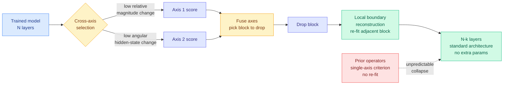

# XMerge: Cross-Axis Selection and Reconstructive Layer Merging for LLM Depth Compression

**Source:** arXiv [2609.02083](https://arxiv.org/abs/2609.02083) · Jundong Hu, Shekar Ramachandran
**Signal:** Kurate cs.LG weekly leaderboard #10, ai_rating 5.0/10. Not on HuggingFace.
**Raw:** `raw/kurate/2026-09-08-cs-lg.md`
**Date ingested:** 2026-09-08

---

## TL;DR

Deleting whole transformer layers is the most deployment-friendly form of compression, because the surviving model is still a standard transformer that any serving stack can run unchanged. The problem is that existing depth-compression methods lose a lot of quality and, worse, **lose an unpredictable amount** that varies across models. XMerge does two things. **Cross-axis selection** picks the block to remove using two signals at once, low relative-magnitude change *and* low angular change in the hidden state. **Local boundary reconstruction** then re-fits the adjacent surviving block, in closed form and with no task labels or end-to-end fine-tuning, so its output matches what the original two blocks jointly produced. Across **seven Llama and Qwen backbones (0.5B to 8B), five published baselines and three reduction levels**, XMerge's advantage is largest at the most aggressive removal: at k=4 it ranks first on six of seven backbones on CORE (a 22-task aggregate) and six of seven on MMLU. Across all 14 (model, regime) cells it is **the only evaluated operator that never collapses.**

---

## Mechanism

**The ablation tells you which half matters.** The paper reports that **local reconstruction provides most of the gain**, with cross-axis fusion helping specifically when the two selection axes disagree. That is an unusually honest decomposition, and it inverts where the literature has spent its effort. Years of depth-compression work has argued about the *selection criterion*; XMerge says the criterion is secondary and the thing nobody was doing was **repairing the seam**. Removing a block leaves the next block receiving an input distribution it was never trained on, and re-fitting it to reproduce the original two-block mapping fixes that directly.

---

## Numbers, and the statistics discipline behind them

- **k=4 (most aggressive):** first on **6/7 backbones on CORE**, first on **6/7 on MMLU**, first on both simultaneously on 5/7.
- **Task-level bootstrap:** the 95% confidence intervals for the three largest CORE margins **exclude zero**; the remaining margins are **consistent with ties**. The paper says this out loud rather than claiming seven wins.
- **Never collapses:** across all 14 (model, regime) cells, the only operator that is top-2 in both zero-shot and in-context regimes. Several competing operators produce large perplexity blowups.
- **Calibration:** on a first single-backbone probe, the best-calibrated operator.
- **Cost:** no task labels, no end-to-end fine-tuning, no architectural change, no inference-time parameters.

That confidence-interval reporting is worth flagging as a methodological standard. Most compression papers on this wiki report a table of wins with no uncertainty, and this one explicitly says most of its margins are ties.

---

## How this relates to prior wiki pages

**It is the third depth-axis result in two days, and the axis was empty a week ago.** The [pruning and sparsity page](model-pruning-sparsity.md) logged on 09-07 that two independent results had arrived the same day observing that **the depth axis carries far less independent information than the parameter count implies**: [Don't Drop Dropout (09-07)](2026-09-07-dont-drop-dropout-layer-sparsity.md), which showed over 2,400 runs from 271M to 8.2B parameters that tuned layer dropout yields lower loss at equal training FLOPs and up to 25% training-FLOP savings, plus 1.5x inference via early exit and self-speculative decoding on the same checkpoint; and **KVShare**, reported in [the KV Cache Frontier (09-07)](2026-09-07-kv-cache-frontier-mla-radix-kvshare.md), which found adjacent layers' KV projections have high cosine similarity in 60-plus-layer topologies and can be shared at 1:2 or 1:4 for an additional 50-75% memory reduction. **XMerge is the third, and it completes the set by covering the post-training case.** Don't Drop Dropout buys depth-robustness during pre-training; KVShare exploits depth redundancy at serving time in the cache; XMerge removes depth from an already-trained checkpoint. **That is the pattern threshold crossed, three papers in two days on an axis this page had never recorded, and none of the three cites either of the others.**

**The composition is now explicitly testable, and the prediction is directional.** The 09-07 entry already proposed that a model pre-trained with layer dropout should be *more* amenable to cross-layer KV sharing, because it was trained to make adjacent-depth representations interchangeable. XMerge sharpens that into a cleaner experiment: **a layer-dropout-pretrained checkpoint should be strictly easier for XMerge to compress, and its two selection axes should agree more often**, because dropout training reduces the functional distinctness of adjacent blocks. If cross-axis fusion is the component that matters only when the axes disagree, then on a dropout-trained model XMerge should collapse to its reconstruction half. That is a falsifiable prediction about a paper interaction, and both artifacts are public.

**It confirms this page's "sparsity you can spend" line rather than fighting it.** Removing complete layers preserves a standard serving architecture, which is the whole reason the granularity is attractive: nothing downstream needs to change. And unusually for this page, XMerge prices its own overhead: **the additional construction cost is recovered through per-token decode savings after roughly tens of thousands of requests.** That is an amortization statement, and it is rare. The [pruning page](model-pruning-sparsity.md) has complained repeatedly that compression papers report what they saved and not what the saving cost or bought; this one gives a break-even request count.

**It sits opposite today's ternarization result on exactly the axis this page cares about.** [Post-training ternarization of Qwen3-4B (09-08)](2026-09-08-ternarization-qwen3-4b.md) achieves a large storage win, 8.29 GiB down to 3.96 GiB, and then reports its Triton GEMV kernel is **4.6x slower than FP16 cuBLAS**, explicitly declining to claim that compression yields faster inference. **XMerge and ternarization are the two halves of this page's thesis in one day: XMerge compresses along a granularity the hardware already schedules and can quote a break-even; ternarization compresses along a granularity the hardware does not support and cannot.**

---

## Gaps

- **0.5B to 8B only.** Depth redundancy plausibly grows with layer count, and KVShare's 50-75% figure was specifically measured in **60-plus-layer** topologies. XMerge's largest backbone is 8B, well below that regime. Whether the reconstruction step still closes the seam at 60+ layers with k scaled proportionally is the single most important untested question, and it is the regime anyone deploying this actually cares about.
- **No wall-clock or throughput figures**, only the amortization claim. Removing k layers from an N-layer model should give a near-linear decode-latency win, and it would have been cheap to measure.
- **Most margins are ties, by the paper's own bootstrap.** The honest summary is "never collapses" rather than "wins," and never-collapsing is a real contribution given the unpredictability the paper set out to fix, but it is a robustness claim not a quality claim.
- **Calibration evidence is one backbone**, described as a first probe.
- **No interaction with quantization or with KV-cache compression.** Depth removal and depth-wise KV sharing are the same observation applied at two layers of the stack, and running both is either multiplicative or self-defeating. Nobody knows which.

---

## Industrial implication

Depth compression is the compression that operations teams can actually accept, because the artifact is still a normal transformer: same serving code, same kernels, same quantization path, just fewer layers. The reason it has not been used much is the unpredictability XMerge targets. **If "never collapses" holds at 30B-70B scale, layer merging becomes a routine step in the model-shipping pipeline** rather than a research technique, in the same slot post-training quantization occupies now. The break-even at tens of thousands of requests means it pays for essentially any production endpoint and never pays for a one-off eval run.

---

## Related pages

- [Model Pruning and Sparsity](model-pruning-sparsity.md)
- [KV Cache](kv-cache.md)
- [ACE: expert skipping (09-08)](2026-09-08-ace-expert-skipping-moe.md)
- [Post-training ternarization of Qwen3-4B (09-08)](2026-09-08-ternarization-qwen3-4b.md)
- [Daily digest 2026-09-08](../daily-digest/2026-09/2026-09-08.md)
