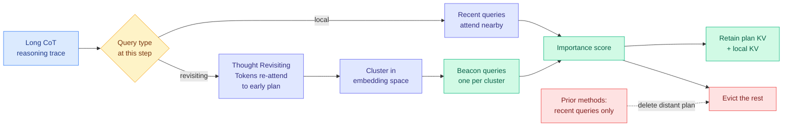

# BeaconKV: KV Cache Compression Guided by Beacon Queries

**Source:** HuggingFace Daily Papers · [arXiv 2609.04971](https://arxiv.org/abs/2609.04971) · Janghyeon Kim, Minsoo Kim (Hanyang University), Kyuhong Shim (Sungkyunkwan University), Jungwook Choi (Hanyang University)
**Raw:** [`raw/huggingface/2026-09-09-beaconkv-key-value-cache-compression-guided-by-beacon-querie.md`](../../raw/huggingface/2026-09-09-beaconkv-key-value-cache-compression-guided-by-beacon-querie.md)

## TL;DR

Every KV cache eviction method on this wiki decides what to keep by asking the most recent queries what they are attending to. BeaconKV shows that assumption is specifically wrong for reasoning models. When a model generates a long chain of thought, some decoding steps are **Thought Revisiting Tokens**: the model jumps back to a plan it wrote thousands of tokens earlier. Recent queries carry no signal about those jumps, so recency-scored evictors delete exactly the entries the model is about to need. BeaconKV's finding is that the revisiting queries are not scattered. They **cluster into a small number of groups in embedding space**, so you can keep one compact representative per cluster (a "beacon") and use those beacons, rather than the query history, to score what to retain. Training-free, no architecture change. Reported: **up to 5.8x memory reduction with near-full-cache accuracy and over 4.3x throughput improvement** across four open-source reasoning models.

## Mechanism

The trick that makes it cheap: storing the whole query history to catch revisits would defeat the purpose, since the query history is as long as the cache you are trying to shrink. Because the revisiting queries collapse into a few similarity groups, a handful of cluster centroids stands in for all of them at negligible storage.

## Key points

- **The failure mode is named and measured, not assumed.** Prior methods (SnapKV, RPC, R-KV, KeyDiff, LazyEviction) treat recent-query attention as a proxy for future attention. The paper's contribution is showing where the proxy breaks: long-horizon reasoning, at the moment the model returns to its own plan.
- **Training-free.** No trainable eviction module (unlike TRIM-KV, LightThinker, Fast KVzip), no architecture change (unlike Titans-style external memory).
- **Numbers:** up to 5.8x memory reduction, over 4.3x throughput, "generally outperforms" existing compression across four open-source reasoning models and diverse benchmarks.
- **Reasoning models specifically.** The whole argument depends on extended chain-of-thought generation. On short chat turns there is no revisiting structure to exploit and the method should collapse to a recency evictor.

## How this relates to prior wiki pages

**It contradicts, on a narrow but important axis, the strongest recent result on the [KV cache page](kv-cache.md).** [Random Attention (09-04)](2026-09-04-random-attention-kv-eviction.md) deleted the KV importance scorer entirely, evicting uniformly at random inside each attention head, and matched the strongest prior evictor at 32-43% higher throughput in vLLM. The reading this wiki took from it was that decode-side scoring was not paying for itself. BeaconKV says the scorer was not useless, it was **looking at the wrong queries**, and once you score against beacons rather than recency you get a real win. These two are directly comparable and the crossover experiment is one table: run BeaconKV against random eviction on the same long-CoT benchmarks at matched retention. If random matches BeaconKV, the beacon machinery is decoration. If BeaconKV wins clearly, Random Attention's null result was measured on traces too short to contain revisiting.

**It sharpens the "second estimator nobody validated" warning this page has carried since 08-26.** The beacon clustering is load-bearing and the obvious control is missing: keep a *random* small subset of past queries instead of clustered representatives, at the same storage. If that matches, the finding is "keep some old queries" rather than "cluster them."

**It is orthogonal to [KVMem (09-08)](2026-09-08-kvmem-kv-context-virtualization.md)**, which pages overflowed KV across GPU, host RAM and NVMe rather than compressing it. BeaconKV shrinks the hot set; KVMem stores the cold set. The composition the KV cache page already flagged (page cold, evict cheaply inside hot) now has a better hot-side candidate than random eviction for reasoning workloads specifically.

**It supplies a mechanism for a cost the [Ken Huang inference series](2026-09-07-kv-cache-frontier-mla-radix-kvshare.md) priced on 09-07.** That chapter reported a Llama-3-70B-class model at 327.68 KB of KV per token, so one 128K session eats 41.94 GB and concurrency on an 8x H100 node collapses from 340-plus streams to about 10 when users submit long contexts. Reasoning traces are exactly how that collapse happens without a user pasting anything.

## Gaps

- No reported control against random eviction at matched retention, which is the live null hypothesis on this page.
- No ablation of clustering against a naive "retain k random historical queries" baseline.
- Throughput is reported but not the regime: acceptance of a compression method at batch 1 and at production concurrency are different claims, and this page has been burned by that distinction before.
- Nothing on interaction with quantized KV, which is where most production caches already live.

## Related

- [KV Cache](kv-cache.md) (concept page)
- [Random Attention: KV eviction without a scorer (09-04)](2026-09-04-random-attention-kv-eviction.md)
- [KVMem: KV context virtualization (09-08)](2026-09-08-kvmem-kv-context-virtualization.md)
- [The KV Cache Frontier: MLA, Radix, KVShare (09-07)](2026-09-07-kv-cache-frontier-mla-radix-kvshare.md)
