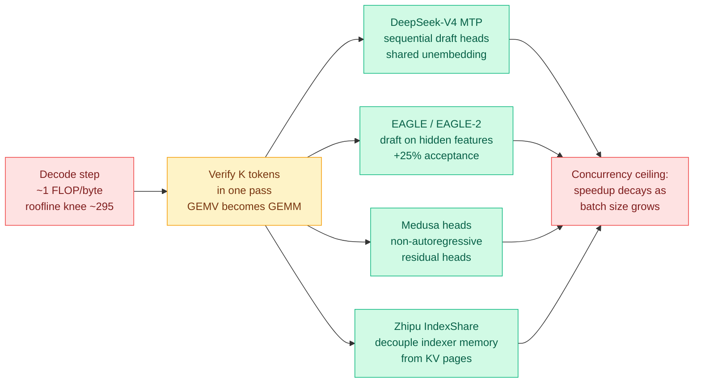

# Next-Gen Speculative Decoding: MTP, EAGLE-2 and IndexShare (Ken Huang, Chapter 3)

**Source:** RSS, [kenhuangus.substack.com](https://kenhuangus.substack.com/p/chapter-3-next-gen-speculative-decoding) · Ken Huang / DistributedApps.ai · Chapter 3 of *The Physics & Engineering of Frontier LLM Inference*
**Raw:** [`raw/rss/2026-09-08-agentic-ai-chapter-3-next-gen-speculative-decoding-multi-token-pre.md`](../../raw/rss/2026-09-08-agentic-ai-chapter-3-next-gen-speculative-decoding-multi-token-pre.md)
**Prior chapters:** [Chapter 1, the roofline](../hardware/2026-09-02-physics-of-llm-inference-roofline.md) · [Chapter 2, the KV cache frontier](2026-09-07-kv-cache-frontier-mla-radix-kvshare.md)

## TL;DR

The free half of this chapter supplies the number that justifies every result on the [speculative decoding page](speculative-decoding.md), and it is more brutal than the framing this wiki has been using. During ordinary autoregressive decoding, an **H100 attains under 0.35% of its peak compute**. The arithmetic is simple: to emit one token the GPU streams every active parameter from HBM to do a single matrix-vector product, then discards the weights. That is roughly **1.0 FLOP per byte moved**, against a hardware roofline knee at **about 295 FLOPs per byte** on an H100 SXM5 (989 TFLOP/s of 16-bit tensor-core compute against 3.35 TB/s of HBM3). The tensor cores starve waiting for the memory bus. Speculative decoding is not a clever trick layered on top of a well-utilized machine, it is the correction for a machine running at one three-hundredth of its capability.

The paid section covers the mechanisms; the free roadmap names them precisely enough to be useful.

## The four mechanisms named

- **DeepSeek-V4 Multi-Token Prediction.** Sequential MTP modules with shared unembedding projections, trained as a multi-task loss during pre-training, then reused at inference as a **zero-overhead speculative generator**. The drafter costs nothing extra because it was already trained as an auxiliary objective.
- **EAGLE and EAGLE-2.** Draft on the **second-to-top hidden state** rather than on tokens, which the chapter puts at **+25% acceptance rate** over token-level draft models. EAGLE-2 adds contextual-entropy-driven dynamic tree expansion, with 2D tree attention masks so all candidate branches verify in a single pass.
- **Medusa heads.** Non-autoregressive residual heads, compared against MTP and independent draft SLMs on parameter overhead and draft-correlation breakdown.
- **Zhipu AI IndexShare.** A memory-systems contribution rather than an algorithmic one: **decouple indexer memory from physical KV cache pages**, so speculative rollbacks do not churn the page allocator. This is the piece a serving engineer would care about most and the piece nobody publishes papers on.

## Why the roofline number matters more than the mechanism list

Because it reframes what "speedup" means. If the machine is at 0.35% utilization, a 3x speedup is not approaching a limit, it is moving from 0.35% to roughly 1%. The chapter's stated concurrency section is the honest counterweight: **as batch size grows, the memory-bound regime relaxes on its own** (weights are amortized across more requests) and the speculative advantage shrinks. That is the same ceiling this wiki's [speculative decoding page](speculative-decoding.md) has flagged repeatedly, now stated as a design parameter rather than a caveat, with engines "dynamically throttling speculative depth" as concurrency rises.

## How this relates to prior wiki pages

**It supplies the physical basis for the batch-size argument this wiki made on 09-07 and could not ground.** That entry noted every acceleration result on the page is quoted at low batch, where the accelerator has idle capacity and free parallelism exists, and that [Uno](2026-09-07-uno-discrete-diffusion-lossless-speedup.md) claiming a win at the largest batch the device supports was the first entry to assert its speedup survives the regime that matters. Chapter 3 explains *why* that regime is different: at high concurrency the roofline position moves and the free parallelism speculative decoding exploits is already being consumed.

**IndexShare is the third arrival in a week saying the KV cache's problem is a memory-systems problem, not a compression problem.** [KVMem (09-08)](2026-09-08-kvmem-kv-context-virtualization.md) pages KV across GPU, host RAM and NVMe. [Google's TPU-Sync externalization (09-08)](../hardware/2026-09-08-tpu-ironwood-inference-externalization.md) ships disaggregated KV transfer with DRAM and NVMe pooling. IndexShare decouples index memory from KV pages so speculative rollback stops thrashing the allocator. **Three independent groups treating the cache as a storage hierarchy rather than a tensor to shrink is a pattern, and this wiki should carry it as one.**

**MTP-as-free-drafter is the direct counterpoint to today's [Online Draft Co-Training](2026-09-09-online-draft-co-training-speculative-rl.md).** If the draft heads are trained as a pre-training auxiliary objective, they inherit the model's updates for free during post-training, which is exactly the staleness problem NVIDIA built a distributed system to solve for an external drafter. Nobody has compared a co-trained external draft against native MTP heads under the same RL run, and that is the cheapest decisive experiment in this area.

## Gaps

- **Paywalled past the roadmap.** The rejection-sampling proof, the production code, the Triton/CUDA kernels and the concurrency-saturation derivation are announced rather than read. Every mechanism figure quoted here comes from the free section.
- The **+25% acceptance** figure for feature-level drafting carries no prompt-distribution qualifier, which is this page's standing complaint about every acceptance number in the literature.
- The 0.35%-utilization figure is for a single-request decode step on a dense or active-parameter model. It is a fair description of the interactive regime and a bad description of a saturated serving node, and the chapter is clear about that only in the concurrency section.

## Related

- [Speculative Decoding](speculative-decoding.md) (concept page)
- [Chapter 1: the physics of LLM inference, roofline (09-02)](../hardware/2026-09-02-physics-of-llm-inference-roofline.md)
- [Chapter 2: the KV cache frontier (09-07)](2026-09-07-kv-cache-frontier-mla-radix-kvshare.md)
- [Online Draft Co-Training (09-09)](2026-09-09-online-draft-co-training-speculative-rl.md)
- [KVMem (09-08)](2026-09-08-kvmem-kv-context-virtualization.md)
