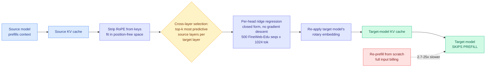

# Cross-Model KV Cache Transfer (NVIDIA): skip the prefill when you switch models

**Source:** X home feed, afternoon capture · [arXiv 2608.03893](https://arxiv.org/abs/2608.03893) · NVIDIA
**Raw:** `raw/twitter/feed/2026-09-09-afternoon-ranked.json` (gitignored)

## TL;DR

Prompt caching is one of the largest cost levers in LLM serving, because a provider holding the KV cache for a stable prefix bills cache hits at roughly **10% of the base input rate**. The catch is that the cache belongs to the model that produced it: keys and values are functions of that model's weights, so nothing else can read them. That makes prompt caching and **model routing structurally incompatible**. The moment traffic moves to another model for cost or capability, the accumulated cache is void and the whole context is re-prefilled at full price.

This paper treats that as a **representation-conversion problem** and solves it in closed form. The headline finding is empirical and slightly surprising: cross-model KV has **substantial linear structure** between matched pairs. On Qwen3 14B to 32B, a linear regression from a **single source layer explains 56% of variance in the target's keys and 32% in values**, rising to **79% and 65% using multiple source layers**. Reported: the mapper runs **2.7 to 25x faster than re-prefill**, retains **73-98% of the receiver's standalone-prefill accuracy on four of six tested pairs**, and stays stable across multi-turn handoff.

## Mechanism

Three design choices carry the result:

1. **Per-head, per-target-layer linear maps solved in closed form**, not by gradient descent. That is what makes it training-free and cheap to fit.
2. **Cross-layer selection**, because models have different layer counts and there is no natural one-to-one correspondence. Each target layer ranks source layers by predictive power and concatenates the top-k (eight in the reported setup). **The ablation says this contributes the most.**
3. **RoPE stripping.** Rotary position embeddings add a position-dependent rotation to keys, so a mapping fitted with RoPE in place would be tied to specific positions. Removing it, fitting in position-free space, and re-applying the target's rotation at inference makes the same mapper **reusable across context lengths**.

Calibration is remarkably cheap: **500 FineWeb-Edu sequences of 1,024 tokens each.**

## How this relates to prior wiki pages

**It is the second cross-model KV translation mechanism on this wiki in eight days, and the two disagree about what is possible.** [A Universal Context-Reuse Layer (09-02)](2026-09-02-cross-model-kv-sharing.md) (arxiv 2608.30963) *trains* a translation layer and claims transfer across scale, architecture, attention configuration, tokenizer and model family, reporting Llama3.1-70B to Qwen2.5-7B at 44.0% against 45.7% native with latency dropping from 899ms to 138ms. NVIDIA's mapper is training-free but **explicitly same-family only**: every tested pair is Qwen to Qwen, Llama to Llama, or Ministral to Ministral, and all share KV head count and per-head dimension. **Cross-family is named as future work.** So one paper claims the harder result with a learned adapter and the other claims a much cheaper mechanism on the easier case. **The honest reading is that closed-form linear structure exists within a family and nobody has shown it exists across families**, which is exactly the boundary a production router cares about.

**The failure mode is reported, which is rare and worth crediting.** Two of six pairs **degrade sharply** under the linear map, with a nonlinear MLP recovering up to **+37 percentage points of HellaSwag retention** on those failures. That means linear structure is present but not uniformly, and no predictor of which pairs will fail is given. A serving system cannot ship a mechanism that silently collapses on two pairs in six without a pre-flight check, and that check does not exist yet.

**It attacks exactly the penalty this wiki priced on 09-07, and only one of that penalty's three terms.** [The Handoff Tax (09-07)](../ai-routing/2026-09-07-handoff-tax-model-switching.md), across 58,000 agent runs and 36 billion tokens, found that mid-session escalation with full history recovers **under half the quality gap** (47% Claude, 36% GPT) and for Claude **costs more than twice starting fresh**, and that the dominant harm is not transport cost but that **carrying the weak model's reasoning into the strong model is actively harmful**: dropping the trajectory and passing only the artifacts lifts recovery to 64% and 84%. **So a mechanism making trajectory transport cheap optimizes the direction where you should be deleting the trajectory.** The reconciliation this wiki reached on 09-07 stands and applies here directly: **KV portability is worth a lot on downshift, where the cheap model needs the blueprint, and little or negative on escalation.** NVIDIA's framing is cost-quality cascading and mid-conversation switching generically, without the direction distinction.

**It reinforces the pattern named earlier today: the KV cache's frontier has moved from compression to placement and portability.** [IndexShare](2026-09-09-next-gen-speculative-decoding-mtp-eagle2-indexshare.md) decouples indexer memory from KV pages, [KVMem (09-08)](2026-09-08-kvmem-kv-context-virtualization.md) pages KV across GPU, host RAM and NVMe, [Google's TPU-Sync (09-08)](../hardware/2026-09-08-tpu-ironwood-inference-externalization.md) ships disaggregated KV transfer with DRAM and NVMe pooling, and on the same day this surfaced, **vLLM published on optimizing for agentic serving where extensive prefix reuse is a primary driver**, and practitioner writing framed the KV cache plainly as **a storage system** requiring block lookup, rehydration into GPU memory, eviction under pressure, cross-worker sharing and survival across engine restarts (the LMCache design point). **Five independent artifacts in two days treating the cache as infrastructure rather than as a tensor to shrink.**

## Gaps

- **Same-family only**, same KV head count and per-head dimension, dense full-attention models only. Sliding-window and attention-recurrent hybrids are untested, which excludes a growing share of 2026 architectures.
- **Two of six pairs fail and no predictor is offered.** Without a cheap pre-flight test, this cannot be deployed behind a router.
- Accuracy retention of 73-98% is a wide band, and the low end is a real quality tax that has to be netted against the 90% cache-hit discount it preserves.
- No direction-dependent evaluation (escalation versus downshift), which the Handoff Tax result says is the variable that decides whether this helps or hurts.

## Related

- [KV Cache](kv-cache.md) (concept page)
- [LLM Routing](../ai-routing/llm-routing.md) (concept page)
- [A Universal Context-Reuse Layer for Cross-Model KV Sharing (09-02)](2026-09-02-cross-model-kv-sharing.md)
- [The Handoff Tax (09-07)](../ai-routing/2026-09-07-handoff-tax-model-switching.md)
- [KVMem (09-08)](2026-09-08-kvmem-kv-context-virtualization.md)
