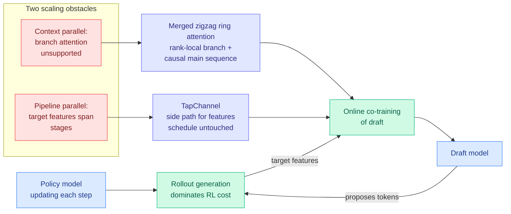

# Online Draft Co-Training for Speculative Decoding in Large-Scale, Long-Context RL Post-Training

**Source:** HuggingFace Daily Papers · [arXiv 2609.07108](https://arxiv.org/abs/2609.07108) · NVIDIA NeMo RL ([code](https://github.com/NVIDIA-NeMo/RL/issues/3698))
**Raw:** [`raw/huggingface/2026-09-09-online-draft-co-training-for-speculative-decoding-in-large-s.md`](../../raw/huggingface/2026-09-09-online-draft-co-training-for-speculative-decoding-in-large-s.md)

## TL;DR

Reinforcement-learning post-training is dominated by rollout generation: the policy has to actually write out long answers before anything can be scored. Speculative decoding (a cheap draft model proposes several tokens, the expensive target verifies them in one pass, output distribution preserved) is the obvious accelerant, but there is a catch specific to RL. The policy is **moving**. A draft trained once goes stale as the policy updates, acceptance falls, and the speedup decays exactly as training proceeds. The fix is to co-train the draft online against the moving policy. This paper is not the idea, it is the **systems engineering that makes the idea run at frontier scale**, and the two obstacles it removes are both parallelism-layer problems rather than modelling problems.

Reported: co-trained drafts track the policy baseline closely, with substantial rollout and end-to-end speedups **up to 122B parameters**, strong scaling at **256K tokens** of context, and significant memory savings over prior context-parallel implementations.

## Mechanism

**Obstacle one, context parallelism.** Long-context training shards the sequence across ranks, and the standard causal implementation (packed, load-balanced zigzag ring attention) has no notion of the *branch* attention a speculative draft needs, since draft candidates hang off the main sequence rather than continuing it. The fix merges rank-local branch attention with the causal main-sequence attention inside the same ring pass.

**Obstacle two, pipeline parallelism.** Training the draft needs the target model's intermediate features, and in a pipeline-sharded model those features live on stages the draft trainer is not on. Naively routing them through the pipeline perturbs the schedule and creates bubbles. **TapChannel** moves them on a separate transport, leaving the pipeline schedule unaffected, at modest overhead.

## Key points

- **Speculative decoding is applied to training, not serving.** Nearly every result on the [speculative decoding page](speculative-decoding.md) accelerates inference. This one attacks the RL rollout bill, which is a different and currently larger line item for anyone doing post-training.
- **The draft is a moving target by construction.** Co-training is what keeps acceptance from decaying as the policy shifts, and the paper's claim is that the co-trained draft "closely tracks the policy baseline."
- **Scale is the contribution.** 122B parameters, 256K context, with a memory improvement over prior context-parallel work.
- **It is a NeMo RL artifact with public code**, which matters for whether the technique diffuses.

## How this relates to prior wiki pages

**It is the third distinct answer in three days to the same question the [speculative decoding page](speculative-decoding.md) has been circling: where does the drafter come from?** [Uno (09-07)](2026-09-07-uno-discrete-diffusion-lossless-speedup.md) deletes the drafter by training diffusion weights to sample the model's own autoregressive distribution in parallel. [Don't Drop Dropout (09-07)](2026-09-07-dont-drop-dropout-layer-sparsity.md) deletes it from the other side, pre-training with layer dropout so the model's own shallow prefix serves as the draft. This paper keeps a separate drafter and instead **removes the assumption that the target is frozen**. Three papers, three positions, and this is the only one that engages the case where the target itself is being updated.

**It also answers a question [Bebop (06-11)](2026-06-11-bebop-mtp-rejection-sampling-rl.md) opened and nobody picked up.** Bebop found multi-token-prediction acceptance is near-linearly bounded by model entropy, so acceptance collapses during RL precisely when rollouts are most expensive. That was a diagnosis with no system attached. Online co-training is a plausible treatment, and the two should be read together: Bebop says why the speedup decays during RL, this paper says how to keep re-fitting the draft so it does not. **Neither cites the other and the composition (co-training with a total-variation objective rather than cross-entropy) is untested.**

**Caveat this page has to apply.** The [07-31 lossy-verification audit](2026-07-31-lossy-verification-speculative-decoding.md) established that a drafter which systematically *overshoots* the target's probabilities is the collapse condition for collaborative verification. A draft co-trained on the target's own current features is at higher risk of correlated overshoot than an independent drafter, not lower. The paper reports acceptance and speedup, not the overshoot diagnostic.

## Gaps

- **No acceptance-by-prompt-distribution breakdown.** This page's standing complaint: tinygrad measured DSpark acceptance at 90.5% on synthetic prompts and roughly 64% on real code, same model, same scheme. RL rollouts have their own distribution and it is not reported.
- No cost accounting for the co-training itself against the rollout saving, only "modest overhead" for the transport.
- Losslessness is asserted by construction (verification is unchanged) but the overshoot diagnostic from the 07-31 audit is not run.
- Whether the speedup survives at the batch sizes RL rollout engines actually use is the same unanswered question this page has for every other acceleration number.

## Related

- [Speculative Decoding](speculative-decoding.md) (concept page)
- [Uno: discrete diffusion lossless speedup (09-07)](2026-09-07-uno-discrete-diffusion-lossless-speedup.md)
- [Don't Drop Dropout: layer sparsity (09-07)](2026-09-07-dont-drop-dropout-layer-sparsity.md)
- [Bebop: MTP rejection sampling under RL (06-11)](2026-06-11-bebop-mtp-rejection-sampling-rl.md)
- [Revisiting lossy verification (07-31)](2026-07-31-lossy-verification-speculative-decoding.md)
