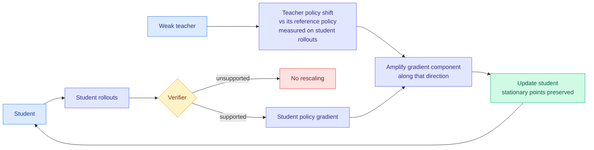

# OPRD: Eliciting Weak-to-Strong Generalization with On-Policy Reverse Distillation

**Source:** HuggingFace Daily Papers · [arXiv 2609.08798](https://arxiv.org/abs/2609.08798)
**Raw:** [`raw/huggingface/2026-09-09-eliciting-weak-to-strong-generalization-with-on-policy-rever.md`](../../raw/huggingface/2026-09-09-eliciting-weak-to-strong-generalization-with-on-policy-rever.md)

## TL;DR

Conventional distillation makes the teacher an **optimization target**, which means the teacher's capacity ceiling becomes the student's. That is fine when the teacher is stronger. It is a problem for the two cases that matter commercially: **successive model generations** (this quarter's model learning from last quarter's) and **multi-domain consolidation** (folding several specialists into one model), where repeating frontier-scale post-training from scratch is prohibitively expensive and the "teacher" may be weaker than the student in places.

OPRD stops treating the teacher as a target. Instead it measures **the teacher's policy shift relative to its own reference policy, evaluated on the student's rollouts**, and uses that direction to **amplify the component of the student's verifier-driven policy gradient that already points the same way**. Because it only rescales updates the verifier already supports, it **preserves the stationary points of policy optimization** while learning faster. Result: higher performance with fewer student updates than existing RL and distillation baselines, in both successive-generation transfer and multi-teacher distillation, and it still works in ordinary strong-to-weak distillation.

## Mechanism

The **"rescale only verifier-supported updates"** clause is what makes the theory work. A teacher signal that is never allowed to introduce a direction the verifier does not already endorse cannot move the optimum, only the speed of getting there. That is why the paper can claim acceleration without redirection.

**The response-style analysis is the evidence for that claim, and it is the most convincing part.** OPRD students end up **closer to models trained with verifier-based RL alone than to their weak teachers**. If the teacher were imposing its ceiling, the students would look like the teacher. They do not.

## How this relates to prior wiki pages

**It is the eighth selective-supervision axis on the [distillation page](knowledge-distillation.md), and the first that is selective about the *direction* of the update rather than about which tokens or prompts to admit.** The prior seven all gate: [TIP](2026-04-16-tip-token-importance-on-policy-distillation.md) weights tokens, [TGOPD (09-08)](2026-09-08-tgopd-prompt-level-teacher-gating.md) gates whole prompts on verified teacher reliability, others gate on entropy or agreement. OPRD admits everything and instead **projects** the teacher's contribution onto a subspace the verifier already blesses. That is a cleaner guarantee than any gate, because a gate can be wrong about a prompt while a projection cannot introduce a bad direction at all.

**It directly addresses the failure TGOPD (09-08) was built to patch, by a different route.** TGOPD's premise is that reverse KL is mode-seeking, so a confidently wrong teacher induces a strong misleading update, and its answer is to verify teacher reliability per prompt before admitting dense supervision. OPRD's answer is that you never need to trust the teacher at all if the teacher can only scale gradients the verifier already produced. **Two papers one day apart, same diagnosis, and OPRD's mechanism strictly dominates in the case where the teacher is unreliable in a way per-prompt probes miss.** The comparison is one table and neither paper has it.

**It supplies a live answer to the [09-08 Looking Ahead prediction](../daily-digest/2026-09/2026-09-08.md) about the missing random-gate control.** That prediction said: the distillation page tracks seven selective-supervision axes and not one has published the control that would show the selection is doing the work, given that [One-Example OPD (09-04)](2026-09-04-one-example-on-policy-distillation.md) already showed sixteen queries match full-data training. OPRD does not run that control either, but its response-style analysis is the nearest thing yet to evidence that the teacher signal changes *rate* rather than *destination*, which is exactly what "most of these filters optimize a non-binding constraint" would predict. **Partial, indirect support for the prediction.**

## Gaps

- No random-direction control: amplifying the student's gradient along an *arbitrary* verifier-supported direction, at matched magnitude, is the null hypothesis and it is not run.
- "Fewer student updates" is the efficiency claim; the cost of running the teacher to measure its policy shift on every student rollout is a real per-step charge and is not netted out.
- Verifier-dependence is total. Everything here needs a verifier, so it inherits the verifiable-domain restriction (math, code) that the whole RLVR line has.
- Weak-to-strong is demonstrated but the *degree* of weakness that still helps is not characterized, which is the parameter a practitioner needs.

## Related

- [Knowledge Distillation](knowledge-distillation.md) (concept page)
- [Verify Before You Distill: TGOPD (09-08)](2026-09-08-tgopd-prompt-level-teacher-gating.md)
- [One-Example On-Policy Distillation (09-04)](2026-09-04-one-example-on-policy-distillation.md)
