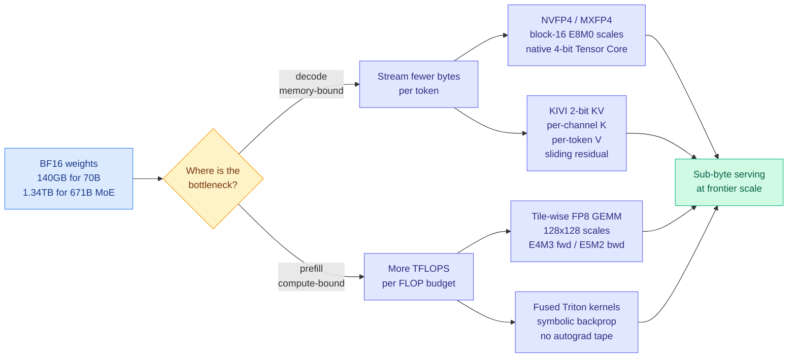

# Extreme Quantization and Precision Engineering: Blackwell FP4, native FP8, 2-bit streaming KV

**Source:** Ken Huang / DistributedApps.ai, *The Physics & Engineering of Frontier LLM Inference*, Chapter 4 (2026-09-10) · [Post](https://kenhuangus.substack.com/p/chapter-4-extreme-quantization-and) · [raw](../../raw/rss/2026-09-10-agentic-ai-chapter-4-extreme-quantization-precision-engineering-bl.md)

## TL;DR

Chapter 4 of the ten-part inference series argues that the 16-bit era is over and names the three mechanisms that ended it. Not "quantization helps," but a specific claim about *where* the tax is paid: at BF16, a 70B dense model spends 140 GB of HBM (the expensive high-bandwidth memory soldered next to the GPU die) on weights alone before any KV cache, and a 671B mixture-of-experts model spends 1.34 TB, which forces multi-node serving purely to hold parameters. The three escapes are **hardware micro-scaling formats** (NVIDIA Blackwell NVFP4 and OCP MXFP4, executing native 4-bit floating-point math on 5th-gen Tensor Cores at a claimed 9 PFLOPS dense on B200), **native tile-wise FP8 GEMM** (DeepSeek-V4's 128x128 decoupled scaling with E4M3 forward and E5M2 backward, reported lossless at 1.6T and 2.8T parameter scale), and **symbolic-backprop Triton kernels** (Unsloth fusing RMSNorm, RoPE and cross-entropy to drop intermediate activation VRAM by up to 80% at 2-5x speedup). Section 6 extends the same logic to the cache: KIVI 2-bit streaming with a sliding-window residual buffer, plus per-channel key and per-token value quantization.

## The precision stack

## Key points

- **The outlier problem is what tile-wise scaling solves.** Activation distributions in transformers develop kurtosis explosions and spike channels, so a single per-tensor scale factor either clips the outliers or wastes the whole dynamic range on them. The chapter traces the lineage (LLM.int8() isolating outlier channels, SmoothQuant migrating scale from activations to weights, AWQ protecting salient weights, GPTQ doing second-order Cholesky updates) and positions DeepSeek's 128x128 tile-wise dynamic scaling as the production answer: give each tile its own scale so an outlier only poisons its own tile.
- **Micro-scaling is the same idea moved into silicon.** OCP MX formats attach an E8M0 scale to each 16- or 32-element vector, and Blackwell's 5th-gen Tensor Cores execute the dot product on E2M1 mantissas natively rather than dequantizing to FP16 first. That is the difference between W4A16 (weights compressed, math still 16-bit) and native W4A4, and it is why the format change buys throughput and not just capacity.
- **Asymmetric key/value quantization is the KV-side insight.** KIVI quantizes keys **per channel along the sequence axis** and values **per token across the hidden dimension**, because the two tensors have different outlier geometry. A sliding-window residual buffer keeps the most recent tokens at full precision, which is where quantization error hurts most.
- **Kernel engineering is a separate axis from format choice.** Unsloth's symbolic backpropagation derives the backward pass analytically instead of replaying a cached forward tape, so the intermediate activations never get allocated. The 80% VRAM figure is a training-side claim, not a serving one, but it is the same "do not materialize what you can recompute or derive" logic.

## How this relates to prior wiki pages

**It completes a four-chapter arc this wiki has been tracking in order.** [Chapter 1 (09-02)](../hardware/2026-09-02-physics-of-llm-inference-roofline.md) established the roofline result that on a 70B model 99.66% of a decode step is spent moving bytes, not computing. [Chapter 2 (09-07)](2026-09-07-kv-cache-frontier-mla-radix-kvshare.md) surveyed the cache frontier and flagged cross-layer KV sharing as the unexplored axis. [Chapter 3 (09-09)](2026-09-09-next-gen-speculative-decoding-mtp-eagle2-indexshare.md) covered speculative decoding as the way to buy back the memory-bound decode step. Chapter 4 is the numerics answer to Chapter 1's diagnosis: if the bottleneck is bytes moved, halve the bytes.

**It lands on the same day as the model that ships the whole stack.** [DeepSeek V4.1 Flash (09-10)](../llms-foundation-models/2026-09-10-deepseek-v41-flash-architecture.md) keeps its HBM-resident backbone "mostly 4-bit" and uses an FP4 KV cache with quantization-aware training. Chapter 4 is the manual; V4.1 Flash is the reference implementation shipped under MIT licence within hours of it. That co-arrival is the strongest evidence this wiki has that sub-byte serving stopped being a research direction and became the default.

**It sharpens the open question on [kv-cache.md](kv-cache.md).** That page recorded on 08-25 that TileMix recovers the INT8-KV quality tax by routing precision per tile, and explicitly asked whether a two-bit mask over FP16/FP8/INT8 would work on Hopper and Blackwell where FP8 gives a third precision point. Chapter 4 supplies the hardware answer (NVFP4 gives a fourth) without supplying the routing policy. The gap is unchanged and now larger.

**It contradicts nothing, but it under-reports the failure mode this wiki has documented.** [When Quantization Breaks Memory (09-07)](2026-09-07-quantization-breaks-recurrent-state.md) found that deterministic 4-bit state storage on a trained recurrent network raised error roughly 70x and 300x on two targets, because writing back a quantized state changes the dynamical system rather than approximating it. Chapter 4's perplexity-retention curves are for feedforward weight and activation quantization, where that mechanism does not apply. Anyone reading the chapter as licence to 4-bit a state-space model should read the 09-07 page first.

## Gaps

The empirical benchmark matrix (Section 7) sits behind the paywall, so the free edition asserts the numbers without showing them. The 9 PFLOPS B200 figure is a vendor dense-compute peak and will not survive contact with a real MoE serving workload. And the chapter treats format selection as a per-model decision when the day's other results, TileMix and CSA2, both argue it is becoming a per-region and per-layer decision.

## Industrial implication

The reason this matters commercially is the interaction with supply. Sub-byte formats are the only lever that reduces HBM demand without reducing model quality, and HBM is the constrained input. Every extra bit of compression is HBM capacity that does not need to be bought, at a moment when [behind-the-meter power buildout (09-10)](../hardware/2026-09-10-behind-the-meter-power-datacenters.md) shows 75 GW of binding orders chasing the same shortage from the electricity side. Precision engineering and power procurement are two prices on the same scarcity.

## Related

- [KV cache](kv-cache.md) · [Memory hierarchy](../hardware/memory-hierarchy.md) · [Model pruning and sparsity](model-pruning-sparsity.md) · [Compute economics](../hardware/compute-economics.md)
