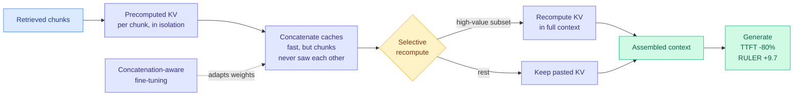

# Fine-tune for KV concatenation, then selectively recompute: 80% off TTFT with the quality back

**Source:** Kurate cs.LG weekly leaderboard #7 (tier 1, ai_rating 5.0), absent from HuggingFace · [Paper](https://arxiv.org/abs/2609.09768) · [raw](../../raw/kurate/2026-09-10-cs-lg.md)

## TL;DR

Retrieval-augmented generation concatenates many retrieved chunks into one long prompt, which makes prefill (the pass that processes the whole input before the first output token) dominate latency. The standard fix is to precompute each chunk's KV cache (the stored attention keys and values, so they need not be recomputed) once and paste the caches together at request time. It works for latency and it has a known defect: the pasted states were computed in isolation, so each chunk never attended to its neighbours, and response quality degrades as the concatenated context gets long. Nobody had established how badly. This paper (Kioxia) combines two corrections. **(i) Fine-tune the model knowing that its KV caches will be concatenated**, so the weights adapt to context-free key/value states. **(ii) Selectively recompute a subset of the caches** rather than all or none. Together, on RULER at a **124k-token input**, they improve the RULER score by **9.7 points** over a recompute-only baseline while cutting **TTFT by 80%** against full attention.

## The mechanism

## Key points

- **The two halves are complements, not alternatives.** Fine-tuning teaches the model to tolerate context-free KV states in general. Selective recompute buys back exactly the chunks where that tolerance is not enough. Either alone is weaker than the pair, which is the paper's actual argument and the reason for its title.
- **The 124k figure is the point.** Prior cache-reuse work reported latency wins at moderate context and left the long-context quality question open. Measuring at 124k on RULER, a benchmark built to stress long-context retrieval and aggregation, is what turns "reuse is fast" into "reuse is fast and this is what it costs you."
- **80% TTFT reduction is measured against full attention**, not against a weaker cached baseline, so the comparison is the honest one.
- **It is a training-time intervention on a serving problem.** That is unusual on this page and it constrains adoption: you cannot apply this to a model you did not fine-tune.

## How this relates to prior wiki pages

**It closes a gap [kv-cache.md](kv-cache.md) has carried since the beginning.** The "Key Concepts" section of that page names **context dependency** as the core obstacle: KV states are specific to the attention context at the time they were computed, so reusing them in a new context produces attention-distribution mismatch, "hence the need to recompute." Every prior entry treated that as a fixed property of the model. This paper treats it as a property of the *weights* and fine-tunes it away partially, then pays for the remainder with targeted recompute. That is the first entry on the page that attacks context dependency at training time.

**It is the RAG-side sibling of [NVIDIA's cross-model KV transfer (09-09)](2026-09-09-nvidia-cross-model-kv-transfer.md), which learns a closed-form map to move a KV cache from one model into another and skips prefill entirely at 2.7 to 25x faster than re-prefill, but degrades sharply on two of six model pairs with no predictor of which.** Both are "reuse a cache that was not computed for this situation" methods, and both hit the same wall: reuse is cheap and sometimes silently wrong. This paper's selective-recompute stage is exactly the mitigation NVIDIA's mapper lacks, expressed as a per-chunk decision instead of a per-pair one. The transferable idea is **partial recompute as an insurance premium on cache reuse**, and it is the obvious next experiment for cross-model transfer.

**It also runs against the grain of [Random Attention (09-04)](2026-09-04-random-attention-kv-eviction.md), which deleted the importance scorer entirely and evicted uniformly at random inside each head, matching the best prior evictor at 32-43% higher throughput.** Selective recompute requires deciding *which* chunks to redo, which is an importance-scoring problem in a new costume. If random selection of recompute targets works as well as a learned one, the same deflationary result applies here. Nobody has run that ablation and it is a five-line change.

## Gaps

RULER only. No end-to-end serving throughput under concurrent load, which is the regime where selective recompute either amortizes or blocks the queue. The selection policy for which caches to recompute is not characterized in the abstract, and everything depends on it. And the fine-tuning requirement means this cannot be dropped into a serving stack in front of an off-the-shelf model, which is how most RAG systems are built.

## Industrial implication

RAG stacks are the single largest deployed long-context workload and prefill is their dominant cost. An 80% TTFT cut with a *quality gain* rather than a quality tax is the shape of result that ships, provided the fine-tune is cheap. The strategic read is that cache reuse is moving from a serving-layer trick to a model-training assumption, which is the same direction [DeepSeek V4.1 Flash (09-10)](../llms-foundation-models/2026-09-10-deepseek-v41-flash-architecture.md) took by training with an FP4 KV cache in the loop rather than quantizing afterwards.

## Related

- [KV cache](kv-cache.md) · [Memory hierarchy](../hardware/memory-hierarchy.md) · [Test-time compute allocation](test-time-compute-allocation.md)
