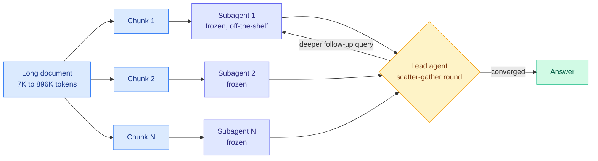

# PARSER: decoupling reading from reasoning cuts long-context agent latency 11x

**Source:** HuggingFace Daily Papers · [Paper](https://arxiv.org/abs/2609.06702) · [raw](../../raw/huggingface/2026-09-10-parser-read-in-parallel-reason-in-depth-for-long-context-llm.md)

## TL;DR

Sequential memory agents read a long document chunk by chunk while carrying a compact memory state forward. That design ties two things together that have no reason to be tied: **how far you have read** and **how deeply you have reasoned**. The consequence is that inference latency grows linearly with document length, and accuracy becomes sensitive to *where* in the document the evidence happens to sit. PARSER breaks the coupling. A bank of lightweight frozen subagents, one per chunk, reads the entire document **in parallel**. A single lead agent then reasons in depth through iterative scatter-gather rounds: broadcast a query to every subagent, aggregate what comes back, formulate a deeper follow-up conditioned on what has been found. All learnable behaviour sits in the lead agent, trained with reinforcement learning; the subagents stay off-the-shelf and frozen. On multi-hop question answering from 7K to 896K tokens, a 4B-backbone PARSER beats the strongest sequential-memory baseline by 5.7 points on average and **12.0 points at 896K**, a 9B version passes DeepSeek-V4-Pro by 6.3 points, and inference latency drops **up to 11x**.

## The mechanism

## Key points

- **Reading is parallel, reasoning is serial, and only reasoning needs depth.** The number of scatter-gather rounds sets reasoning depth and is independent of N, the number of chunks. Wall-clock reading cost becomes O(1) in the number of chunks given enough parallel capacity, which is where the 11x comes from.
- **Concentrating all learnable behaviour in one small agent is a cost decision, not just an engineering convenience.** The subagents are frozen, so the RL run only ever updates the lead. That is why a 4B backbone is competitive: you are training a query planner, not a document reader.
- **Robustness to evidence placement is the result to take seriously.** Controlled experiments perturb evidence position, order and distance, conditions that cause large accuracy swings in sequential methods. PARSER is stable under all three. Sequential memory agents fail here because a fact seen at chunk 3 has to survive compression through chunks 4 to N.
- **The 896K number is the one that matters.** The 5.7-point average gap widens to 12.0 at the longest context, meaning the advantage grows exactly where sequential memory degrades.

## How this relates to prior wiki pages

**It is the architectural counterpart to a result that arrived through social the same day.** [Trace as State (2609.02702)](../llms-foundation-models/2026-09-10-trace-as-state-conditional-state-long-context.md) proves that for causal state-update processors, giving the condition *first* can require exponentially less memory than giving it last, and gets DeepSeek V4 Pro Preview from 29.2% to 81.8% on GraphWalks Parents by re-reading the context with prior reasoning traces prepended. Both papers attack the same failure: **a causal transformer cannot use state it discovers late to change how it encoded text it read early.** Trace as State fixes it by re-reading with the state in front. PARSER fixes it by never committing to a single read order at all, since every chunk is available to every query round. Two independent answers to one problem, published within days.

**It sits against the sequential-memory line this wiki has been accumulating.** Compression-based long-context work (see [LatentPress (09-04)](2026-09-04-latentpress-latent-context-compression.md), which compresses context into a latent state, and [LatentStream (09-04)](2026-09-04-latentstream-progressive-latent-memory.md), which grows that state progressively) all assume the sequential frame and try to make the carried state better. PARSER argues the frame itself is the cost. That is a stronger claim and it is now backed by a latency number, not just accuracy.

**It reframes the cost question for [kv-cache.md](kv-cache.md).** Every method on that page reduces the cost of one long KV cache. PARSER replaces one long cache with N short independent ones, which changes the memory profile from a single large allocation to many small parallelizable ones. Those are very different things to schedule on a GPU, and the paper does not report aggregate memory, only latency.

## Gaps

The 11x latency figure assumes the parallel subagent calls actually run in parallel, which requires N-way serving capacity. Under a fixed GPU budget with queueing, the speedup is a scheduling question the paper does not answer, and total token consumption across N subagents plus R rounds is not reported anywhere in the abstract. It is entirely possible that PARSER trades dollars for latency rather than saving both. Evaluation is multi-hop QA only; whether scatter-gather survives tasks that need a genuinely global read, such as summarization or code-wide refactoring, is untested.

## Industrial implication

Latency and evidence-position robustness are the two things that block long-context agents from production, and this hits both. If the token accounting turns out to be favourable, PARSER is the natural shape for any retrieval-augmented agent already running a fan-out over chunks, because most stacks already have the subagent pattern and are using it for retrieval rather than for iterative interrogation. The one-line change is making the fan-out re-queryable instead of one-shot.

## Related

- [KV cache](kv-cache.md) · [Test-time compute allocation](test-time-compute-allocation.md) · [Multi-agent systems](../agentic-systems/multi-agent-systems.md)
