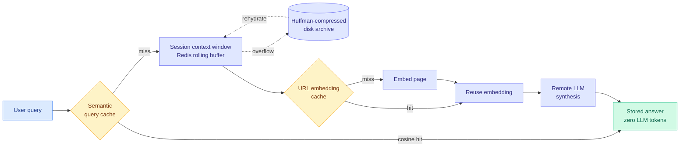

# A three-layer cache on an 8-vCPU box: 89.3% hit rate for LLM web search

**Source:** HuggingFace Daily Papers · [Paper](https://arxiv.org/abs/2609.05463) · [raw](../../raw/huggingface/2026-09-10-a-three-layer-caching-architecture-for-low-latency-llm-web-s.md)

## TL;DR

OreoLook is an open-source answer engine of the ChatGPT-search / Perplexity kind: browser agents fetch live pages, a remote provider does the synthesis, and everything else (local search, session management, embeddings) runs on commodity CPU. As usage grew it hit three separate failures that all look like one problem. Sessions lost context, equivalent questions phrased differently triggered fully redundant work, and the same URL got embedded again for every session that touched it. The paper's answer is three caches at three different granularities: a **Session Context Window** (rolling recent messages in Redis, overflowing to Huffman-compressed disk archives), a **Semantic Query Cache** (cosine similarity over embedding vectors, so a rephrasing returns the stored answer without an LLM call at all), and a **URL Embedding Cache** (deduplicating embedding computation across sessions). Deployed on one 8-vCPU Cascade Lake server at 2 GHz with 32 GB RAM, 30 Hypercorn workers across three containerized replicas: **89.3% aggregate Redis keyspace hit rate, 0.1 ms read latency, 1.38 MB memory overhead.** A background LRU daemon migrates idle sessions to disk and rehydrates them on demand, so a conversation can resume days later.

## The three layers

## Key points

- **The semantic query cache is the only one of the three that removes an LLM call entirely.** Prefix caching, which this wiki has covered extensively, reuses computed KV states for a shared prompt prefix but still runs the request: new tokens are processed and the full answer is decoded. A semantic hit skips input tokens, output tokens and decode time together. That is a categorically larger saving and a categorically larger correctness risk.
- **The hardware is the argument.** 8 vCPUs, 32 GB, no GPU, 0.1 ms reads and 1.38 MB overhead. The claim is not that caching is clever but that the entire non-synthesis half of an answer engine fits on a machine that costs tens of dollars a month.
- **Overflow to compressed disk with LRU rehydration is what makes long sessions affordable.** Most production systems either cap session length or pay to keep everything hot. Huffman-compressing cold sessions to disk is the boring correct answer.
- **89.3% is an aggregate keyspace hit rate across all three layers**, not a semantic-answer-reuse rate, and the paper should not be read as claiming 89.3% of queries skip the model.

## How this relates to prior wiki pages

**It is a production instance of the fourth layer named on [the four cache layers page (08-29)](2026-08-29-four-cache-layers-kv-prefix-prompt-semantic.md), which separated per-request KV cache, server-side prefix caching, provider-billed prompt caching and application-level semantic caching, and observed that the semantic layer was the least studied of the four.** This is the first entry with deployed numbers for that layer, and it arrives the same day that Redis pushed LangCache, a managed semantic-response cache, into the practitioner feed with a claimed 90% API cost reduction and 15x faster cache-hit responses. **Two independent semantic-cache artifacts in one day is the pattern: the cheapest token is the one never sent, and the industry is finally building the layer that never sends it.**

**It quietly supports the ContextPipe arithmetic recorded on [kv-cache.md](kv-cache.md).** [ContextPipe (09-06)](../agentic-systems/2026-09-06-contextpipe-database-context-assembly.md) cut total tokens 31% and LLM calls 23% while *lowering* its KV cache-hit ratio, and the page's resolution was that a token never assembled costs nothing at any cache tier. A semantic cache is the extreme version: the entire request is never assembled. Both results push against optimizing cache-hit ratio as an objective.

**The correctness risk is the part the wiki should track.** Deciding that two differently-worded questions share an answer is a similarity-threshold judgement, and the paper's own framing (rephrasings, tuned thresholds, expiration policies, data isolation, monitoring for incorrect matches) concedes that a bad match returns a confidently wrong cached answer with no model in the loop to catch it. No entry on this wiki has measured that error rate.

## Gaps

No accuracy evaluation of the semantic cache at all: no false-hit rate, no threshold sweep, no measure of how often a "close enough" match returned a materially wrong answer. Single deployment, single workload, no comparison against a no-cache baseline on answer quality. And the synthesis step still runs on a remote provider, so the commodity-hardware claim covers everything except the expensive part.

## Industrial implication

For any customer-support or FAQ-shaped LLM product, the semantic layer is the highest-leverage unimplemented optimization, because those workloads have genuinely repeated intent behind varied phrasing. The engineering that decides whether it ships is not the cache, it is the threshold tuning and the false-hit monitoring, and neither this paper nor Redis's product page tells you how to set them.

## Related

- [KV cache](kv-cache.md) · [Test-time compute allocation](test-time-compute-allocation.md) · [Compute economics](../hardware/compute-economics.md)
