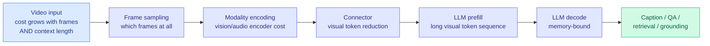

# Why is video still so expensive? A survey of inference efficiency in video LLMs

**Source:** HuggingFace Daily Papers · [Paper](https://arxiv.org/abs/2609.10355) · [Repo](https://github.com/momentslab/awesome-efficient-videollm) · [raw](../../raw/huggingface/2026-09-10-why-is-video-still-so-expensive-a-survey-of-inference-effici.md)

## TL;DR

Video LLMs couple a video representation to a pretrained language model and answer questions about it. Their cost grows with both frame count and context length simultaneously, which is why captioning a two-minute clip can cost more than reasoning over a book. This survey organizes every efficiency mechanism that reports a **concrete** reduction (parameter count, FLOPs per input, latency, memory, or visual/audio token count) by **the pipeline stage it acts on**: frame sampling, modality encoding, connector-level token reduction, and LLM prefill/decode. The useful discipline is that it assembles accuracy-cost comparisons **under shared host models and input protocols** where those exist, and explicitly separates them from heterogeneous cross-paper numbers that cannot be compared. Its two named gaps: audiovisual efficiency is barely studied relative to visual-only, and there is no standardized evaluation protocol.

## Where the cost is

## Key points

- **Organizing by pipeline stage is the right taxonomy** because the mechanisms genuinely compose: dropping frames, shrinking the encoder, reducing connector tokens and compressing the KV cache are four independent multipliers on the same bill.
- **The token-count axis is the one that connects video to the rest of this wiki.** A visual token is a language-model token as far as prefill and the KV cache are concerned, so connector-level token reduction is the same optimization as text-side context compression wearing different clothes.
- **The survey's insistence on shared-host-model comparisons is a methodological contribution in itself**, and the reason it is worth reading rather than skimming the repo.
- **Coverage runs from late 2022 forward** plus the earlier frame-sampling and vision-encoder mechanisms that survive as components of current pipelines.

## How this relates to prior wiki pages

**It generalizes [Select, Compress, Reinvest (09-05)](2026-09-05-select-compress-reinvest-visual-tokens.md), which showed that visual tokens are not merely reducible but that the budget freed by dropping them can be reinvested into reasoning tokens for a net accuracy gain.** The survey catalogues dozens of connector-level reduction methods but frames them all as pure savings. The reinvestment framing, that a saved visual token can be spent as a reasoning token, is the sharper idea and the survey does not carry it. Anyone building on this taxonomy should treat "reduction" and "reallocation" as separate columns.

**It provides the missing denominator for the video-generation economics thread on [compute-economics.md](../hardware/compute-economics.md).** That page has tracked serving cost for text inference in detail; video has appeared mostly as a demand-side driver of datacenter buildout. This is the first entry that decomposes where video inference cost actually goes, which is what makes the demand figure interpretable.

**The audiovisual gap it names matters more than it looks.** Every efficiency mechanism catalogued here was developed for the visual stream. Audio tokens have different temporal density and different redundancy structure, and applying visual-token pruning heuristics to them is an untested transfer.

## Gaps

It is a survey, so it inherits its field's reporting: literature-reported numbers, not reproductions. The authors are explicit that cross-paper evidence is heterogeneous, which is honest but also means most of the catalogue cannot be ranked. And the taxonomy has no cost model, so a reader cannot compute which stage to optimize first for their own workload.

## Related

- [KV cache](kv-cache.md) · [Test-time compute allocation](test-time-compute-allocation.md) · [Compute economics](../hardware/compute-economics.md)
