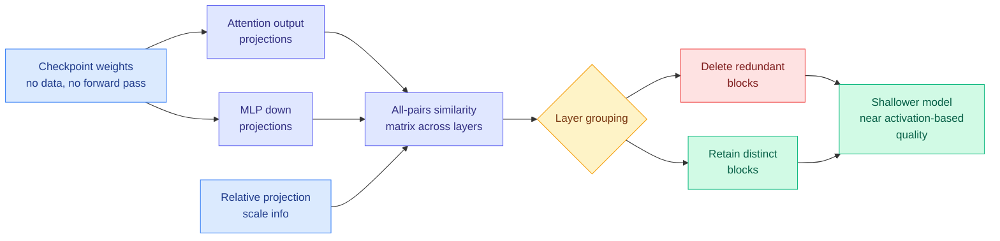

# WRP: pruning whole transformer blocks by reading the weights, with no calibration data

**Source:** Kurate cs.LG weekly leaderboard #9 (tier 1, ai_rating 4.5), absent from HuggingFace · [Paper](https://arxiv.org/abs/2609.09883) · [raw](../../raw/kurate/2026-09-10-cs-lg.md)

## TL;DR

Depth pruning deletes entire transformer blocks to cut inference cost. Deciding *which* blocks normally requires running calibration data through the model and watching the hidden states, which needs data you may not have and forward passes you may not want to pay for. Existing forward-free methods avoid that but score each block **in isolation**, which misses the thing that actually licenses deletion: two adjacent blocks doing nearly the same job. **Weight-Redundancy Pruning (WRP)** estimates inter-layer redundancy directly from checkpoint weights. It compares attention output projections and MLP down-projections across layers, combines those pairwise similarities with relative projection-scale information, and builds an all-pairs similarity matrix that drives layer grouping and block selection. No calibration data, no forward pass. It consistently beats existing forward-free magnitude pruning and **approaches activation-based methods** across multiple pruning ratios, model families and downstream tasks.

## The mechanism

## Key points

- **Pairwise beats pointwise.** The whole gain over prior forward-free methods comes from asking "is this block redundant *with respect to that one*" instead of "is this block individually unimportant." Redundancy is a relation, not a property.
- **Data-free matters for licensing and privacy, not just cost.** A pruning method that needs no calibration corpus can be applied to a model whose training distribution you cannot legally sample, which is most enterprise fine-tunes.
- **"Approaches activation-based" is an honest framing.** WRP does not claim to beat methods that actually look at activations. It claims to get close for free, which is the correct trade to offer.

## How this relates to prior wiki pages

**It is the depth-axis complement to [XMerge (09-08)](2026-09-08-xmerge-depth-compression.md), which compresses depth by merging adjacent layers rather than deleting them.** Both start from the same empirical fact, that adjacent transformer blocks are highly similar, and diverge on what to do about it: merge the pair into one, or drop one and keep the other. Merging preserves more of the signal and costs a fitting step; WRP costs nothing and throws information away. Nobody has run them head to head at matched compression ratio, and that is the experiment [model-pruning-sparsity.md](model-pruning-sparsity.md) needs.

**The adjacency observation now appears at three levels of the stack in one week, which is a pattern worth naming.** [KVShare (09-07)](2026-09-07-kv-cache-frontier-mla-radix-kvshare.md) found that adjacent layers' KV projections have high cosine similarity in 60-plus-layer topologies, so anchor layers can serve follower layers for 50-75% extra memory reduction. [DeepSeek V4.1 Flash (09-10)](../llms-foundation-models/2026-09-10-deepseek-v41-flash-architecture.md) shipped CSA2, whose Reuse mode declines to re-decide which tokens matter at every layer. WRP deletes the redundant block outright. **Three papers, one underlying claim: depth in current LLMs contains substantial repeated computation, and it can be shared, reused or removed.** That is the third instance and it crosses the threshold for calling it a pattern rather than a coincidence.

**It sharpens the open question on [model-pruning-sparsity.md](model-pruning-sparsity.md) about what pruning signals actually measure.** [Don't Drop Dropout (09-07)](2026-09-07-dont-drop-dropout-layer-sparsity.md) found layer-level sparsity behaves differently from what unit-level intuitions predict. WRP's finding that weight-space similarity alone nearly matches activation-space measurement suggests the activation signal was largely recovering structure already visible in the weights, which would be a mildly deflationary result for the whole activation-based pruning literature if it holds at scale.

## Gaps

No throughput or latency numbers in the abstract, only downstream task quality, so the practical speedup at a given quality loss is unstated. "Multiple pruning settings" and "model families" are unenumerated. And the method's core assumption, that similar projection weights imply similar function, ignores that two layers with similar weights can sit at very different points in the residual stream and therefore do very different work.

## Industrial implication

Data-free depth pruning is the cheapest possible way to make a model fit a smaller box, and it composes with quantization rather than competing with it: prune the depth, then serve the remainder at 4-bit per [Chapter 4 (09-10)](2026-09-10-extreme-quantization-blackwell-fp4-native-fp8.md). For anyone shipping a fine-tuned open model to constrained hardware, this is a one-afternoon experiment with no data pipeline attached.

## Related

- [Model pruning and sparsity](model-pruning-sparsity.md) · [Knowledge distillation](knowledge-distillation.md) · [KV cache](kv-cache.md)
