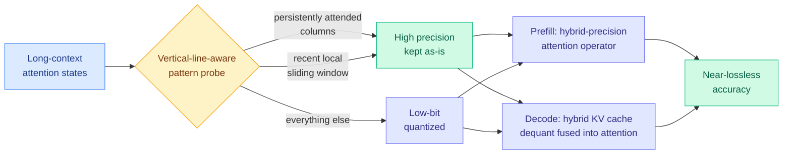

# HyQuant: Hybrid-Precision Quantization for LLM Attention

**Source:** HuggingFace Daily Papers, arXiv 2608.27875 (Shanghai Jiao Tong University, Xi'an Jiaotong, Xiamen University, Tencent Penglai Lab)
**Raw:** [raw/huggingface/2026-09-11-hyquant-hybrid-precision-quantization-for-llm-attention.md](../../raw/huggingface/2026-09-11-hyquant-hybrid-precision-quantization-for-llm-attention.md)
**Links:** [arXiv](https://arxiv.org/abs/2608.27875) · [Code](https://github.com/jerrysfls/HyQuant)

## TL;DR

Quantizing the attention module (turning its 16-bit numbers into 4-bit or 8-bit ones to save memory and bandwidth) breaks down at very low bit widths, and the field's standard answer has been smoothing: mathematically flatten the outliers so a uniform low-bit grid can represent everything. HyQuant declines to smooth. It observes that attention is not uniform and never was, keeps a small set of accuracy-critical states in full precision, and quantizes the rest hard. The critical set is identified by a cheap structural signal, **vertical-line tokens**: in a long-context attention map, a small number of columns are attended to by almost every query, persistently, across positions. Those columns plus a local sliding window stay in high precision. Everything else goes low-bit. The same rule applies in both phases: during prefill it is a hybrid-precision attention operator, and during decode it becomes a KV cache compression policy, with KV dequantization fused into the attention computation so the dequantized values never round-trip through memory.

## What problem it solves

Low-bit quantization of attention states carries a large error at aggressive bit widths because attention activations have heavy outliers, and a uniform quantization grid has to stretch to cover them, which wastes almost all of its resolution on values that never occur. The prevailing fix is smoothing: rescale weights and activations so the outliers shrink and the bulk spreads out. Smoothing is a *global* correction to a *local* problem, and it costs accuracy at very low bit widths because it distorts the values that mattered in order to accommodate the ones that did not.

HyQuant's premise is that you should not try to make the distribution uniform. You should spend bits where the distribution says to. The alphaxiv walkthrough states the enabling observation plainly: **a small number of tokens remain persistently important** across a long context. Those tokens show up as vertical lines in the attention heat map because every query row attends to the same few key columns. Detecting them does not need a learned model or a calibration pass, only a lightweight pattern signal, so the selection overhead stays small enough not to eat the saving.

## Key results

- Near-lossless accuracy across diverse tasks, models and datasets, with what the paper describes as an extremely simple design. The claim is explicitly framed as a practicality result rather than a new frontier on the accuracy-versus-bits curve.
- The same criticality rule covers prefill and decode, so one policy governs both the compute-bound and the memory-bound phase rather than requiring two separate schemes.
- KV dequantization is **fused** with attention computation in the decode kernel. Without fusion, you decompress a block of the cache into registers or shared memory and then attend to it, which reintroduces exactly the memory traffic the compression was supposed to remove.

## How this relates to prior wiki pages

**This is the third result in eighteen days that treats precision as something you route rather than something you set, and the second that routes it inside attention.** [TileMix (08-25)](2026-08-25-tilemix-tile-centric-mixed-precision-attention.md) partitioned the query-key score matrix into hardware-aligned tiles and dispatched each tile group through an FP16 or an INT8 path, with both paths updating one shared online-softmax state. HyQuant partitions along a different axis: TileMix's unit is a *geometric tile of the score matrix*, HyQuant's is a *semantically selected set of tokens*. The two are close to orthogonal and there is no reason they could not compose, which nobody has tried. The [LLM Routing page's](../ai-routing/llm-routing.md) 08-25 entry named the general pattern, that routing is the same allocation problem recurring wherever compute can be spent unevenly. HyQuant is another instance at the lowest level of that stack.

**It directly attacks the INT8-KV-cache quality tax this page has recorded since spring.** The [KV cache page](kv-cache.md) has logged INT8 KV quantization as a memory play whose cost is long-context quality, and recorded TileMix as the first result to buy that quality back in the kernel. HyQuant buys it back differently, by refusing to quantize the tokens that carry the long-context signal in the first place. The mechanisms are complementary: TileMix recovers accuracy on the score computation, HyQuant protects the cached states themselves.

**Vertical-line tokens are the same phenomenon as attention sinks, arriving at a different conclusion.** Prior eviction work uses persistent-attention structure to decide what to *keep* and what to *discard*. HyQuant uses it to decide what to keep at *what precision*, which is a strictly gentler decision: an evicted token is unrecoverable, a low-bit token is merely noisy. That distinction matters for the failure mode. Eviction methods fail catastrophically when the importance estimate is wrong on a token that later turns out to matter; HyQuant degrades gracefully in the same situation.

**And [Why Does Post-Training Quantization Work? (09-11)](2026-09-11-why-post-training-quantization-works.md), which landed on the same day from Kurate, supplies the theory HyQuant lacks.** That paper shows quantization error survives partly because a layer's injected error opposes its inherited error and partly because the LM head absorbs residual error into the low-ranked vocabulary tail. HyQuant's heuristic, spend bits on persistently attended tokens, is a guess at where those two protections are weakest. Nobody has connected the two, and the connection is the obvious next experiment.

## Gaps

No throughput or memory numbers appear in the abstract, only the accuracy claim, and "limited overhead" for the pattern probe is asserted rather than ablated. That matters because the entire argument turns on the selection cost being small relative to the saving, and the probe runs on the attention map, which is the one tensor you were trying not to materialize. The vertical-line signal is also a long-context artifact; whether it exists in short-context or heavily-batched serving, where the attention map has fewer rows to establish persistence over, is unaddressed. No hardware breadth is reported either, and the fused-dequant kernel is where hardware generation matters most, since Hopper and Blackwell give you FP8 as a third precision point and change the arithmetic entirely.

## Research angle

The open question is whether token-level and tile-level precision routing are additive or whether they are cashing the same redundancy budget. This is the identical question the [KV cache page](kv-cache.md) raised on 09-10 about three depth-sharing results, and it now recurs one level down. The concrete experiment is cheap: run HyQuant's token selection and TileMix's tile dispatch in the same kernel, and measure whether the accuracy recovered is the sum of the two or roughly the max. If it is the max, the field has been describing one redundancy from three angles.

## Related

- [Quantization (concept page)](quantization.md)
- [Why Does Post-Training Quantization Work? (09-11)](2026-09-11-why-post-training-quantization-works.md)
- [TileMix: tile-centric mixed-precision attention (08-25)](2026-08-25-tilemix-tile-centric-mixed-precision-attention.md)
- [KV Cache](kv-cache.md)
- [LLM Routing](../ai-routing/llm-routing.md)
