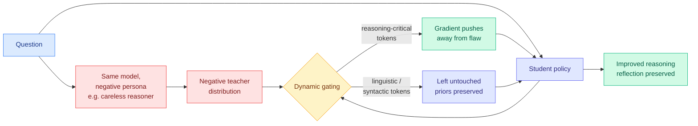

# Negative Self-Distillation: Learning to Reason by Avoiding Flaws

**Source:** HuggingFace Daily Papers, arXiv 2609.11699 (University of Virginia: Rongcan Pei, Zhepei Wei, Xinyu Zhu, Wei-Lin Chen, Yu Meng; with Shuyao Xu, Stanford)
**Raw:** [raw/huggingface/2026-09-11-negative-self-distillation-learning-to-reason-by-avoiding-fl.md](../../raw/huggingface/2026-09-11-negative-self-distillation-learning-to-reason-by-avoiding-fl.md)
**Links:** [arXiv](https://arxiv.org/abs/2609.11699)

## TL;DR

On-policy self-distillation (OPSD) lets a model teach itself by conditioning on privileged information, usually the ground-truth solution, generating a clean reasoning trace, and then training the unconditioned model to imitate it. Recent work found this *degrades* hard reasoning, and the diagnosis is specific: a trace written by someone who already knows the answer never hesitates, never backtracks, never says it is unsure. Training on it therefore penalizes exactly the exploratory and self-corrective behaviour that hard problems require. The alphaxiv walkthrough names the failure mode **reflection collapse**. Negative Self-Distillation inverts the construction. Instead of building a good teacher to imitate, it builds a **bad** one to move away from: prompt the model itself to reason under a deliberately degraded persona (the paper's example is a "careless reasoner"), and push the student's distribution *away* from that self-generated negative teacher. No ground truth, no external teacher, no labels.

## The problem the gating mechanism solves

Naively pushing a distribution away from a bad teacher is an unlearning objective, and unlearning objectives applied to language models are dangerous for a mundane reason. A flawed reasoning trace is still written in English. Its tokens are a mixture of the *behavioural* flaw (the careless inference, the skipped check, the unjustified leap) and ordinary *linguistic* scaffolding (articles, connectives, the structure of a sentence). Penalizing the whole trace penalizes both, and the second category is the model's foundational language ability. Indiscriminate divergence therefore risks catastrophic degradation of fluency in exchange for a marginal reasoning gain.

The fix is a **dynamic gating mechanism** that identifies reasoning-critical tokens and confines the gradient update to them. Linguistic priors are left alone; only behavioural flaws are pushed against. That gate is the technical contribution, and it is what separates this from a naive negative-KL baseline.

Empirically, NSD consistently outperforms OPSD and other label-free, self-bootstrapping reinforcement-learning baselines.

## How this relates to prior wiki pages

**This is the fifth entry on the [knowledge distillation page](knowledge-distillation.md) in three weeks whose core move is deciding which tokens carry the signal, and the first to apply that decision to a *negative* signal.** The prior four all filtered positive supervision. TIP found most teacher-generated tokens carry no learning signal so roughly 10% suffices. [R2-OPD (08-25)](2026-08-25-r2-opd-reasoning-progress-filtering.md) went further, showing that some teacher supervision is *actively harmful* because teacher agreement punishes a student that finds a different valid reasoning path, and suppressed the distillation reward wherever a teacher-derived ranking and a progress-derived ranking disagreed. NSD's gate does the same kind of work on the other sign: it decides which tokens are safe to *repel*. The page's running principle, do not apply a single signal uniformly across a sequence, now covers attraction and repulsion alike.

**It is the fourth resolution of what the 08-28 entry called the teacher ceiling, and the cheapest.** That entry recorded four mechanisms for escaping the bound that a purely distributional objective places on a student at its teacher's level: [OPDVR (08-26)](2026-08-26-opdvr-distillation-verifiable-reward.md) broke the bound with a verifier, [QAH (08-26)](2026-08-26-quantization-aware-healing.md) swapped a degraded teacher pointer back to the original pre-compression model, and [Self-OPD (08-28)](2026-08-28-self-opd-teacher-free-flow-matching.md) removed the referent entirely by supervising a student with its own advantage-ranked exploration. NSD escapes by a route none of them took: **a negative teacher imposes no ceiling at all**, because "be unlike this" does not bound you from above. It is also the only one of the four that needs neither a verifier, a second model, nor K rollouts per step. Generating a degraded trace costs one extra forward pass with a different system prompt.

**It also extends the pull-push objective Self-OPD introduced.** Self-OPD's design used all-branch pull-push, where high-advantage branches attract the velocity field and low-advantage branches actively repel it, and this wiki recorded that explicitly pushing away from failures is what lets a teacher-free method extract signal from its own mistakes instead of discarding them. NSD is the pure-push limit of that idea in the language-model setting: there is no positive branch at all, only a repulsion target, and the gate takes the place of Self-OPD's direction-aware attenuation. **Two independent groups, three weeks apart, both concluding that a model's own failures are usable supervision.**

## Gaps

The persona is a prompt. "Act as a careless reasoner" produces *some* distribution of flaws, and there is no guarantee it covers the flaws the model actually makes, or that it is stable across model families and scales. If the negative teacher's errors are disjoint from the student's real errors, the method is pushing away from a strawman and the gains have to come from somewhere else, which is a mechanism question no ablation in the abstract settles. The gate is likewise a learned or heuristic identifier of reasoning-critical tokens, and this wiki has already flagged the shared risk across this whole family: **every method in it depends on a second estimator nobody has validated** (the note first written for R2-OPD's progress reward and VoI-MoLE's reducibility estimator). NSD's gate is the newest instance. Finally, "consistently outperforms" is reported without the benchmark set or scale sweep in the abstract, so the size of the effect is unstated.

## Research angle

The obvious composition is a **negative persona ensemble**: several degraded personas covering different flaw classes (careless, overconfident, pattern-matching, arithmetic-sloppy) rather than one, with the gate deciding not just which tokens but which flaw axis applies where. The sharper open question is whether the negative direction can be *measured* rather than prompted. The model's own incorrect rollouts are a free, on-distribution negative teacher, and [TTPO (08-28)](2026-08-28-ttpo-test-time-policy-optimization.md) already showed that rollouts disagreeing with a majority-vote pseudo-label are usually wrong regardless of whether the vote was right. That gives a label-free way to *find* real flawed traces instead of synthesizing fake ones, and combining TTPO's dispatcher with NSD's gate is a concrete unwritten paper.

## Related

- [Knowledge distillation](knowledge-distillation.md)
- [R2-OPD: reasoning-progress filtering (08-25)](2026-08-25-r2-opd-reasoning-progress-filtering.md)
- [Self-OPD: teacher-free flow matching (08-28)](2026-08-28-self-opd-teacher-free-flow-matching.md)
- [TTPO: test-time policy optimization (08-28)](2026-08-28-ttpo-test-time-policy-optimization.md)
