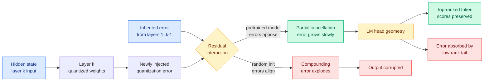

# Why Does Post-Training Quantization Work?

**Source:** arXiv 2609.11716 (Tsinghua University + Bosch AI Research: Yuxiang Chen, Michael Beyer, Jun Zhu, Jianfei Chen)
**Surfaced by:** Kurate cs.LG leaderboard #10 this week, tier 1, ai_rating 6.5/10. Absent from HuggingFace Daily Papers.
**Raw:** [raw/kurate/2026-09-11-cs-lg.md](../../raw/kurate/2026-09-11-cs-lg.md)
**Links:** [arXiv](https://arxiv.org/abs/2609.11716)

## TL;DR

Every quantization paper in this wiki reports that post-training quantization works. None explains why it should. Round a model's weights down to 4 bits without any calibration and, naively, each layer injects an error that the next layer inherits and amplifies, so by layer 60 the hidden state should be garbage. That is exactly what happens to a randomly initialized model. It does not happen to a pretrained one. This paper measures the difference and names two mechanisms. First, the error a layer newly introduces tends to **point against** the error it inherited from its input, so the two partially cancel and the gap between the full-precision and quantized forward pass grows slowly instead of compounding. That counteracting interaction is not architectural. It **develops during pretraining**, which is why the random-init control does not have it. Second, the geometry of the LM head preferentially preserves the scores of high-ranked tokens, so whatever hidden-state error survives lands mostly on tokens the model was not going to pick anyway.

## What the paper actually shows

The setup is a controlled comparison rather than a new method. Take a pretrained LLM and a randomly initialized model of the same architecture. Quantize both, weight-only, straight to NVFP4 with no calibration at all. Measure the **weight reconstruction error** (how far each quantized weight sits from its full-precision value) and then track, layer by layer, the divergence between the full-precision hidden state and the quantized one.

The weight reconstruction errors are comparable across the two models. The hidden-state trajectories are not. The random model's divergence climbs fast with depth. The pretrained model's climbs slowly. So the standard folk explanation, that PTQ works because quantized weights stay close to the originals and therefore errors propagate slowly, is measurably incomplete: the weights are equally close in both cases and only one model stays intact. Whatever is doing the work is a property acquired during pretraining, not a property of small perturbations.

**Mechanism one: counteracting residual interaction.** Decompose the error at the output of layer k into the part inherited from the input and the part the layer's own quantized weights just added. In the pretrained model those two components are anti-correlated. The layer's fresh error systematically opposes the error it received. The sum is smaller than either part alone, repeatedly, all the way down the stack. The paper quantifies this and identifies it as a major factor in the slow growth, not a marginal one. This is the load-bearing finding, and it reframes quantization robustness as a *learned* property of the residual stream.

**Mechanism two: LM-head geometry.** Hidden-state error still accumulates, just slowly. What converts a surviving hidden-state perturbation into a wrong token is the final projection. The paper shows the LM head preferentially preserves scores and probabilities for high-ranked tokens, the ones representing the model's most confident predictions. The error preferentially lands in the long tail of the vocabulary, where it changes the ordering of tokens that were never going to be sampled. Output stability is therefore not the same claim as hidden-state stability, and the paper separates them.

## How this relates to prior wiki pages

**It supplies the missing "why" under twelve prior entries.** This wiki has 12 dated quantization summary pages and, until today, no concept page and no mechanistic account. [TurboQuant (04-22)](2026-04-22-turbo-quant-kv-cache-quantization.md), [OSCAR (05-21)](2026-05-21-oscar-extreme-kv-cache-quantization.md), [MXSENS (07-27)](2026-07-27-mxsens-mixed-precision-quantization.md), [MXAttention (08-01)](2026-08-01-mxattention-mxfp4-attention-quantization.md), [ICBQ (08-12)](2026-08-12-icbq-interleaved-cross-block-quantization.md) and the rest all *use* the empirical fact that pretrained transformers tolerate aggressive rounding. This is the first entry that measures the tolerance and says where it comes from. See the new [quantization concept page](quantization.md).

**It explains, retrospectively, a failure this wiki recorded four days ago.** [Quantization breaks recurrent state (09-07)](2026-09-07-quantization-breaks-recurrent-state.md) found that quantizing recurrent or state-space layers degrades far worse than quantizing attention layers at the same bit width. The counteracting-residual mechanism is a property of a *residual stream with many parallel-ish blocks writing into it*. A recurrent state is carried forward multiplicatively through time rather than added into a residual highway, so there is no inherited-versus-injected decomposition for the two components to cancel across. The cancellation mechanism simply does not exist in that geometry. The paper does not make this argument, but it is the obvious reading, and it is testable.

**It sharpens [Quantization-Aware Healing (08-26)](2026-08-26-quantization-aware-healing.md).** QAH found that distilling a compressed model from a *degraded recovered checkpoint* caps the student, and fixed it by pointing the teacher at the original pre-compression model. Under this paper's account, the recovered checkpoint is exactly a model whose counteracting residual interaction was disturbed by the recovery fine-tune, which predicts that healing procedures should be evaluated on whether they restore the anti-correlation, not only on downstream accuracy. Nobody measures that today.

**It gives the missing justification for spatially routed precision.** [TileMix (08-25)](2026-08-25-tilemix-tile-centric-mixed-precision-attention.md) routes FP16 or INT8 per tile group of the attention score matrix, and [HyQuant (09-11)](2026-09-11-hyquant-hybrid-precision-attention.md) keeps a small set of persistently important tokens in high precision while quantizing everything else. Both are empirically motivated. This paper says the error budget is not uniform: some error gets cancelled by the residual interaction and some gets absorbed by the LM head's tail, so the regions where neither protection applies are the ones worth spending bits on. That is a principled selection criterion, and no mixed-precision paper currently uses one.

## Gaps

The analysis is weight-only PTQ. Activation quantization, KV cache quantization and attention-state quantization, which is where most of this wiki's practical results live, are not covered, and there is no reason to assume the same two mechanisms govern them. The counteracting interaction is characterized quantitatively but not *causally*: the paper shows it develops during pretraining without identifying what in the training dynamics produces it, so there is no prescription for training a model to be more quantizable. And the LM-head argument protects top-ranked tokens, which is precisely the regime where confident greedy decoding is safe and says nothing about long sampled reasoning chains where a single low-probability branch matters.

## Research angle

The actionable experiment is a **calibration set chosen by residual anti-correlation**. Every calibration algorithm on the market (GPTQ, AWQ and descendants) selects calibration data by activation statistics. If the robustness comes from an anti-correlation that is stronger in some layers than others, then the layers where it is weakest are the ones a calibration budget should be concentrated on, and that is directly measurable with the paper's own instrumentation. The second experiment: track the anti-correlation *during* pretraining and find when it appears. If it emerges at a particular token count or loss level, quantizability becomes a pretraining checkpoint property you can select for, which would be the first training-time lever on a serving-time cost.

## Related

- [Quantization (concept page)](quantization.md)
- [HyQuant: hybrid-precision attention quantization (09-11)](2026-09-11-hyquant-hybrid-precision-attention.md)
- [Quantization breaks recurrent state (09-07)](2026-09-07-quantization-breaks-recurrent-state.md)
- [Extreme quantization on Blackwell (09-10)](2026-09-10-extreme-quantization-blackwell-fp4-native-fp8.md)
- [KV Cache](kv-cache.md)
