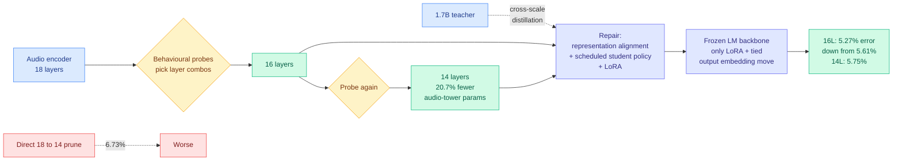

# X-AuT: Progressive Audio-Encoder Compression for Speech LLMs with Cross-Scale Distillation

**Source:** HuggingFace Daily Papers, arXiv 2609.11412
**Raw:** [raw/huggingface/2026-09-11-x-aut-progressive-audio-encoder-compression-for-speech-llms.md](../../raw/huggingface/2026-09-11-x-aut-progressive-audio-encoder-compression-for-speech-llms.md)
**Links:** [arXiv](https://arxiv.org/abs/2609.11412) · [Project site](https://xpeng-ai.github.io/x-aut)

## TL;DR

In a speech LLM, an audio encoder turns the waveform into embeddings that a frozen language-model decoder then consumes. Shrinking that encoder is the obvious way to cut inference cost, but deleting whole blocks perturbs the embeddings the decoder was trained to read, and the characteristic failure is not graceful degradation. It is **deletion errors and premature end-of-sequence**: the model stops transcribing early or drops words, because a perturbed embedding stream pushes the decoder toward the stop token. X-AuT prunes progressively rather than in one step. It selects which layer combinations to remove using short behavioural probes, then repairs the damage through representation alignment, cross-scale distillation from a larger teacher, scheduled student-policy supervision, and LoRA fine-tuning. The language-model backbone stays frozen throughout; only attention LoRA adapters and the tied output embedding move.

## Key results

Across ten public Chinese-English benchmarks, compressing Qwen3-ASR-0.6B's audio encoder:

- **18 to 16 layers: macro-average error falls from 5.61% to 5.27%.** Pruning two layers made it *better*. That is the headline and it should be read as evidence the original encoder was over-provisioned rather than as evidence that pruning improves models.
- **14 layers: 5.75% error with 20.7% fewer audio-tower parameters.** A usable second operating point.
- **Progressive 18 to 14 beats direct 18 to 14: 5.75% versus 6.73%.** The schedule is worth roughly a point of error, which is the paper's clearest ablation.
- **Cross-scale distillation from the 1.7B teacher gives 5.55% mean error against 8.45% for self-distillation.** A larger teacher is worth almost three points here, which is an unusually large teacher effect.
- Training data is drawn from the highest-agreement tier of a transcript-consistency pipeline, with source reweighting during fine-tuning.

The authors state these are single-run results and that effects vary across benchmarks, which is more honest reporting than most compression papers offer.

## How this relates to prior wiki pages

**It is a depth-pruning result, and it lands three days after two others, which puts the count past this wiki's pattern threshold.** The [KV cache page's](kv-cache.md) 09-10 entry recorded three independent results saying depth contains repeated computation that can be shared, reused or removed: DeepSeek V4.1 Flash's CSA2 Reuse mode declining to recompute the KV and the top-K index at every layer, [WRP forward-free depth pruning (09-10)](2026-09-10-wrp-forward-free-depth-pruning.md) deleting redundant blocks by comparing projection weights across layers with no forward pass at all, and [KVShare (09-07)](2026-09-07-kv-cache-frontier-mla-radix-kvshare.md) showing adjacent layers' KV projections are highly similar. X-AuT is the fourth, in a different modality, and its 18-to-16 improvement is independent evidence for the same claim: **transformer stacks ship with depth nobody is using.** The interesting divergence is selection method. WRP selects with **no data at all**, purely from weight redundancy. X-AuT selects with short **behavioural probes**, which costs forward passes. Nobody has compared the two criteria on the same model, and that is now a well-posed question with two published methods on either side.

**The frozen-backbone-plus-LoRA repair is the [knowledge distillation page's](knowledge-distillation.md) damage-repair role, applied to a compression step.** That page recorded distillation-as-repair as a recurring role distinct from distillation-as-capability-transfer: [Quantization-Aware Healing (08-26)](2026-08-26-quantization-aware-healing.md) refused to distil from a degraded recovered checkpoint and pointed the teacher back at the original pre-compression model, and TaoLive used on-policy distillation as stage-two repair for generalization that harness-augmented fine-tuning had destroyed. X-AuT is the same move: distillation exists here not to teach anything new but to put back what pruning removed. It is also the cleanest instance, because the thing being repaired is precisely localized, an embedding interface between a pruned encoder and an untouched decoder.

**And it names a failure mode this wiki has not recorded before.** Every compression result on these pages reports degradation as a metric decline. X-AuT reports it as a *behavioural* change, specifically premature end-of-sequence. That distinction matters for evaluation: an error-rate number averages a model that stops early into the same bucket as a model that transcribes fluently but inaccurately, and those are entirely different production failures.

## Gaps

Single runs, no seeds, and the paper says so. Ten benchmarks but only Chinese and English, on one 0.6B model, so nothing about scale behaviour is established, and the whole result could be a property of an over-provisioned small encoder rather than of encoders generally. The efficiency claim is also stated in **parameters**, not latency, memory or energy, and for an audio tower feeding a frozen decoder the parameter count is the least interesting of the four. No wall-clock inference numbers appear. The repair pipeline has four components (alignment, cross-scale distillation, scheduled student-policy supervision, LoRA) and only the teacher-scale ablation is reported, so which of the other three carry the load is unknown.

## Research angle

The unexplored composition is **pruning depth and quantizing what remains**. This wiki now has a well-developed quantization account ([Why Does Post-Training Quantization Work? 09-11](2026-09-11-why-post-training-quantization-works.md) argues robustness comes from a counteracting residual interaction acquired during pretraining, where a layer's injected error opposes its inherited error) and a growing depth-pruning account. Those two interact in a way nobody has tested: removing layers removes cancellation opportunities, so a depth-pruned model should be *more* fragile to quantization than the original at the same bit width. That is a falsifiable prediction, it is cheap to test on exactly this 18-to-14 sweep, and if it holds it constrains every stacked compression pipeline in production.

## Related

- [Model pruning and sparsity](model-pruning-sparsity.md)
- [Knowledge distillation](knowledge-distillation.md)
- [WRP: forward-free depth pruning (09-10)](2026-09-10-wrp-forward-free-depth-pruning.md)
- [Why Does Post-Training Quantization Work? (09-11)](2026-09-11-why-post-training-quantization-works.md)
