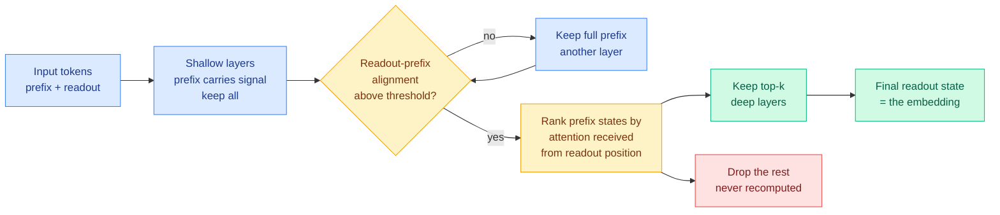

# FastE: Readout-Triggered Token Compression for LLM Embedding Inference

**Source:** arXiv [2609.08407](http://arxiv.org/abs/2609.08407) · Kurate cs.AI #12 (ai_rating 6.5/10), absent from HuggingFace
**Authors:** Jinsong Shu, Jinyong Wen, Baokun Wang, Zhongle Xie, Lidan Shou, Weiqiang Wang (Zhejiang University + Ant Group)
**Raw:** [Kurate cs.AI leaderboard](../../raw/kurate/2026-09-12-cs-ai.md)

## TL;DR

Embedding models built on an LLM backbone read the whole input and then take one final "readout" state as the vector. FastE observes that the states for all the other tokens, the prefix, stop mattering as you go deeper into the network: deleting them in shallow layers is destructive, deleting them in deep layers is nearly free. So it deletes them, progressively, at a depth the model itself signals. Training-free, plug-and-play, no retraining. On NarrativeQA with Qwen3-Embedding-0.6B it cuts decoder-backbone FLOPs by **40.11%** while retaining **99.53%** of full-forward nDCG@10.

## What the paper actually shows

The empirical finding comes first and it is the contribution. The authors measure **depth-dependent prefix redundancy**: they ablate prefix states at each layer of a final-readout embedding model and record the damage. In shallow layers, removing prefix states wrecks the embedding. At greater depth, the same removal barely moves the output. The interpretation is that the prefix and the readout state co-propagate, and by the time they are deep in the stack the readout has already absorbed what it needs. The prefix becomes increasingly compressible as a function of depth.

Two mechanisms turn that observation into a method:

1. **When to compress.** A single fixed threshold on batch-mean **readout-prefix alignment**. When the readout state's representation has converged toward the prefix states it draws on, the method reads that as the signal that redundancy has set in. This is a lightweight online heuristic, computed from activations already present, so it costs essentially nothing.
2. **What to keep.** Rank prefix states by **the attention score they receive from the readout position**, and retain the top ones for subsequent layers. The readout position is the only position whose output survives, so its own attention is the right relevance signal. This is a cleaner argument than most eviction heuristics get to make, because in an embedding model there genuinely is exactly one query that matters.

The quality-efficiency tradeoff is exposed as a single knob, the maximum removal ratio, tunable without retraining. Validated across five text-embedding benchmarks, two backbone scales, and three cross-modal retrieval tasks, plus Qwen3-VL-Embedding.

## How this relates to the rest of the wiki

**It is a new row in the non-uniformity table on the [quantization page](quantization.md), on an axis that page does not have.** That page records seven results, each arguing precision should be allocated along some axis rather than set uniformly: inference phase (Mix-Quant), layer sensitivity (MXSens), geometric tile (TileMix), semantically selected tokens (HyQuant), block processing order (ICBQ), robot execution state (VQVLA), normalization position (MXAttention). FastE is not quantization, it is token dropping, but it is the same claim one level up: **compute should be allocated, not set**, and its axis is **depth-crossed-with-position**, which none of the seven carry. The pattern the quantization page named, that the field has converged on allocation without asking whether the allocations are additive, extends here directly.

**It is the mirror image of [WRP (09-10)](2026-09-10-wrp-forward-free-depth-pruning.md).** WRP removes whole transformer blocks by estimating inter-layer weight redundancy from the checkpoint, no forward pass required. FastE keeps every block and removes tokens, with the removal schedule keyed to depth. Both papers are saying that the deep half of an LLM does less independent work than its parameter count implies. WRP says the layers are redundant with each other; FastE says the layers stop needing the input. **Nobody has composed them, and the composition is the obvious experiment**: run WRP first to shorten the stack, then ask whether FastE's depth-dependent redundancy curve survives on the pruned model, or whether both methods are cashing the same budget. The [model pruning page](model-pruning-sparsity.md) should carry that question.

**It narrows the scope of the [KV cache page's](kv-cache.md) current thesis in a useful way.** That page concluded on 09-09 that the cache's frontier has moved from compression to placement, on the strength of IndexShare, KVMem and TPU-Sync all treating the cache as a storage hierarchy. FastE is a pure compression result that still wins, and the reason is that embedding inference is a different workload: it is prefill-only, single-pass, with no decode trajectory and exactly one output position. **Placement beats compression when the cache must survive across turns; compression still wins when the forward pass is one-shot.** That is a workload boundary the page should state explicitly rather than letting the placement thesis generalize.

## Gaps

The alignment threshold is a second estimator that arrives unvalidated, which this wiki has flagged repeatedly in this method family. The obvious control is a **fixed layer index** chosen per model with no alignment computation at all. If compressing from layer 18 onward matches the adaptive trigger, the contribution is the attention-based ranking and the depth observation, not the trigger. No such ablation is reported. Separately, every result is on 0.6B-class backbones and the redundancy curve is exactly the sort of thing that could shift with scale, and embedding models with mean-pooling rather than final-readout are out of scope by construction, which is a large fraction of deployed retrieval stacks.

## Industrial implication

Embedding inference is the unglamorous high-volume workload: every retrieval-augmented system re-embeds its corpus and embeds every query. A training-free 40% FLOP cut that drops into an existing serving path with one tunable knob is the kind of thing that ships in a quarter rather than a year, because it requires no retraining, no new checkpoint, and no change to the vector index. The cost story is straightforwardly good: indexing a large corpus is a one-time bill that this roughly halves, and query-side embedding is on the latency path for every RAG request.

**Related:** [quantization](quantization.md) · [model pruning and sparsity](model-pruning-sparsity.md) · [KV cache](kv-cache.md) · [WRP forward-free depth pruning (09-10)](2026-09-10-wrp-forward-free-depth-pruning.md)
