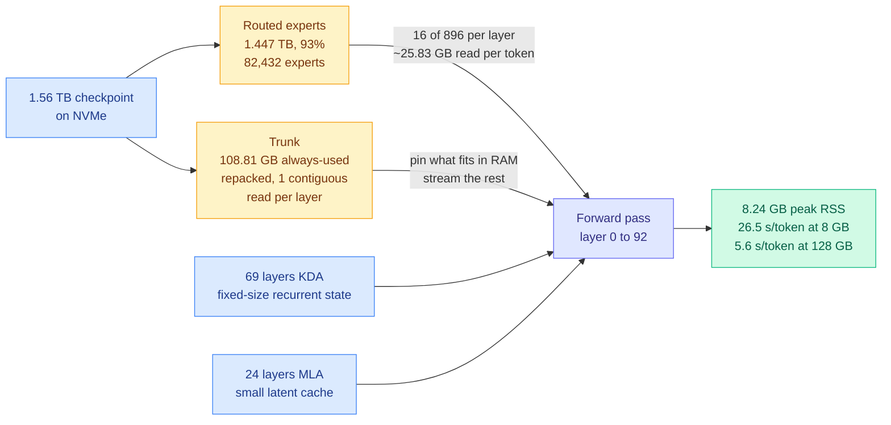

# kimi-k3-in-c: a 2.78T-parameter model on one CPU in 8.24 GB of RAM

**Source:** GitHub [FareedKhan-dev/kimi-k3-in-c](https://github.com/FareedKhan-dev/kimi-k3-in-c) (7.6k stars, 1.2k forks), surfaced via the X home feed ([@techNmak](https://x.com/techNmak/status/2098437595441295726), the day's most-shared Tier 1 artifact)
**Raw:** [X feed capture](../../raw/twitter/feed/2026-09-12-morning.md)

## TL;DR

A 176 KB portable C99 program runs inference on Kimi K3, a 2.78-trillion-parameter mixture-of-experts model, on a single CPU with a measured peak resident set of **8.24 GB**. The checkpoint was not compressed: it is still **1.56 TB on disk**. Nothing was quantized away. The trick is that K3's architecture leaves almost all of its bytes in places that can live on NVMe and be streamed, so RAM stops being the thing that decides whether the model runs at all and becomes only the thing that decides how fast. At 8 GB it takes 26.5 seconds per token. At 128 GB it takes 5.6. The output is byte-identical at every memory size.

## The actual accounting, which is the interesting part

**The experts are the checkpoint.** K3 has 92 routed layers with 896 experts each, and only 16 fire per layer per token. That is 82,432 routed experts occupying 1.447 TB, or **93% of the whole checkpoint**. They never enter RAM as a set. They sit on NVMe and are fetched on demand. One expert is about 17.56 MB, so a single token can require **1,472 expert fetches** across 92 layers, and with no useful resident hits the engine reads roughly **25.83 GB of expert weights per token**. This is the entire cost model: the machine is not computing, it is reading.

**The trunk is what is left.** About 113 GB of weights are used on every token regardless of routing. The author repacks 108.81 GB of them into a separate "trunk" file laid out so each of the 93 layers is **one contiguous run**, which matters enormously for NVMe throughput. Whatever fits in RAM is pinned; the rest streams through a reusable buffer as the forward pass walks layer 0 to 92. More RAM pins more trunk. That is the whole RAM/speed curve: 8 GB gives 26.5 s/token, 32 GB gives 24.2, 64 GB gives 19.8, and 128 GB+ gives 5.6 because at that point the disk wait disappears entirely.

**The attention design is what makes the resident set small enough to matter.** 69 of K3's 93 layers use KDA, which carries a **fixed-size recurrent state** instead of a KV cache that grows with every token. The other 24 use MLA (multi-head latent attention, which stores one compressed latent per token instead of full per-head keys and values). Without this, the cache alone would blow the 8 GB budget on any nontrivial context and the entire exercise would fail. **The memory-hierarchy trick only works because the sequence-length-dependent term was already bounded by architecture.**

## How this relates to the rest of the wiki

**It is the most extreme instance of the pattern the [KV cache page](kv-cache.md) named on 09-09: the frontier has moved from compression to placement.** That page crossed its three-instance threshold with IndexShare decoupling indexer memory from physical cache pages, [KVMem (09-08)](2026-09-08-kvmem-kv-context-virtualization.md) paging KV across GPU, host RAM and NVMe, and Google's TPU-Sync shipping disaggregated KV transfer with DRAM and NVMe pooling. All three moved the *cache* down the memory hierarchy. **This moves the weights.** It is the same structural claim, applied to the larger object, and it says the claim generalizes: the question is no longer how small you can make a tensor but which tier it lives in and how well you can stream it.

**It is the practitioner proof of what [@lemire argued on the same day](https://x.com/lemire/status/2098397491372704050): inference is bandwidth-bound, and the hardware was built for the wrong thing.** His framing is that LLM inference is closer to streaming a video than to running a simulation, because you do many matrix-vector multiplications against a huge weight matrix and barely reuse the weights, so bandwidth is the scarce resource and compute is not. GPUs piled compute first and bolted on high-bandwidth memory afterward, which is expensive. kimi-k3-in-c is that argument executed to its logical end: strip the compute down to portable C99 with no BLAS and no GPU, accept a terrible per-token latency, and discover the model still runs, because the binding constraint was never arithmetic. **The 26.5 s/token is not a failure, it is the measurement.** The [memory hierarchy page](../hardware/memory-hierarchy.md) should carry this as its cleanest demonstration that the roofline, not the FLOP count, decides what is possible.

**It reframes what MoE sparsity actually buys, and the wiki has been imprecise about this.** The standard framing, restated well in the same day's feed by [@techNmak](https://x.com/techNmak/status/2098527428931190930), is that a 671B MoE model activates about 37B parameters per token, so you get capacity without the compute cost, and the catch is that inactive does not mean nonexistent because the weights still have to be stored and the router still has to move tokens to them. This repo shows the catch is also the opportunity. **Sparse activation means the vast majority of the checkpoint is cold on any given token, and cold bytes are exactly the bytes you are allowed to demote to a slower tier.** Dense models cannot do this. A 2.78T MoE is in some operational sense *easier* to run on a small machine than a dense 70B, which inverts the usual intuition.

## Gaps and honest framing

This is not a deployment. 26.5 s/token is unusable for anything interactive, and the benchmark is a short prompt generating 8 tokens. The measurements are single-request on one machine with 124 cores and a fast NVMe drive, and the author says plainly that a slower drive is slower for the first three rows. Nothing here addresses concurrency, which is where NVMe paging schemes historically break, because multiple users thrash the page cache against each other. There is also no accuracy evaluation beyond byte-identical output against itself, which verifies the implementation but tells you nothing the original model did not already tell you.

## Industrial implication

The immediate implication is not that anyone will serve traffic this way. It is that **the floor on "what hardware can run this model" has moved, and moved on an axis buyers do not currently price.** Procurement conversations are conducted in GPU memory: will it fit in 80 GB, do I need 8 of them. This says that for MoE architectures with bounded attention state, the relevant quantity is **NVMe bandwidth and the contiguity of your weight layout**, and RAM sets your latency rather than your feasibility. Over a year that shows up as pressure on a specific product category: cheap, high-bandwidth, non-HBM inference machines with weights held in commodity storage, which is exactly the bet @lemire names Positron as making with its Atlas machine and Asimov chip.

**Related:** [KV cache](kv-cache.md) · [memory hierarchy](../hardware/memory-hierarchy.md) · [KVMem, KV context virtualization (09-08)](2026-09-08-kvmem-kv-context-virtualization.md) · [compute economics](../hardware/compute-economics.md)
