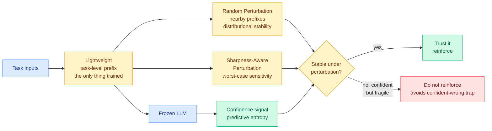

# TASCO: Stability-Aware Test-Time Adaptation for LLM Reasoning

**Source:** arXiv [2609.11393](http://arxiv.org/abs/2609.11393) · Kurate cs.AI #4 (ai_rating 5.5/10), absent from HuggingFace
**Authors:** Bincheng Gu, Min Gao, Zongwei Wang, Yibing Bai, Yulan He, Junliang Yu
**Raw:** [Kurate cs.AI leaderboard](../../raw/kurate/2026-09-12-cs-ai.md)

## TL;DR

Test-time adaptation improves a model's reasoning on a task without post-training it, by optimizing a small amount of state at inference. The usual signal is **predictive entropy**: push the model toward more confident reasoning states. The flaw is well known and rarely addressed, which is that a language model can be confidently wrong, and entropy minimization will happily drive it deeper into a wrong trajectory. TASCO's observation is that **confidence is trustworthy when it is stable**: high confidence that survives a small perturbation of the prompt is much more likely to be correct than high confidence that collapses. So it optimizes a lightweight task-level prefix for stability as well as confidence, keeping the model itself frozen.

## The mechanism

The only trained object is a **task-level prefix**, and the model stays frozen. That keeps the method in the cheap tier: no gradient through the model, no checkpoint per task, and the adapted state is a small artifact you can cache and reuse per task type.

Stability is operationalized through two alternative perturbation strategies, and the choice between them is the paper's main design axis:

- **Random Perturbation** promotes *distributional* stability, asking that the trajectory distribution induced by nearby perturbed prefixes stay close. This is an average-case notion.
- **Sharpness-Aware Perturbation** targets *worst-case* local sensitivity, borrowing directly from sharpness-aware minimization. This asks that no small perturbation destroys the confidence.

Reported results: improved reasoning accuracy **and token efficiency** across diverse LLMs and reasoning benchmarks. The behavioral analysis is the part worth trusting most, because it checks the obvious failure mode: TASCO maintains stable confidence under perturbation **without prematurely concentrating the predictive distribution**, which is what a naive entropy minimizer does and why naive entropy minimizers degrade.

## How this relates to the rest of the wiki

**It is a direct answer to the objection that has been standing against every confidence-based method on the [test-time compute allocation page](test-time-compute-allocation.md).** That page's recurring finding is that methods in this family depend on a second estimator that nobody validated, and the most common such estimator is model confidence. TASCO does not defend confidence; it **conditions on it**. The claim is not that confidence is a good signal but that confidence-plus-stability is, and the two perturbation strategies are the price paid for that qualifier. That is a more honest position than the literature usually takes, and it makes the method falsifiable in a specific way.

**The token-efficiency claim is what makes it a cost result rather than only a quality one.** Most test-time adaptation trades inference compute for accuracy, which is exactly the wrong direction for anything serving real traffic. TASCO reports improving both, which if it holds means the stability constraint is pruning wasted reasoning rather than adding more. **That is the same shape as the deletable-learned-selection-layer pattern this wiki has tracked on the test-time compute page**: a method wins partly by stopping the system from spending on trajectories that were never going to pay off.

**It sits opposite the verifier-based branch of test-time compute.** A verifier or process reward model is an *external* judge of a reasoning step. TASCO is deliberately internal: no external verifier, no reward model, nothing extra to serve. The tension between those two approaches is a live one on this wiki, and the crossover experiment is whether stability-filtered confidence approaches verifier quality at a fraction of the serving cost. Nobody has run it, and it is a cheap experiment because both baselines exist.

## Gaps

The two perturbation strategies are presented as alternatives without a stated rule for choosing between them, which in practice means a hyperparameter search per deployment and undercuts the "lightweight" framing. **The perturbation itself has a cost that is not obviously accounted for in the token-efficiency claim**: evaluating stability requires running perturbed prefixes, and whether the reported efficiency gain is net of that cost is the first thing to check in the paper's accounting. There is also no comparison against the simplest possible baseline in this family, which is self-consistency sampling with majority vote, a method that is also a stability measure and requires no training at all.

## Industrial implication

The deployable version of this is not adaptation at all, it is **triage**. If stability-under-perturbation is a better correctness signal than raw confidence, the cheapest use is to decide when to escalate: answer directly when confidence is stable, and route to a larger model or a verification pass when confidence is high but fragile. That makes it a routing feature rather than an adaptation method, and routing features are much easier to ship than anything that modifies inference state.

**Related:** [test-time compute allocation](test-time-compute-allocation.md) · [LLM routing](../ai-routing/llm-routing.md)
