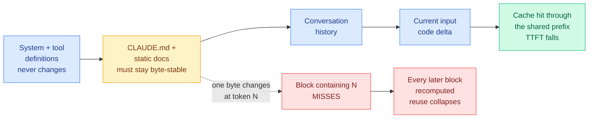

# Prefix-Stable KV Caching for Agent Context Files (Ken Huang, 2026-09-13)

**Source:** [CLAUDE.md Modernization and Prefix-Stable KV Caching for Claude Code](https://kenhuangus.substack.com/p/claudemd-modernization-and-prefix), Ken Huang / Agentic AI, 2026-09-13. Raw: [`raw/rss/2026-09-13-agentic-ai-claude-md-modernization-and-prefix-stable-kv-caching-fo.md`](../../raw/rss/2026-09-13-agentic-ai-claude-md-modernization-and-prefix-stable-kv-caching-fo.md), also in [`raw/gmail/2026-09-13-starred.md`](../../raw/gmail/2026-09-13-starred.md).

**TL;DR.** The instruction file an agent harness loads at session start is not a document, it is the head of a cached tensor. Anthropic's prompt cache keys on the exact rendered byte prefix up to each breakpoint, so one changed byte at token N invalidates the KV state for every token after N. That makes three things that look like formatting trivia into real cost events: a `Last updated:` stamp at the top of a memory file, a script that concatenates `.kb/*.md` without a fixed locale sort, and CRLF drift. Huang's prescription is to treat the context file as a build artifact: a short static bootstrap first, volatile content last, and a deterministic compiler in between with a prefix-integrity audit. This is the first item in this wiki that makes KV cache reuse a property of a repository's build system rather than of a serving stack.

---

---

## What it actually claims

**The prefix is assembled in a fixed order and only the left side is reusable.** A Claude Code turn renders as `[system and tool definitions] → [CLAUDE.md and static docs] → [conversation history] → [current input or code delta]`. The inference stack scans left to right and looks up whether the hash of the prefix matches a recent precomputed KV matrix. On a hit through token N it reuses attention states for those N tokens rather than recomputing them, which is a direct cut to time-to-first-token on the shared portion.

**Cache state is allocated on token-block boundaries**, commonly discussed as 1024-token chunks for many serving stacks, with model-dependent minimum cacheable prefix lengths on Anthropic's side. The consequence is the load-bearing one: if the first 5,000 tokens of project instructions are identical turn over turn, the early blocks hit. If token 4,100 changes, the block containing it misses **and every later block must recompute, because attention at any position depends on all prior positions**. There is no partial credit inside a block and no recovery after one.

**Three local workflow bugs destroy the prefix while the prose looks unchanged.**

1. **Dynamic injections at the head of memory.** Dates, the current git branch, a coverage percentage, a "Last updated" stamp. Anything regenerated per session at the top of the file is the worst possible placement, because it invalidates everything below it.
2. **Non-deterministic file order.** A script that globs `.kb/*.md` and concatenates without a fixed locale sort will emit a different byte sequence on a different machine or after a filesystem reorder. The fix is `LC_ALL=C` alphabetical sort, which is stable across locales.
3. **Line-ending and whitespace drift.** `\n` versus `\r\n`, or a trailing space, changes tokenizer IDs without changing anything a human reader sees. The repo-level fix is `.gitattributes` with `eol=lf` for memory markdown plus a pre-commit CRLF normalizer.

**The volatility hierarchy is the organizing rule.** Keep the root bootstrap file static and minimal: build and test commands, non-default conventions, project-specific workflow gates. Put architecture tours and tool manuals in low-churn separate files (`docs/`, `ARCHITECTURE.md`, path-scoped `.claude/rules/`). Append session logs at the **bottom**, where invalidating them costs only the tail.

**The token-budget half is separate from the cache half and reinforces it.** Anthropic's own memory guidance targets under roughly 200 lines per context file, and `/doctor` (v2.1.206+) now proposes trimming checked-in material the model can recover by reading the tree. Huang's five-step checklist is diagnose, offload non-essential rules, use dateless model IDs (family aliases such as `sonnet`, or dateless major IDs such as `claude-sonnet-5`, because dated snapshot IDs pin weights and convenience aliases for older generations can move), prune implicit coding standards ("always handle errors gracefully" burns prefix tokens and dilutes the rules that actually differ from model defaults), and condense memory-tracking liturgy into one outcome rule.

---

## How this relates to prior wiki pages

**It is the first result on the [KV cache page](kv-cache.md) where the cache's behaviour is determined by a git repository rather than by a serving policy.** That page has tracked the cache through compression (bit width), then eviction (which tokens to keep), then placement (which memory tier), then billing (the [cache as a billing surface, 08-14](kv-cache.md)). This adds a fifth surface: **provenance stability**. The bytes are not being compressed, evicted, or moved. They are being held identical, and the entire saving comes from that.

**It sharpens, and partly contradicts, the 09-06 cache-hit-ratio finding.** [ContextPipe (09-06)](2026-09-06-contextpipe-database-context-assembly.md) cut total token volume 31% while *lowering* the cache-hit ratio, on the arithmetic that a token never assembled costs nothing at any cache tier, and the KV cache page recorded from that "the cache-hit ratio turns out not to be the objective." Huang's argument runs the other way for a specific reason worth naming: ContextPipe assembles context **per query**, where the right move is to assemble less. An agent instruction file is loaded **on every turn of every session** and is the same for all of them, so it is the one region where hit ratio and total cost point the same direction. **The two are compatible once you split context by reuse frequency, and neither paper does that split.** The general rule that falls out: *compress what is assembled per query, freeze what is assembled every query.*

**It gives [SoL-Pi's (09-11)](../agentic-systems/2026-09-11-sol-pi-harness-auto-research.md) token savings a free and unsearched neighbour.** NVIDIA's auto-research loop over harnesses found four optimizations worth 45-49% of tokens, of which two (Online Context Compact, ObservationPack) act on the volatile tail of the context. None of the four act on the static head, and the search space did not include byte-stability of the bootstrap file. **That is a cheap experiment: hold the harness fixed, make the prefix byte-stable, and measure the change in cached-read fraction and TTFT.** It is orthogonal to all four of SoL-Pi's wins because it touches a region they never modify.

**It is also a cost fact about this repository.** cere-bro's own `CLAUDE.md` is loaded at the head of every session in this project. Everything above applies to it directly, which is the rare case of a wiki source that is an operating instruction for the wiki.

---

## Gaps

No numbers. The post is a mechanism explanation and a checklist, and the paid section carries the scripts, but there is **no published measurement of what prefix stability is worth** on a real repo: no cached-read token fraction before and after, no TTFT delta, no dollar figure. Everything here is derived from documented cache semantics rather than measured. The 1024-token block size is described as "commonly discussed" for many serving stacks rather than confirmed for Anthropic's, and Anthropic documents model-dependent minimum cacheable prefix lengths without publishing the block granularity. So the specific claim "a change at token 4,100 costs you blocks 5 onward" is the right shape and an unverified constant.

## Industrial implication

Every team running a coding agent at scale is currently paying an invisible tax they have no instrument for. The fix costs one sort flag, one `.gitattributes` line and a pre-commit hook, which puts it in the rare category of a real serving saving with essentially no engineering risk. Within two quarters, expect `/doctor`-style tooling to report prefix-stability directly (a diff of the rendered prefix across two sessions, and a cached-read percentage per session), because the diagnosis is mechanical and the current situation is that nobody can see the miss.

## Related pages

- [KV cache](kv-cache.md)
- [Agent harness engineering](../agentic-systems/agent-harness-engineering.md)
- [Hardware-aware attention kernels (09-13)](../hardware/2026-09-13-hardware-aware-attention-kernels.md), the same author's Chapter 5, on what the cached prefix costs when it *does* have to be recomputed
