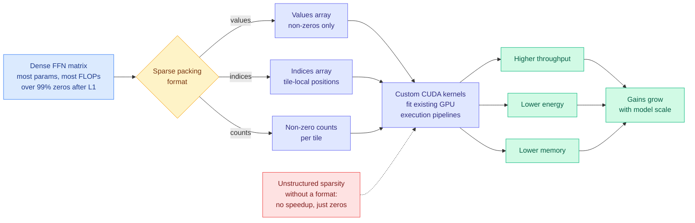

# Sparser, Faster, Lighter Transformer Language Models (Sakana AI + NVIDIA)

**Source:** Edoardo Cetin, Stefano Peluchetti, Emilio Castillo, Akira Naruse, Mana Murakami, Llion Jones. Sakana AI and NVIDIA. Code: [github.com/SakanaAI/sparser-faster-llms](https://github.com/SakanaAI/sparser-faster-llms). Surfaced 2026-09-13 via an image attachment on the X home feed ([@thesupermanmx](https://x.com/thesupermanmx/status/2098959174508106220)); the paper's first page was read directly from the attached screenshot. Raw: [`raw/twitter/images/2026-09-13/2098959174508106220-0.jpg`](../../raw/twitter/images/2026-09-13/).

**TL;DR.** Feedforward layers hold most of a transformer's parameters and most of its execution FLOPs, and they are almost entirely inactive on any given token. This paper makes that exploitable rather than merely true: **simple L1 regularization induces over 99% unstructured sparsity in the feedforward layers with negligible downstream degradation**, and a new **sparse packing format plus a set of CUDA kernels** turns that sparsity into real throughput, energy and memory savings on modern GPUs during both inference and training. The benefits **increase with model scale**. Everything is being released open-source, kernels included.

---

The paper's Figure 1 lays out three packing variants against a dense matrix: **aELL**, **bTwELL**, and a **hybrid**, each storing values, tile-local indices, and per-tile non-zero counts, with tile size T and tile index t. The hybrid splits rows between formats according to how their non-zeros distribute, which is the detail that makes the kernel's memory access regular enough to be fast.

---

## What it claims

**The target is chosen deliberately.** Feedforward layers account for most of an LLM's parameters and most of its execution FLOPs. They are also where activation sparsity is largest, because the nonlinearity zeroes most units on most tokens.

**The inducement is embarrassingly simple.** Not a learned gating mechanism, not a routing network, not a structured mask designed for hardware. **L1 regularization**, applied during training, drives over 99% sparsity with negligible impact on downstream performance. The paper backs this with a quantitative study of LLM sparsity rather than a single headline model.

**The contribution that makes it matter is the systems half.** Unstructured sparsity has been known to exist in transformers for years and has almost never been convertible into speed, because irregular non-zero positions destroy the coalesced memory access and regular tiling that GPU matrix kernels depend on. This is why the field drifted toward *structured* sparsity (2:4 patterns, block sparsity, mixture-of-experts) which is hardware-friendly but leaves quality on the table. **This paper builds the packing format and the CUDA kernels that make the unstructured case work inside existing optimized execution pipelines**, for both inference and training.

**Scale is the right direction.** Throughput, energy and memory benefits **increase with model size**, which is the opposite of how most efficiency techniques age.

---

## How this relates to prior wiki pages

**It is the first result on the [pruning and sparsity page](model-pruning-sparsity.md) where unstructured sparsity comes with its own kernels.** Everything that page records has had to choose between quality (unstructured, no speedup) and speed (structured, quality cost). This refuses the choice, and the refusal is a kernel-engineering result rather than a machine-learning one. That places it in the same category as the day's other GPU item, [Ken Huang's Chapter 5 (09-12)](../hardware/2026-09-13-hardware-aware-attention-kernels.md), which argues that attention's 15% Model FLOPs Utilization is a memory-movement problem rather than an arithmetic one. **Both say the same thing about where the remaining headroom is: not in the math, in how the bytes are laid out.**

**It is the dense-model counterpart to the sparse-activation argument [kimi-k3-in-c (09-12)](2026-09-12-kimi-k3-in-c-nvme-expert-streaming.md) made about mixture-of-experts.** That project ran a 2.78-trillion-parameter model on one CPU in 8.24 GB by keeping 93% of the checkpoint on NVMe, and this wiki's reading of it was that **sparse activation is what makes cold bytes demotable, and a dense model has none**. This paper manufactures that property in a dense model: L1 regularization creates the cold bytes that a storage-tiering or bandwidth-reduction scheme needs. The composition is obvious and unrun. **Induce 99% FFN sparsity, then apply expert-streaming-style placement to the resulting cold weights.** Nobody has tried it because the two results are one day apart.

**It adds a ninth axis to the quantization page's non-uniformity table, and it is not about bits.** The [quantization page](quantization.md) records eight axes along which sensitivity is non-uniform (inference phase, layer, geometric tile, selected tokens, block processing order, robot execution state, normalization position, and depth via FastE on 09-12) and its organizing claim has generalized to "compute should be allocated rather than set." **Unstructured FFN sparsity is that claim at the individual-weight level**, and the practical reason it belongs alongside quantization rather than separate from it is that both cash the same redundancy budget and nobody has measured whether they are additive. A 4-bit model at 99% FFN sparsity is a straightforward experiment and there is no published point for it.

**The open-source release is the strategically interesting part.** This wiki's [GPU kernels page](../hardware/gpu-kernels.md) argued on 09-13 that serving-cost differences between providers are increasingly kernel-quality differences, and that vLLM, SGLang and TensorRT-LLM defaults are therefore an unusually large lever over the industry's aggregate inference bill. **A jointly-authored Sakana-NVIDIA kernel release is exactly the mechanism by which such a lever gets pulled**, and NVIDIA's presence on the author list is not incidental: a sparse packing format that only runs well on one vendor's hardware is a competitive asset regardless of its license.

## Gaps

Read from the paper's first page only, so no numbers beyond the abstract's claims are available here: the "substantial throughput, energy and memory benefits" are unquantified in what was accessible, and there is no reported speedup multiple, no hardware list, and no accuracy table. The phrase "negligible impact on downstream performance" needs the benchmark suite behind it before it means anything, and 99% sparsity claims in the literature have historically been sensitive to which evaluations are run. L1 regularization is applied during training, which means this is **not a post-training technique**: it requires either training from scratch or a regularized fine-tune, and the cost of that step is not stated. Nothing addresses whether the sparsity pattern survives quantization or depth pruning.

## Industrial implication

If the kernels are as portable as claimed, this is the first credible path to making unstructured sparsity a deployment default rather than a research curiosity, and the scale-increasing benefit means the largest models gain most, which is where the serving bill actually is. The thing to watch is adoption into serving stacks: a sparse packing format is worth nothing until vLLM or TensorRT-LLM dispatches to it. Expect that integration question to be settled within two quarters, and expect the answer to depend more on NVIDIA's roadmap than on the paper's merits.

## Related pages

- [Model pruning and sparsity](model-pruning-sparsity.md)
- [Quantization](quantization.md)
- [GPU kernels](../hardware/gpu-kernels.md)
- [Hardware-aware attention kernels (09-13)](../hardware/2026-09-13-hardware-aware-attention-kernels.md)
