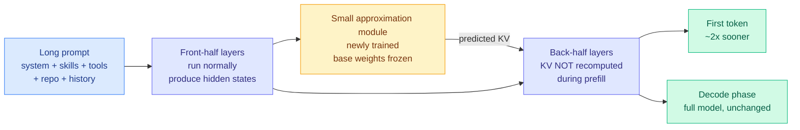

# Retrofitting the Causal Encoder-Decoder: an external KV-approximation module halves Qwen3-8B prefill

**Source:** X home feed, [@wei_wang](https://x.com/wei_wang/status/2098962121715302542), 2026-09-14. A practitioner writeup (in Chinese) of a third-party experiment that ports DeepSeek V4.1 Flash's causal-encoder-decoder idea onto an unmodified Qwen3-8B. **Raw:** [feed capture](../../raw/twitter/feed/2026-09-14-morning-ranked.json)
**Date:** 2026-09-14

## TL;DR

[DeepSeek V4.1 Flash (09-10)](../llms-foundation-models/2026-09-10-deepseek-v41-flash-architecture.md) got its prefill savings from an architecture you have to pretrain: 20 causal-encoder layers followed by 20 decoder layers, with the decoder's input-phase KV states projected from the encoder's final state rather than computed layer by layer, giving about 8B active parameters while reading and 16B while writing, plus a compressed global KV around 890 bytes per token. The assumption everyone made, including this wiki, was that you buy that with a full pretraining run. **Someone tested whether you can bolt it on instead.** They left Qwen3-8B's weights completely untouched and trained a small external module that predicts the back-half layers' KV states from the states already computed in the front half. Reported result: **prefill time falls by close to half, with the final output preserved.** If it holds, the interesting part is not the number, it is the claim that a pretrained model's prefill cost is not fixed by its architecture, and that an existing checkpoint can be retrofitted with the depth-sharing trick a newer architecture was designed around.

---

## What the problem actually is

Prefill is the phase where the model pushes the entire input prompt through every Transformer layer to build the KV cache before it can emit a single token. It is the FLOP-heavy phase, and it scales with context length. For a local agent this is the dominant annoyance, and the writeup is precise about why: the painful part of running a model on a workstation is usually **not** slow token-by-token generation, it is the wait before the first token when a long context loads. A coding agent re-reads a large pile of project files. A computer-use agent carries accumulated action history and interface state. A deep-research run loads long documents. A multi-agent system re-sends tool definitions, memory and task background on every hop. **All of these pay the prefill bill repeatedly**, and at a few hundred thousand tokens the wait alone makes local agents unpleasant regardless of decode speed.

## The idea

DeepSeek V4.1 Flash's answer was structural: during the input phase, don't run the long prompt through the back half of the network at all. Project shared KV states for those layers from the encoder's final state instead. The retrofit keeps that shape but changes what supplies the projection. Rather than an architecture trained end-to-end for it, train a **small auxiliary model** that takes the states produced by the front half and predicts what the back half's KV states would have been. The base model is frozen. Nothing about Qwen3-8B changes. The extra module is the only new parameter.

The economic framing in the writeup is the part worth keeping: **the original model keeps doing generation, and a small added model absorbs the prefill cost.** That is a different bargain from every other local-inference lever. Quantization, pruning and speculative decoding all modify or approximate the thing that generates. This adds a component that changes only how the input is ingested.

## Why this could matter beyond one experiment

If the technique transfers, the addressable set is large and already deployed: Llama, Qwen, DeepSeek distillations, and the long tail of already-fine-tuned vertical models could each get an inference upgrade without a new base model and without a retraining run. The writeup's own framing is that **you may not need to wait for the next generation of models to get the next generation's serving economics.**

The memory angle is the second half. On a 128GB unified-memory workstation, model weights fitting is not the same as the machine being usable: long contexts and several concurrent agents consume KV cache fast, and capacity that holds the weights may leave nothing for concurrent sessions. The claim underneath both V4.1 Flash and this retrofit is that **a Transformer does not have to store a full independent KV set for every layer.** Back-half states can be projected, shared or approximated, and if the approximation error stays bounded then a large fraction of what was treated as mandatory storage is optional. For hardware with generous capacity but much lower bandwidth than a datacenter GPU, that kind of architectural saving is worth more than added arithmetic.

## What is not established

The writeup is unusually careful about its own limits, and those caveats should be carried forward intact:

- **Halved prefill is not doubled overall speed.** The claim is specifically about time-to-first-token, not generation throughput.
- **Test scale, context lengths, task coverage and the method used to judge "output preserved" are not public.** "Final output remains consistent" is asserted, not measured against a stated metric.
- **Reliability across task types is open.** Whether the approximation module holds up simultaneously on code, math, long-document retrieval and tool calling is exactly the question, and the failure mode of a bad KV approximation is a quiet quality regression rather than a crash.
- **It does not make V4.1 Flash itself deployable on a workstation.** A 552B-parameter model with Engram embeddings and a bespoke inference stack has a deployment floor this does nothing to lower.

Treat it as a promising direction with one unreplicated data point, not a result.

## How this relates to what the wiki already knows

**This is the fourth independent result in eight days saying that Transformer depth contains repeated computation you can share, reuse or delete.** The [KV cache page's 09-10 entry](kv-cache.md) named the first three and called the pattern: DeepSeek V4.1 Flash's CSA2 Reuse mode declining to recompute both the KV and the top-K token index at every layer, [WRP forward-free depth pruning (09-10)](2026-09-10-wrp-forward-free-depth-pruning.md) deleting whole blocks by comparing attention-output and MLP-down-projection weights across layers with no calibration data, and [KVShare (09-07)](2026-09-07-kv-cache-frontier-mla-radix-kvshare.md) showing adjacent layers' KV projections are highly similar. This retrofit is the fourth, and it is the one that **converts the observation into a deployment procedure for models that already exist**, which none of the other three do.

**It also sharpens the open question that entry left.** That question was whether the depth-sharing results are additive or whether they are all cashing the same redundancy budget. The retrofit makes it testable cheaply and on one checkpoint: apply WRP's weight-redundancy scoring to Qwen3-8B, then train the KV approximation module, and see whether the prefill saving from approximation shrinks on the blocks WRP already identified as redundant. If the two savings are disjoint the budget is layered; if they overlap heavily there is one redundancy and three ways to spend it.

**And it is the second time in two weeks that a learned selection or computation layer turned out to be replaceable by a cheap approximation.** The [test-time compute allocation page](test-time-compute-allocation.md) has been collecting instances of the deletable-learned-selection-layer pattern. This is a variant rather than an instance: nothing is deleted, but forty layers of exact computation are replaced by one small learned predictor, and the thing being predicted is state that the field has treated as necessarily exact.

**Provenance caveat.** This reached the wiki through a practitioner's X post about someone else's experiment, with no paper, no repository and no third-party reproduction. The [bookmark curation trail](../../raw/twitter/bookmarks/CURATION-INDEX.md) recorded on 09-06 that compression between a paper and a social post is where accuracy damage usually happens. Here there is no paper to compare against at all, so the confidence floor is lower than usual. The mechanism is sound and consistent with V4.1 Flash's published design; the magnitude is a single unverified report.

## Related pages

- [KV cache](kv-cache.md)
- [DeepSeek V4.1 Flash architecture (09-10)](../llms-foundation-models/2026-09-10-deepseek-v41-flash-architecture.md)
- [Speculative decoding](speculative-decoding.md)
- [Model pruning and sparsity](model-pruning-sparsity.md)
- [Memory hierarchy](../hardware/memory-hierarchy.md)
