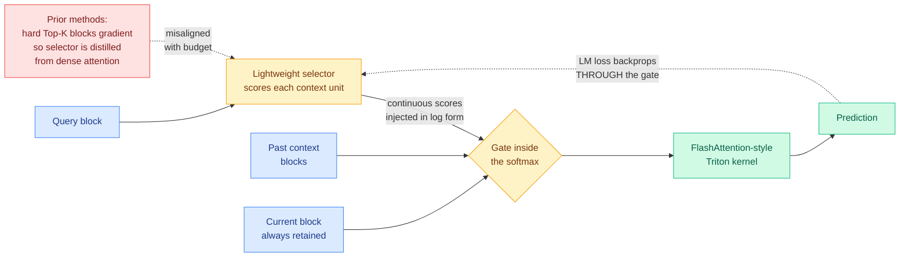

# SAS: Simple Attention Sparsification via End-to-End Optimization of Context Ranking

**arXiv:** [2609.13141](https://arxiv.org/abs/2609.13141) · **HF Daily Papers:** [page](https://huggingface.co/papers/2609.13141) · **Date:** 2026-09-14
**Raw:** [farmer file](../../raw/huggingface/2026-09-14-sas-simple-attention-sparsification-via-end-to-end-optimizat.md)

## TL;DR

Post-training sparse attention works by putting a small learned selector in front of attention: the selector scores every block of past context, a hard Top-K keeps the best few, and the model attends only to those. The problem is that Top-K is a discrete operation, so no gradient flows from the language modeling loss back into the selector. Every trainable method in this line has worked around that by **distilling the dense attention distribution**: train the selector to rank context units the way full attention would have weighted them. SAS argues that this target is the wrong one. Under a fixed attention budget, what you want is not "which units did dense attention weight highly" but "which units, if I can only afford K of them, most change the prediction." Those are different orderings, and the gap wastes budget. SAS closes it by injecting the selector's **continuous** scores into the attention logits during training, so the language modeling loss updates the selector through ordinary backpropagation, no distillation target and no straight-through estimator. It ships with a memory-efficient Triton kernel that folds the gate into FlashAttention-style computation so long-sequence training is affordable. Across reasoning, long-context understanding and agentic tasks it beats trainable sparse-attention baselines at every budget, **with the largest gains where the budget is tightest**.

---

## What the paper actually changes

The setup is post-training attention sparsification: take a pretrained dense Transformer and, without retraining it from scratch, make each query attend to a small set of context units (tokens or blocks) instead of the whole prefix. That cuts the quadratic cumulative attention cost. The selector is the component that decides which units.

The standard recipe is selector-scores-then-hard-Top-K. Hard Top-K is not differentiable, so the language modeling gradient stops at the selection boundary and the selector has to be trained against a proxy. The proxy that everyone uses is the model's own dense attention distribution, layer by layer: rank context units the way the original full attention weighted them.

SAS's claim is that this proxy is systematically misaligned with the deployed objective. Dense attention weight measures how much attention mass a unit received when the model could afford *all* of them. Under a budget of K, the quantity that matters is the unit's marginal contribution to the prediction given that only K units survive. A unit can carry meaningful dense attention weight and still be redundant once a handful of others are already selected, and the distillation objective has no way to express that. The budget gets spent on units that look important in isolation.

The fix is almost embarrassingly direct: **stop blocking the gradient.** Inject the selector's continuous scores into the attention logits during training. The softmax then sees a gated score matrix, the loss flows back through the gate into the selector by standard backpropagation, and the selector learns a ranking optimized for the actual downstream loss at the actual budget. No distillation target, no straight-through estimator, no auxiliary loss to tune.

The paper is honest that the simple version does not work by itself, and the three design choices it identifies are the real contribution:

1. **The gate goes inside the softmax, in log form.** Multiplying the post-softmax attention probabilities by a gate rescales an already-normalized distribution and gives the selector a weak, badly-conditioned gradient. Adding the log-gate to the pre-softmax logits makes the selector's score a genuine additive bias on the attention energy, which is where the signal lives.
2. **Normalized softmax gates, calibrated against the always-retained current block.** The current block is never dropped, so it is a fixed reference. Normalizing the gates against it gives the historical context a consistent scale to compete on rather than letting the gate magnitudes drift.
3. **Continuous scores are preserved rather than binarized.** The model learns *relative priorities* among context units, not just an in-or-out decision. That is what lets the ranking degrade gracefully as the budget tightens instead of falling off a cliff.

The fourth piece is engineering, and it is what makes the method usable: a **memory-efficient Triton kernel** that integrates the gate into FlashAttention-style tiled computation. Without it you would have to materialize the gated N x N score matrix to differentiate through it, which is exactly the tensor FlashAttention exists to avoid, and long-sequence training would be impossible.

## Key results

- Consistently beats trainable sparse-attention baselines across reasoning, long-context understanding and agentic tasks, at every attention budget tested.
- **Gains are largest under tight budgets.** This is the result that matters, and it is the direct prediction of the paper's thesis: when the budget is generous the two orderings mostly agree, because there is room for the merely-useful units. When the budget is tight, only a budget-aware ranking spends it well.
- Long-sequence training is tractable: the Triton kernel keeps the gated attention inside the FlashAttention memory envelope.

## Gaps

The abstract reports relative wins against baselines but no absolute throughput, latency or memory numbers, so the speedup half of the sparse-attention bargain is unquantified here. There is no ablation isolating how much of the gain comes from each of the three design choices, which matters because the paper's own framing is that the naive version fails and the details rescue it. Budget levels, model scales and sequence lengths are not given in the abstract. And the training cost of the gated forward pass against the distillation baselines is not reported, which is the fair comparison: SAS moves work from a cheap auxiliary loss into the main training loop.

## How this relates to what the wiki already knows

**This is the first result on the sparse-attention thread to attack the selector's training objective rather than its architecture.** The [attention mechanisms page](../llms-foundation-models/attention-mechanisms.md) and this folder have accumulated a long line of selector designs. [MISA (05-11)](2026-05-11-misa-mixture-of-indexer-sparse-attention.md) made DeepSeek Sparse Attention's 64-head token indexer cheaper by treating the indexer heads as a mixture-of-experts pool and routing to eight of them per query, recovering over 92% of the tokens the full indexer would have chosen at 3.82x the kernel speed. [CRISP (09-03)](2026-09-03-crisp-cliff-aware-sparse-prefilling.md) made the selection cliff-aware. [RTPurbo (05-24)](2026-05-24-rtpurbo-full-to-sparse-attention.md) transferred a full-attention model to a sparse one. All of them take the ranking target as given and optimize how you compute it. SAS says the target itself is wrong.

**It also lands directly on a tension this folder recorded twice in the last two weeks.** [HyQuant (09-11)](2026-09-11-hyquant-hybrid-precision-attention.md) argued that precision allocation should be preferred to eviction under equal memory budgets, because an evicted token is unrecoverable while a low-bit token is merely noisy, and it identified "vertical-line tokens" (key columns nearly every query attends to persistently) by probing the attention map. That probe is exactly a dense-attention-derived importance signal, which is the family of signal SAS argues is misaligned with a budgeted objective. The two results are not in direct conflict, because HyQuant allocates bits and SAS allocates slots, but **they disagree about whether dense attention weight is a good target**, and nobody has run the comparison.

**The convergence worth naming.** [Sparser, Faster, Lighter (09-13)](2026-09-13-sparser-faster-lighter-transformers.md), from Sakana AI and NVIDIA, found that plain L1 regularization drives over 99% unstructured sparsity in feedforward layers with negligible degradation, and its actual contribution was the sparse packing format and CUDA kernels that convert that sparsity into throughput. SAS's actual contribution is the same shape: a simple training signal plus the Triton kernel that makes it affordable. **Two consecutive days, two independent groups, same lesson: the sparsity idea was never the hard part; the kernel that makes it pay is.** That is now three instances counting [MISA's TileLang kernel (05-11)](2026-05-11-misa-mixture-of-indexer-sparse-attention.md), which crosses this wiki's threshold for calling it a pattern. The pattern is that a sparse-attention or sparse-weight paper without its own kernel should be read as a hypothesis, not a result.

**Open problem this opens.** SAS's thesis implies a measurable quantity nobody has published: the rank correlation between dense-attention weight and budget-conditional marginal contribution, as a function of K. If that correlation is high at large K and collapses at small K, it explains SAS's own result and tells every eviction and compression method on this page exactly where its importance heuristic stops being trustworthy. It is a cheap experiment on an existing checkpoint.

## Related pages

- [Attention mechanisms](../llms-foundation-models/attention-mechanisms.md)
- [KV cache](kv-cache.md)
- [Model pruning and sparsity](model-pruning-sparsity.md)
- [Quantization](quantization.md)
