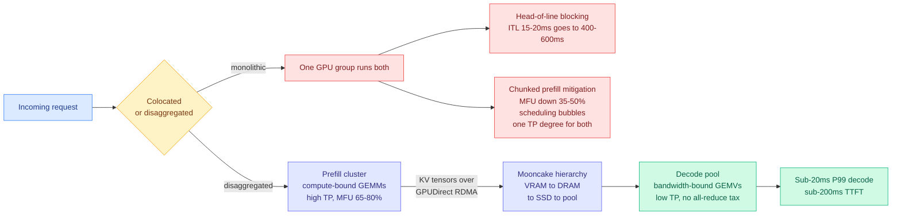

# Disaggregated Serving Architectures: Mooncake, DistServe and vLLM V1

**Source:** Ken Huang, *The Physics & Engineering of Frontier LLM Inference*, Chapter 6 · [Post](https://kenhuangus.substack.com/p/chapter-6-disaggregated-serving-architectures) · **Date:** 2026-09-15
**Raw:** [RSS farmer file](../../raw/rss/2026-09-15-agentic-ai-chapter-6-disaggregated-serving-architectures-mooncake.md)

## TL;DR

Chapter 6 of Ken Huang's ten-part inference series makes one argument: **monolithic colocation is an architectural dead end**, and the free portion of the post carries enough numbers to evaluate the claim.

The setup is the standard two-phase split. **Prefill** (reading the prompt) is compute-bound: large matrix multiplications over 1,000 to 128,000 input tokens, arithmetic intensity of roughly 100 to 250 FLOPs per byte moved from HBM, saturating tensor cores and pushing model-FLOPs utilization toward 65-80%. **Decode** (generating tokens one at a time) is memory-bandwidth-bound: matrix-vector products at one token per step, arithmetic intensity of 0.5 to 4 FLOPs per byte, with the execution pipelines mostly idle while weights and KV tensors stream across the memory bus for every single token. Running both on the same GPU means a prefill kernel seizes the streaming multiprocessors for hundreds of continuous milliseconds, and every concurrent decode stream behind it suffers **head-of-line blocking**. The post's number: inter-token latency explodes from an optimal **15-20ms to 400-600ms**, which destroys any P99 service-level objective immediately.

The interesting part is the attack on **chunked prefill**, which is the mitigation most production stacks actually use (Sarathi-Serve, vLLM v0.6): slice a long prompt into 512-token chunks and interleave them with decode passes. Huang calls it a compromise with three named costs. **Arithmetic intensity collapse**: slicing a 32K prefill into 64 chunks degrades the prefill matrix multiplications enough to cut tensor-core utilization by **35% to 50%**, lengthening time-to-first-token. **Scheduling bubbles and memory jitter**: interleaving compute-bound and bandwidth-bound kernels causes cache-line evictions, bus contention and warp-scheduling stalls, so decode never achieves jitter-free latency. **Asymmetric parallelism constraints**: colocation forces prefill and decode to share one tensor-parallel degree, but prefill latency improves with high TP while single-token decode is dominated by cross-GPU all-reduce overhead that gets *worse* at high TP. The third is the strongest of the three because it is structural rather than a tuning problem: no single TP value is right for both phases, so any colocated system is misconfigured for one of them by construction.

The prescribed alternative is **physical prefill-decode disaggregation**: dedicated prefill clusters, independent decode pools, and a KV cache transfer engine moving the computed KV tensors between them over zero-copy GPUDirect RDMA on InfiniBand or RoCEv2. The chapter roadmap names Moonshot AI's **Mooncake** hierarchical KVCache storage engine (VRAM, host DRAM, local SSD, distributed pool) as deployed in the 2.8T Kimi K3 stack, plus vLLM V1's C++ core with async request scheduling and lock-free queues. Targets stated: sub-20ms P99 decode latency and sub-200ms time-to-first-token under heavy concurrency. The detailed treatment, kernels, and cluster-sizing templates are behind the paywall; what is free is the argument and the numbers above.

---

---

## How this relates to the rest of the wiki

**This supplies the architecture that resolves the contradiction [hardware/memory-hierarchy](../hardware/memory-hierarchy.md) has been carrying for two days.** The 09-14 SemiAnalysis piece argued you should stop paying for HBM capacity because bandwidth per cube does not scale with stack height. Today's [Vera Rubin agentic-inference benchmark](../hardware/2026-09-15-semianalysis-vera-rubin-agentic-inference.md) defines the agentic workload as one whose cached-input ratio tends toward 1, meaning it wants *more* KV capacity than anything before it. Those pull in opposite directions only if KV has to live in HBM. **Mooncake's answer is that it does not: a hierarchical KVCache store spanning VRAM, host DRAM, local SSD and a distributed pool means capacity is bought at the cheapest tier that meets the latency budget, and HBM is sized for bandwidth.** Neither SemiAnalysis piece names this resolution, and it is the obvious one.

**The chunked-prefill critique is a live contradiction with production practice, and it is worth flagging as unresolved.** vLLM and SGLang ship chunked prefill on by default and it is widely regarded as a win. Huang's position is that it is a local optimum papering over a structural misfit. Both can be true if the crossover depends on context length and concurrency, which is precisely the plot nobody has published. **That plot is the single most useful missing artifact for anyone choosing a serving architecture right now.**

**It also sharpens the KV-offload cliff on [kv-cache](kv-cache.md).** The 09-14 entry recorded a Kimi K3 production run where a 36-44% KV budget cut tracked full-memory throughput invisibly until concurrency hit about 70, then dropped ~30% at once with 10x the DRAM reads. Mooncake is the Kimi stack's own storage engine, so that cliff was measured on a system already running the hierarchy this chapter describes. **The cliff is therefore not an argument against tiering; it is a measurement of where the tier boundary bites.** Every eviction and compression policy on the KV page is implicitly a policy about which tier a block lands in, and none of them say so.

**Sub-agent bursts connect the two pieces.** The Vera Rubin write-up names bursty sub-agent KV allocation as a defining property of agentic traffic. A disaggregated architecture with an RDMA transfer engine handles a burst by *migrating* KV rather than by holding headroom in every decode pool, which is the cheaper answer if the fabric can keep up. That makes ConnectX-9 and Spectrum-6 load-bearing rather than incidental, and it is why the six-product co-design framing in the NVIDIA piece is coherent.

## Gaps

- The free portion is an argument, not a measurement. The three chunked-prefill costs are stated with numbers but no source is given for the 35-50% MFU figure, and it presumably depends heavily on chunk size, sequence length and kernel implementation.
- No TCO comparison. Disaggregation buys latency at the price of a fabric and of holding two pools sized independently, and the sizing ratio is behind the paywall. A prefill-to-decode ratio that is wrong by 2x wastes more than head-of-line blocking costs.
- The targets (sub-20ms P99 decode, sub-200ms TTFT) are stated as goals rather than as measured results on a named model and hardware.
- Nothing on failure modes: what happens to an in-flight session when a decode pool member dies and the KV lives somewhere else.

## Links

- [kv-cache](kv-cache.md) (concept page) · [memory-hierarchy](../hardware/memory-hierarchy.md) · [compute-economics](../hardware/compute-economics.md)
- [Vera Rubin NVL72 agentic inference (09-15)](../hardware/2026-09-15-semianalysis-vera-rubin-agentic-inference.md)
- [4-hi HBM: bandwidth over capacity (09-14)](../hardware/2026-09-14-semianalysis-4hi-hbm-bandwidth-over-capacity.md)
- [Daily digest 2026-09-15](../daily-digest/2026-09/2026-09-15.md)
