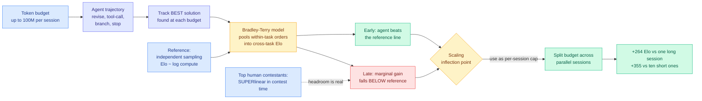

# When Agents Slow Down: Understanding LLM Agents' Test-Time Strategies via Elo-per-token Analysis

**arXiv:** [2609.15309](https://arxiv.org/abs/2609.15309) · **HF Daily Papers:** [page](https://huggingface.co/papers/2609.15309) · **Date:** 2026-09-15
**Raw:** [farmer file](../../raw/huggingface/2026-09-15-when-agents-slow-down-understanding-llm-agents-test-time.md)

## TL;DR

An agent that revises, calls tools, explores branches and decides when to stop is spending test-time compute on its own schedule, which makes the usual scaling question unanswerable: you cannot plot performance against compute when the agent chooses the compute. This paper builds the missing measuring instrument. It studies open-ended tasks that emit a continuous score for every intermediate submission, so progress is visible all the way along a long trajectory rather than only at the end. It then tracks the **best solution found at each token budget** and uses a Bradley-Terry model (the standard statistical method for turning pairwise win/loss records into a single rating) to fold within-task orderings into **Elo ratings** that are comparable across tasks with completely different score scales. Applied to four general-purpose agents on four open-ended benchmarks, with sessions running up to **100M tokens**, the result is a clean and uncomfortable curve.

The reference line is independent sampling, which is theoretically characterized: Elo grows **linearly with log compute**. Against that line, agents start well. They convert early tokens into Elo *faster* than independent sampling, which is the whole justification for agentic scaffolding. Then the marginal return decays, and eventually the agent falls **below** the independent-sampling reference. Past that crossing, the scaffold is actively worse than just drawing more independent samples and picking the best. The paper names the crossing the **scaling inflection point**: the per-session budget at which marginal Elo gain equals the independent-sampling reference.

The actionable part is what you do with that number. Using the inflection point as the per-session budget and splitting 100M tokens across parallel sessions on FrontierCS Polyomino Packing, they gain **+264 Elo over one long session** and **+355 over ten short sessions**. Same bill, different allocation, large difference. And the control that gives the result its sting: the strongest **human** contestants on the shared AtCoder Heuristic Contest tasks improve **superlinearly** over contest time. Humans keep accelerating where agents decelerate, which is direct evidence of continual learning and says the headroom above the agent curve is real rather than a property of the task.

---

---

## Key claims

- **Elo-per-token is a measurement method, not a technique.** Its contribution is that agent test-time scaling becomes plottable at all. The prior state was a single end-of-run score against an unstated bill.
- **Agents are front-loaded.** They beat independent sampling early and lose to it late. Both halves matter: the early win justifies scaffolding, the late loss caps it.
- **The inflection point is a schedulable quantity.** Once you can locate it, "how long should one session run" stops being a hyperparameter someone guessed and becomes something you measure per task family.
- **Breadth beats depth once past the crossing.** +264 Elo from re-slicing a fixed 100M-token budget into parallel sessions sized at the inflection point.
- **Humans accelerate where agents decelerate.** Superlinear improvement by strong AtCoder contestants on the shared tasks. The gap is continual learning, and the paper is careful to call it evidence of headroom rather than of any particular missing mechanism.

## How this relates to the rest of the wiki

**This is a direct confirmation of the thread [test-time compute allocation](test-time-compute-allocation.md) opened on 09-08, arriving from a completely different direction.** That entry recorded [revision propagation](2026-09-08-revision-propagation-test-time-compute.md) (09-08, the paper that benchmarked propagating a local edit through every dependent part of a multi-turn artifact) finding that **parallel sampling with selection beats sequential self-revision and beats spending more reasoning tokens on one attempt, by 2.2 to 9.7 points at fixed budget**. That was one task, one budget, and the concept page framed the mechanism as recall-versus-depth: independent draws give union-like coverage, and thinking harder in one pass cannot fix an omission the model does not know it made.

Elo-per-token generalizes the same finding to four agents, four benchmarks and a 100M-token scale, and it supplies the thing the 09-08 result could not: **the crossover point where depth stops paying**. The concept page said the field over-buys depth and under-buys breadth. This paper says *how much* depth is the right amount, and it is a number you can measure rather than a preference. Two independent results one week apart is a pattern; the concept page should now treat breadth-over-depth as the default allocation and depth as the thing that needs justifying.

**It also lands squarely against the social-sourced Anthropic inverse-scaling claim circulating the same day**, which reports that unconstrained test-time compute degrades accuracy through distractor fixation, template forcing and self-correction loops. Those are *failure modes*; Elo-per-token is a *budget curve*. They are compatible and one may explain the other: if the marginal token past the inflection point is more likely to be spent second-guessing a valid intermediate step than finding a better one, the Elo curve bending below the sampling reference is exactly what you would observe. Nobody has tested that link, and it is cheap: instrument the trajectories past the inflection point and check whether the failure modes concentrate there.

**Against [the Handoff Tax (09-07)](../ai-routing/2026-09-07-handoff-tax-model-switching.md)** (the study across 58,000 agent runs and 36 billion tokens finding that passing a cheap model's full history on escalation recovers under half the quality gap, while dropping the trajectory and passing only the code edits lifts recovery from 47% to 64%), there is a shared implication worth stating: **both papers find that the accumulated trajectory is a liability past a certain length.** The Handoff Tax says discard it at a model boundary. Elo-per-token says cap it at a budget boundary. Neither cites the other and nobody has asked whether the inflection point and the handoff break-even are the same quantity in different units.

**For [llm-routing](../ai-routing/llm-routing.md)** the consequence is concrete. A router that decides which model handles a query now has a second lever with a measured payoff: how many parallel sessions, capped at what budget. That is a routing decision in the same cost-at-a-quality-bar sense, and it is orthogonal to model choice.

## Gaps

- The four benchmarks are open-ended tasks with **continuous intermediate scores**, which is what makes the trajectory observable. Most production agent work has no such signal, so locating the inflection point in the wild needs a proxy the paper does not supply.
- The inflection point is reported per session; whether it is stable across task families, model sizes or harness designs is untested. If it moves with the harness, it is a tuning constant rather than a law.
- The parallel-session win assumes sessions are independent. Agentic workloads in production share a KV cache prefix, so the dollar cost of ten parallel sessions is not ten times one session, and the paper prices everything in tokens rather than in serving cost.
- The human superlinearity comparison is on AtCoder heuristic contests, where strong contestants have deep task-specific priors. It is evidence of headroom, not of a mechanism agents are missing.

## Links

- [test-time compute allocation](test-time-compute-allocation.md) (concept page)
- [Revision propagation (09-08)](2026-09-08-revision-propagation-test-time-compute.md)
- [Daily digest 2026-09-15](../daily-digest/2026-09/2026-09-15.md)
