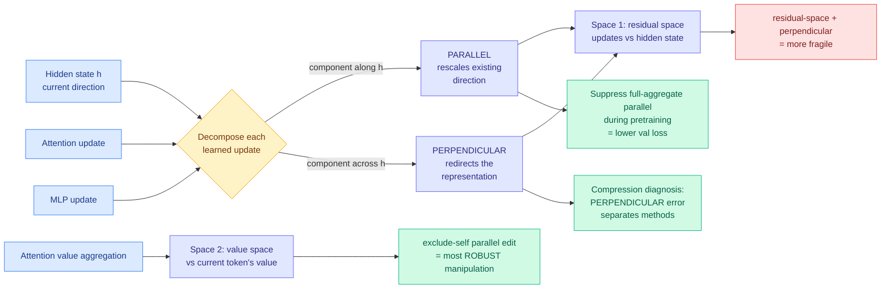

# Disentangling Representation Evolution in Transformers through Directional Decomposition

**Date ingested:** 2026-09-16
**Source:** HuggingFace Daily Papers · [arXiv 2609.15975](https://arxiv.org/abs/2609.15975) · [code](https://github.com/Shwai-He/Transformer-Geometry)
**Raw:** [raw/huggingface/2026-09-16-disentangling-representation-evolution-in-transformers.md](../../raw/huggingface/2026-09-16-disentangling-representation-evolution-in-transformers.md)

## TL;DR

A transformer layer does not replace the hidden state, it adds to it. This paper splits every added update into two pieces: the part that points **along** the current hidden state (parallel, which rescales what is already there) and the part that points **across** it (perpendicular, which rotates the representation toward something new). The measurement result is that pretrained models carry a substantial parallel component beyond what the residual identity path alone would produce, and the practically useful result is that **perpendicular error separates compression methods more clearly than parallel error does**. That is a diagnostic the compression literature does not currently have: a way to say *how* a quantized or pruned model is wrong, not just how much.

## Mechanism

## What it shows

**Three findings, and they are independent of each other.**

1. **Pretrained models carry substantial parallel components** beyond the residual identity path. A layer that only preserved direction would contribute nothing new; the measurement says a meaningful share of what layers do is scale rather than rotate.

2. **Edit robustness is strongly space-dependent.** The decomposition is applied in two different spaces: to attention and MLP updates relative to the hidden state (residual space), and to attention value aggregation relative to the current token's own value (value space). Manipulating the **exclude-self parallel component in value space**, meaning you scale only the aggregate of other tokens' values while leaving the token's own message untouched, is markedly more robust than either the residual-space equivalent or any perpendicular manipulation. That is a concrete map of where a model tolerates intervention and where it does not.

3. **Perpendicular error is the better compression diagnostic.** When a compression method introduces update error, decomposing that error into parallel and perpendicular parts separates methods more cleanly along the perpendicular axis. A method that mostly perturbs magnitude is doing something different from one that perturbs direction, and until now both showed up as one undifferentiated error number.

4. **Suppressing the full-aggregate parallel component during from-scratch pretraining lowers validation loss** and improves downstream averages, with the value-space variant strongest. This turns a descriptive geometry into a training intervention.

## How this relates to prior wiki pages

**It supplies the missing diagnostic layer under the whole quantization thread.** The [quantization page](quantization.md) tracks a long run of methods that each report an error or a perplexity delta and then argue about which is better. [Why Does Post-Training Quantization Work? (09-11)](2026-09-11-why-post-training-quantization-works.md) asked the theory question of why rounding weights after training costs so little, and answered it in terms of loss-landscape flatness. This paper asks a different and complementary question: **given that some error is introduced, what kind of error is it?** Parallel error means the method got the magnitude wrong; perpendicular error means it rotated the representation. Two methods with identical scalar error can be doing entirely different damage, and nothing in the wiki's compression literature currently distinguishes them.

**It connects directly to the pruning thread.** [WRP, forward-free depth pruning via weight redundancy (09-10)](2026-09-10-wrp-forward-free-depth-pruning.md) removes layers judged redundant with each other, and [Sparser, Faster, Lighter Transformers (09-13)](2026-09-13-sparser-faster-lighter-transformers.md) removes structure more broadly. The directional decomposition offers a redundancy criterion those methods do not use: a layer whose update is overwhelmingly parallel is rescaling rather than computing, which is a different kind of removable than a layer whose update duplicates a neighbour's.

**It is the mechanism-level sibling of the attention-selection argument in [SAS (09-14)](2026-09-14-sas-attention-sparsification-end-to-end.md).** SAS argued that the right target for a sparse-attention selector under a fixed budget is not "which blocks did dense attention weight highly" but "which blocks, if I can only afford K, most change the prediction." This paper makes the same move one level lower: not "how much did the update change" but "in which direction, and does that direction matter." Both are arguments that the field has been optimizing a magnitude when it should be optimizing a direction.

**And the exclude-self value-space result speaks to [attention mechanisms](../llms-foundation-models/attention-mechanisms.md).** Separating the current token's own value message from the aggregate of everyone else's, and finding the aggregate far more safely scalable, is a structural claim about what attention is doing that any KV-eviction method should care about: eviction acts entirely on the non-self aggregate, which is the component this paper says is the robust one to perturb.

## Gaps

- The compression-diagnosis result is stated as "perpendicular error separates methods more clearly," which is a separability claim, not a predictive one. Whether perpendicular error **predicts downstream degradation** better than scalar error is the question a practitioner needs answered and it is not in the abstract.
- The pretraining intervention is from-scratch, so it is unavailable to anyone working with existing checkpoints, which is almost everyone doing compression work.
- No model scale is named in the abstract. A geometry result that holds at small scale and dissolves at frontier scale would be a very different paper.
- The two spaces (residual and value) are studied separately. Whether their parallel components are the same phenomenon measured twice or genuinely distinct quantities is unresolved.

## Industrial implication

Nothing ships from this next quarter. What it changes is how a compression team reports results. A quantization or pruning paper that publishes a parallel/perpendicular error split alongside its perplexity delta gives reviewers a way to tell a method that is quietly rotating representations from one that is only rescaling them, and the first is the one that will fail on a held-out domain. The realistic path is that this decomposition becomes a standard ablation table in compression papers within a year, the same way layer-wise sensitivity plots did.
