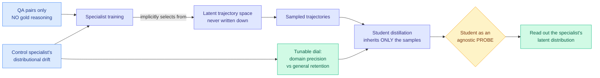

# Training Specialist Models without Reasoning Trajectories for Domain Expert Distillation

**Date ingested:** 2026-09-16
**Source:** HuggingFace Daily Papers · [arXiv 2609.13770](https://arxiv.org/abs/2609.13770)
**Raw:** [raw/huggingface/2026-09-16-training-specialist-models-without-reasoning-trajectories.md](../../raw/huggingface/2026-09-16-training-specialist-models-without-reasoning-trajectories.md)

## TL;DR

Specialist distillation normally works by having a domain-expert teacher write out its reasoning and training a student to copy those traces. This paper asks what happens when the specialist itself was trained only on question-answer pairs, with no reasoning supervision at all. The answer is that specialist training still selects a distribution over reasoning trajectories, silently, and that distribution is inherited by anything distilled from it. Across **27 specialist-student pairings** the specialization-generalization profile of the teacher and the student correlate exceptionally strongly, and **deliberately controlling the specialist's distributional drift moves both teacher and student along a predictable trade-off between domain precision and retained general capability**.

## Mechanism

## The methodological trick

The clever part is using **student distillation as an instrument rather than as a goal**. A student inherits no parameterization from the specialist and none of its optimization constraints. It inherits only the sampled trajectories. That makes the student a clean read-out of what the specialist's latent trajectory distribution actually contains, in a way that probing the specialist's weights directly cannot be.

## Results

- **27 specialist-student pairings**, and their specialization-generalization profiles correlate exceptionally strongly. The student is not an independent model, it is a projection of the teacher's latent distribution.
- **Distributional drift is a controllable dial.** Turn it and both teacher and student move together along a domain-precision versus general-capability curve.
- Holds across **chemistry, physics and multilingual** settings, and **across divergent model families**, which is the sweep that makes it a property of the method rather than an artifact of one checkpoint pair.

## How this relates to prior wiki pages

**It reframes a question the [knowledge distillation page](knowledge-distillation.md) has treated as settled.** The wiki's distillation thread has been about *what signal to transfer*: [OPRD (09-09)](2026-09-09-oprd-on-policy-reverse-distillation.md) matched teacher hidden states rather than output tokens; [negative self-distillation (09-11)](2026-09-11-negative-self-distillation.md) removed the teacher entirely by learning to avoid self-constructed reasoning flaws; TIP argued most teacher-generated tokens carry no learning signal and roughly 10% suffice. All of those assume the teacher's trajectory distribution is a given. This paper says **it is a choice you are already making without knowing it**, set by how you tuned the specialist.

**It is the distillation-side statement of the argument [Drift-Constrained Optimization (09-16)](../llms-foundation-models/2026-09-16-drift-constrained-optimization.md) makes on the fine-tuning side**, and the two landed on the same HuggingFace page on the same day. DCO says: specify a behavioral drift budget before optimization, and what remains free is the direction of the update. This paper says: the drift you allow the specialist determines the trajectory distribution your students inherit. **Two papers, one morning, both arguing that drift is a design parameter rather than a side effect.** Neither cites the other and neither notices the other exists.

**It also puts a cost figure in reach that nobody has computed.** The wiki's distillation results all price teacher inference as a line item, because generating reasoning traces is the expensive part. This paper's setting has no gold reasoning at all, so the specialist is cheaper to build, but the trade-off it exposes means you pay in a different currency: a tighter domain specialist produces a student with less general capability, and that loss has no price tag yet.

## Gaps

- The drift control is described as systematic but the abstract does not name the knob. Whether it is a learning-rate schedule, a KL penalty against the base model, or a data-mixture ratio decides whether this is easy or hard to apply.
- "Exceptionally strongly correlated" across 27 pairings is a correlation claim. It does not establish that the student's profile is *caused* by the specialist's latent distribution rather than both being caused by the training data.
- No result on whether a student can be steered **away** from its teacher's profile. If the inheritance is as tight as reported, the practical question is whether it can be broken.
- Chemistry, physics and multilingual are three domains with clean answers. Nothing here tests a domain where the correct reasoning trajectory is genuinely contested.

## Industrial implication

Anyone shipping a small domain model distilled from a larger fine-tuned one is currently choosing its generalization profile by accident. This paper says the choice is upstream, at specialist training, and is tunable there. In a production stack that means the specialist's drift setting becomes a deployment parameter like temperature: dial it tight for a narrow high-precision endpoint, dial it loose when the small model still has to handle off-domain traffic. The first vendor to expose that as a knob rather than a retraining decision will find it cheap to build, because the mechanism is already in every fine-tuning pipeline, just unlabelled.
